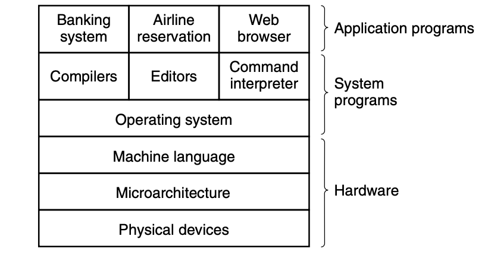

### Operating Systerms Design and Implementation Notes

# 1. Introduce to Operating Systerm
##### By Jiawei Wang
 
<!-- vim-markdown-toc GFM -->

* [The most fundamental system program is the operating system](#the-most-fundamental-system-program-is-the-operating-system)
* [1. Program](#1-program)
* [2. Machine](#2-machine)
    * [1).The Oprating Systerm as an Extend Machine](#1the-oprating-systerm-as-an-extend-machine)
    * [2).The Operating System as a Resource Manager](#2the-operating-system-as-a-resource-manager)

<!-- vim-markdown-toc -->

 

**As We all know that: A modern Computer can be divided into two pieces:   -- Hardware and Software** 
**And Software also can be divided into two kinds:   -- Systerm programs and Application Programs** 

**System programs, which manage the operation of the computer itself. 
Application programs, which perform the actual work the user wants.**

## The most fundamental system program is the operating system

**A major function of the operating system is to hide all this complexity and give the programmer a more convenient set of instructions to work with**

**We can try to understand Oprating Systerm from two aspects:**
## 1. Program
**OS is a Very big program  From the previous layer picture we can see found that OS is not equal to Systerm programs but a part of it** 
**So What the difference between OS and Other Systerm Programs? **
**On top of the operating system is the rest of the system software Here we find the command interpreter (shell), window systems, compilers, editors, GUI, and similar application-independent programs. **
 
**The difference between OS and Other Systerm Programs is that the operating system is (usually) that portion of the software that runs in kernel mode or supervisor mode. It is protected from user tampering by the hardware **
**For Example: Compilers and editors run in user mode. If a user does not like a particular compiler, he is free to write his own if he so chooses; he is not free to write his own clock interrupt handler, which is part of the operating system and is normally protected by hardware against attempts by users to modify it**
  
**In Conclusion: Everything running in kernel mode is clearly part of the operating systerm. Which means can't be easily changed by the user**
## 2. Machine
**From the perspective of the machine, we can also understand Oprating Systerm from two aspects:**
### 1).The Oprating Systerm as an Extend Machine
**If we try to understand the Machine(computer) with a top-down view, like we metioned before. **
**It is not hard to get that conclution: **
**In each case, the abstraction offered by the operating system is simpler and easier to use than that offered by the underlying hardware.**  
**For Example:**
> The most basic commands are read and write, each of which requires 13 parameters, packed into 9 bytes. These parameters specify such items as the address of the disk block to be read, the number of sectors per track, the recording mode used on the physical medium, the intersector gap spacing, and what to do with a deleted-data-address-mark. If you do not understand this mumbo jumbo, do not worry; that is precisely the point—it is rather esoteric. When the operation is completed, the controller chip returns 23 status and error fields packed into 7 bytes. As if this were not enough, the floppy disk programmer must also be constantly aware of whether the motor is on or off. If the motor is off, it must be turned on (with a long startup delay) before data can be read or written. The motor cannot be left on too long, however, or the floppy disk will wear out. The programmer is thus forced to deal with the trade-off between long startup delays versus wearing out floppy disks (and losing the data on them).  

**Without going into the real details, it should be clear that the average programmer probably does not want to get too intimately involved with the programming of floppy disks (or hard disks, which are just as complex and quite different). Instead, what the programmer wants is a simple, high-level abstraction to deal with. In the case of disks, a typical abstraction would be that the disk contains a collection of named files. Each file can be opened for reading or writing, then read or written, and finally closed. Details such as whether or not recording should use modified frequency modulation and what the current state of the motor is should not appear in the abstraction presented to the user.**
  
**The program that hides the truth about the hardware from the programmer and presents a nice, simple view of named files that can be read and written is. Of course, the Operating System.**
  
**In this view, the function of the operating system is to present the user with the equivalent of an Extended Machine or Virtual Machine that is easier to program than the underlying hardware**

### 2).The Operating System as a Resource Manager
**An alternative, bottom-up, view holds that the operating system is there to manage all the pieces of a complex system. Modern computers consist of processors, memories, timers, disks, mice, network interfaces, printers, and a wide variety of other devices. In the alternative view, the job of the operating system is to provide for an orderly and controlled allocation of the processors, memories, and I/O devices among the various programs competing for them.** 
 
**Resource management includes multiplexing (sharing) resources in two ways: in time and in space, which will be Introduced in the future notes**
   
