### Operating Systerms Design and Implementation Notes

# 4. The Fourth Generation (1980–Present) Personal Computers
#### By Jiawei Wang
 

<!-- vim-markdown-toc GFM -->

* [1. 8-bit ages](#1-8-bit-ages)
    * [1) Microcomputer](#1-microcomputer)
    * [2) Intel 8080](#2-intel-8080)
    * [3) CP/M](#3-cpm)
* [2. Apple and Microsoft](#2-apple-and-microsoft)
    * [1) Apple II](#1-apple-ii)
        * [MOS Technology](#mos-technology)
        * [Apple-DOS](#apple-dos)
        * [Disk Oprating Systerm(DOS)](#disk-oprating-systermdos)
    * [2) MS-DOS](#2-ms-dos)
        * [86-DOS](#86-dos)
    * [3. Modern System](#3-modern-system)
        * [Apple Macintoch](#apple-macintoch)
        * [Classic Mac OS (1984 to 2001)](#classic-mac-os-1984-to-2001)
        * [BSD](#bsd)
        * [Linux](#linux)
        * [GNU and GPL](#gnu-and-gpl)
        * [Microsoft Windows](#microsoft-windows)

<!-- vim-markdown-toc -->

## 1. 8-bit ages

### 1) Microcomputer
**With the development of LSI (Large Scale Integration) circuits, chips containing thousands of transistors on a square centimeter of silicon, the age of the microprocessor-based personal computer dawned.**
  
**[By Springsgrace - Own work, CC BY-SA 4.0](https://commons.wikimedia.org/w/index.php?curid=79216985)** 
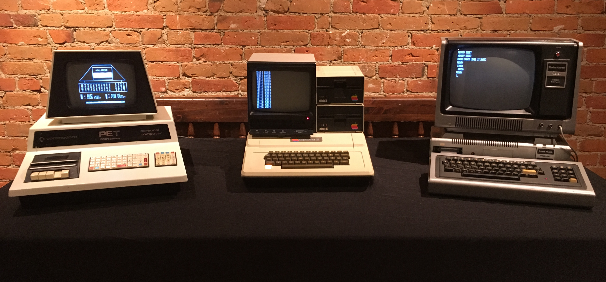
**"1977 Trinity" of home computing: the Commodore PET 2001, the Apple II, and the TRS-80 Model I**
> **In terms of architecture, personal computers (initially called microcomputers) were not all that different from minicomputers of the PDP-11 class, but in terms of price they certainly were different.** 
  
> **The minicomputer made it possible for a department in a company or university to have its own computer. The microcomputer made it possible for an individual to have his or her own computer.**

 

### 2) Intel 8080

**There were several families of microcomputers. In April 1974, Intel came out with the 8080, the first general-purpose 8-bit microprocessor** 
**[intel 8080 By Konstantin Lanzet - CPU collectionCamera: Canon EOS 400D, CC BY-SA 3.0](https://commons.wikimedia.org/w/index.php?curid=7028099) **
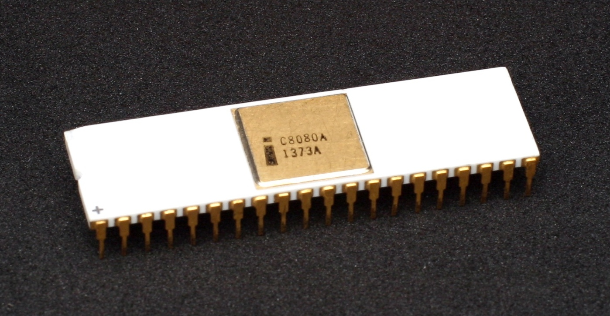
 
**Let's see the architecture of Intel 8080. We can see that its design concept is very close to Nowadays Intel's architecture: 
[By Appaloosa - Own work, CC BY-SA 3.0](https://commons.wikimedia.org/w/index.php?curid=5197867)** 
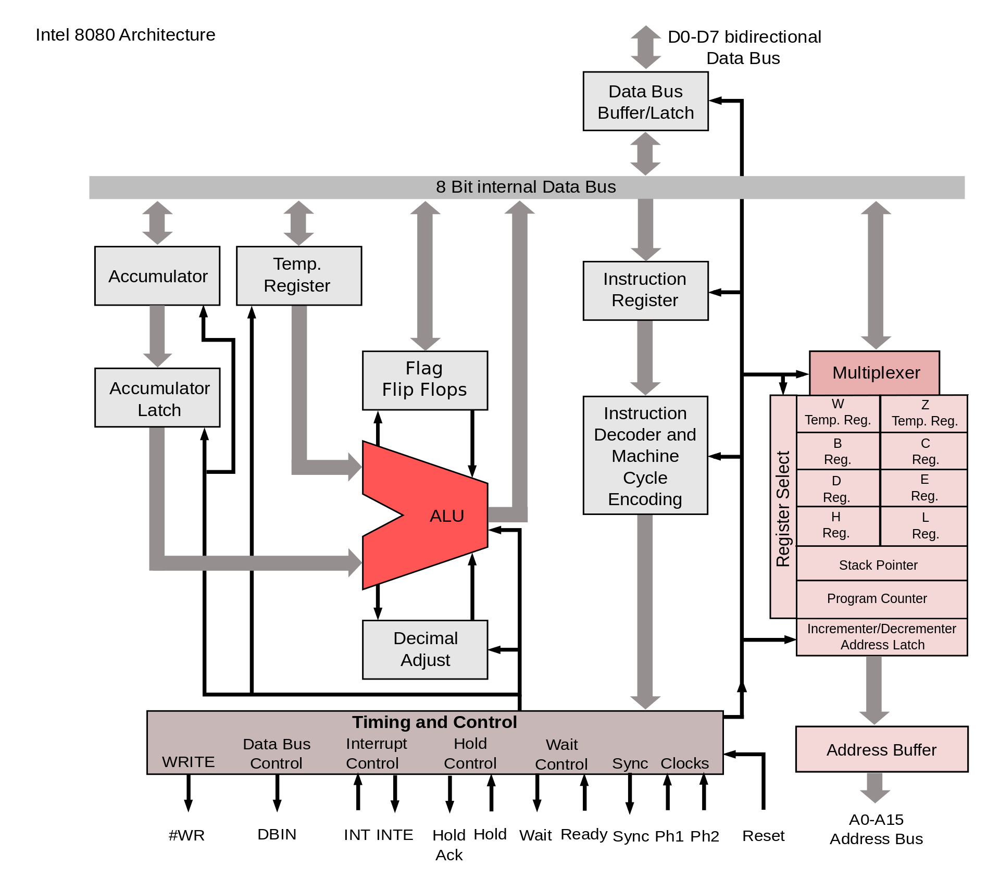

### 3) CP/M
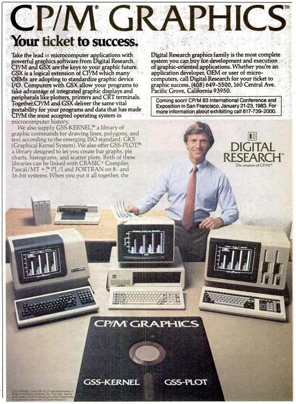 
**[CP/M By Digital Research - Scanned from the November 29, 1982 InfoWorld magazine, Public Domain](https://commons.wikimedia.org/w/index.php?curid=30603370)** 

**CP/M originally standing for Control Program/Monitor and later Control Program for Microcomputers, is a mass-market operating system created in 1974 for Intel 8080/85-based microcomputers by Gary Kildall of Digital Research, Inc. Initially confined to single-tasking on 8-bit processors and no more than 64 kilobytes of memory.** 

**Many application programs were written to run on CP/M, and it dominated the personal computing world for about 5 years.** 
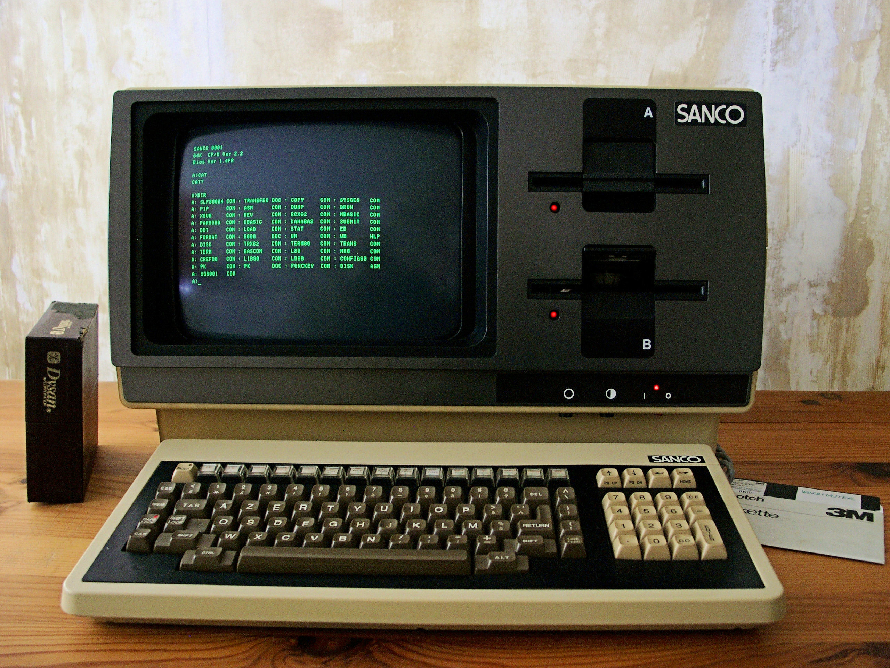
**[A SANCO Computer which runs CP/M at 1982 By Mspecht - Own work, CC BY-SA 3.0](https://commons.wikimedia.org/w/index.php?curid=16374059)** 

> **A minimal 8-bit CP/M system would contain the following components: **
> * A computer terminal using the ASCII character set 
> * An Intel 8080 (and later the 8085) or Zilog Z80 microprocessor 
> * At least 16 kilobytes of RAM, beginning at address 0 
> * A means to bootstrap the first sector of the diskette 
> * At least one floppy disk drive 

**However, because of a missed opportunity in the conversion to a 16-bit CPU, it lost miserably to Microsoft's MS-DOS in the 16-bit PC market centered on IBM PC/AT and IBM PC compatible machines, and thus disappeared from the market. Although CP/M introduced the "CP/M 86" designed for Intel 8086 and the "CP/M 68k" designed for Motorola 68000, there are almost no users.**

## 2. Apple and Microsoft

### 1) Apple II
**Like Intel Motorola also produced an 8-bit microprocessor, the 6800. A group of Motorola engineers left to form MOS Technology and manufacture the 6502 CPU after Motorola rejected their suggested improvements to the 6800. The 6502 was the CPU of several early systems. One of these, the Apple II, became a major competitor for CP/M systems in the home and educational markets.**
 

**[Apple-II By FozzTexx - Own work, CC BY-SA 4.0](https://commons.wikimedia.org/w/index.php?curid=79580939)** 
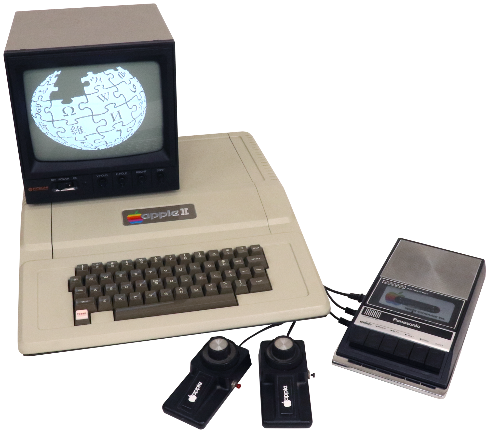

#### MOS Technology
> **Like 8080 and Z-80, 6502 is an 8-bit CPU that can address up to 64KB of memory. Just like the Zilog Z-80 is based on the earlier Intel 8080 CPU, the MOS 6502 is based on the Motorola 6800 CPU (released in the same year as the 8080, the price is $360 the same as the 8080).**

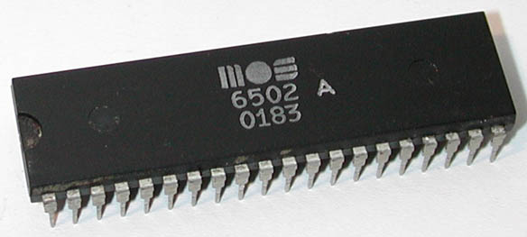

> **The 6502's design goal is "a better performance and lower price alternative than the 6800". When the 6502 was launched in the second half of 1975, its price tag was 25 dollars**

> **In response, Motorola drastically reduced the price of the 6800 from 175 to 69 dollars (MOS Technology has also developed a 6501 CPU that can directly replace the 6800 on the circuit board, but due to Motorola's lawsuit, MOS Technology abandoned the 6501 plan and paid Motorola USD200,000).**
 

**At the Beginning of this Note. We see three Computers. Because all of them released at 1977. and Two of them use MOS-6502(AppleII and PET) another(TRS-80) using Zilog Z-80. We call them Trinity-1977.**

 

#### Apple-DOS
> **When Apple Computer introduced the Apple II in April 1977, the new computer had no disk drive or disk operating system (DOS). Although Apple co-founder Steve Wozniak designed the Disk II controller late that year, and believed that he could have written a DOS, his co-founder Steve Jobs decided to outsource the task. The company considered using Digital Research's CP/M, but Wozniak sought an operating system that was easier to use. On 10 April 1978 Apple signed a $13,000 contract with Shepardson Microsystems to write a DOS and deliver it within 35 days.(with Assembly language)**
 

#### Disk Oprating Systerm(DOS)

**CP/M. Apple-DOS. and MS-DOS(We will introduce later). All of them were DOS(Disk Oprating Systerm)**

**From [Wikipedia](https://en.wikipedia.org/wiki/Disk_operating_system):**
> **In the early days of computers, there were no disk drives, floppy disks or modern flash storage devices. Early storage devices such as delay lines, core memories, punched cards, punched tape, magnetic tape, and magnetic drums were used instead.**

**In these days. If you want to run a program. You have two choices: **
* **Using punched cards. Like IBM 1401 -- Slow and not very easy to carry**
* **Program and data entry was done at front panel switches directly into memory or through a computer terminal / keyboard. -- When power was turned off any information was lost.**

> **In the early 1960s, as disk drives became larger and more affordable, various mainframe and minicomputer vendors began introducing disk operating systems and modifying existing operating systems to exploit disks.**
 

> **Both hard disks and floppy disk drives require software to manage rapid access to block storage of sequential and other data. For most microcomputers, a disk drive of any kind was an optional peripheral; systems could be used with a tape drive or booted without a storage device at all. The disk operating system component of the operating system was only needed when a disk drive was used.**
 

**That Software is called Disk Oprating Systerm(DOS)** 

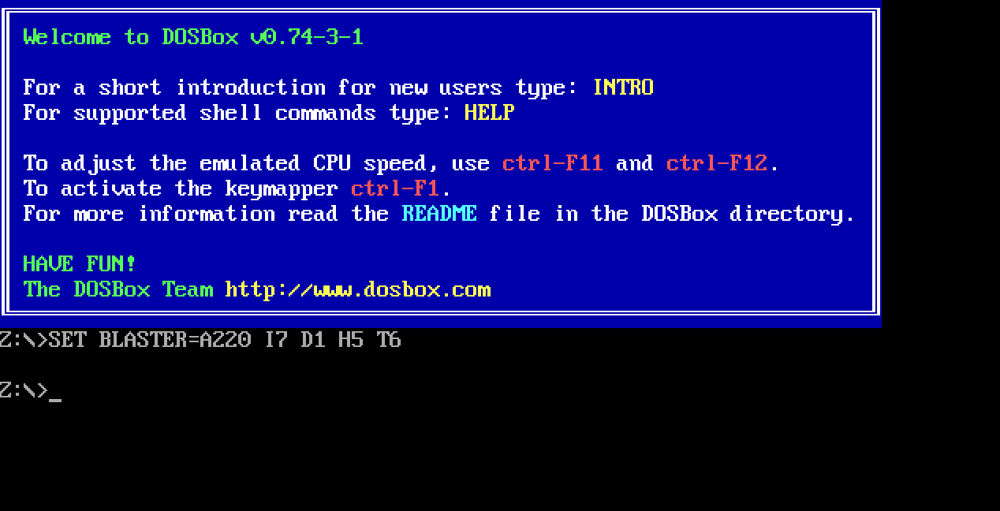
**[DOSBox is a DOS-emulator that uses the SDL-library which makes DOSBox very easy to port to different platforms. DOSBox has already been ported to many different platforms, such as Windows, BeOS, Linux, MacOS X...](https://www.dosbox.com)**

### 2) MS-DOS

**In the Beginning of [1) Apple II](#1-apple-ii). We metioned that the Apple II, became a major competitor for CP/M systems in the home and educational markets.** 

**But CP/M was so popular that many owners of Apple II computers purchased Z-80 coprocessor add-on cards to run CP/M, since the 6502 CPU was not compatible with CP/M. The CP/M cards were sold by a little company called Microsoft, which also had a market niche supplying BASIC interpreters used by a number of microcomputers running CP/M.**
 

#### 86-DOS
**The next generation of microprocessors were 16-bit systems. Intel came out with the 8086 at July 1, 1979** 
**[Intel 8086 Photo By Thomas Nguyen - Own work, CC BY-SA 4.0](https://commons.wikimedia.org/w/index.php?curid=46809082)**
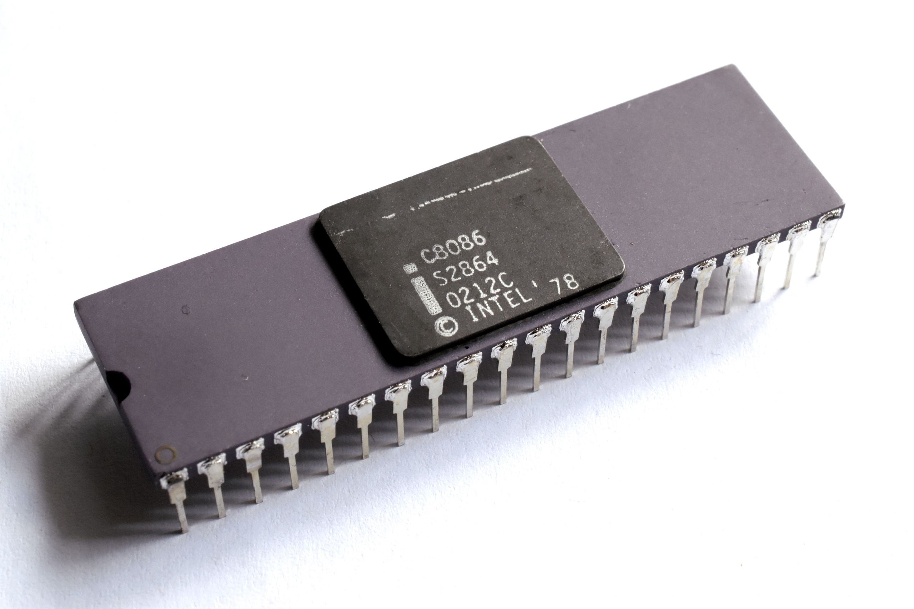

**[From Wikipedia](https://en.wikipedia.org/wiki/MS-DOS)**

> **MS-DOS was a renamed form of 86-DOS – owned by Seattle Computer Products, written by Tim Paterson. Development of 86-DOS took only six weeks, as it was basically a clone of Digital Research's CP/M (for 8080/Z80 processors), ported to run on 8086 processors and with two notable differences compared to CP/M: an improved disk sector buffering logic, and the introduction of FAT12 instead of the CP/M filesystem. This first version was shipped in August 1980.** 

> **Microsoft, which needed an operating system for the IBM Personal Computer, hired Tim Paterson in May 1981 and bought 86-DOS 1.10 for US$75,000 in July of the same year. Microsoft kept the version number, but renamed it MS-DOS. They also licensed MS-DOS 1.10/1.14 to IBM, which, in August 1981, offered it as PC DOS 1.0 as one of three operating systems for the IBM 5150, or the IBM PC.**

> **Within a year, Microsoft licensed MS-DOS to over 70 other companies. It was designed to be an OS that could run on any 8086-family computer. Each computer would have its own distinct hardware and its own version of MS-DOS, similar to the situation that existed for CP/M**

### 3. Modern System
**CP/M, MS-DOS, and the Apple DOS were all command-line systems: users typed commands at the keyboard.**  
**In the late 1960s, researchers at the Stanford Research Institute, led by Douglas Engelbart, developed the On-Line System (NLS), which used text-based hyperlinks manipulated with a then-new device: the mouse. and complete with windows, icons, menus, and mouse. We call them GUI(Graphical User Interface)** 
  

#### Apple Macintoch
**Apple’s Steve Jobs saw the possibility of a truly user-friendly personal computer (for users who knew nothing about computers and did not want to learn), and the Apple Macintosh was announced in early 1984 with US dollars 2,495** 
**[Macintoch 128k announced in 1984 by Steve Jobs](https://www.youtube.com/watch?v=2B-XwPjn9YY&t=28s)** 
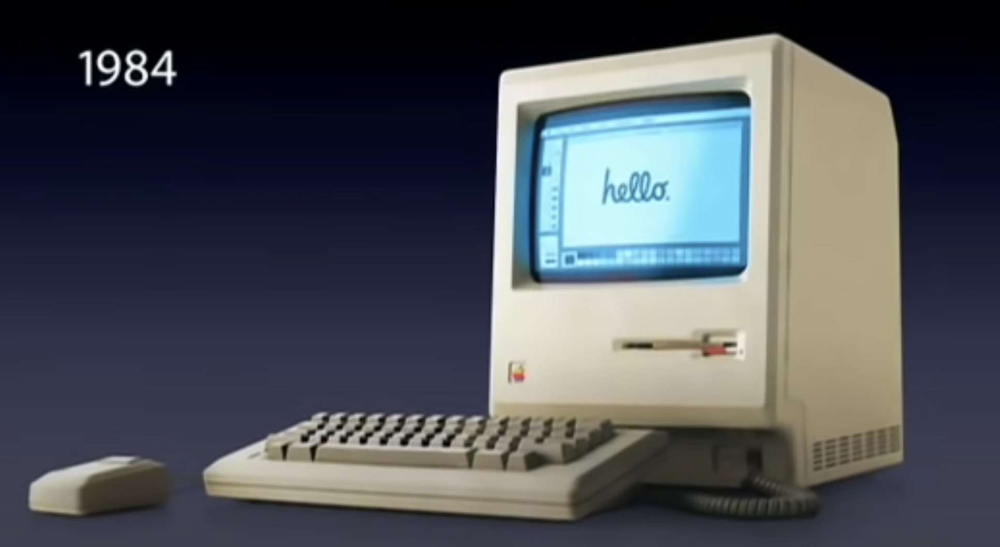 
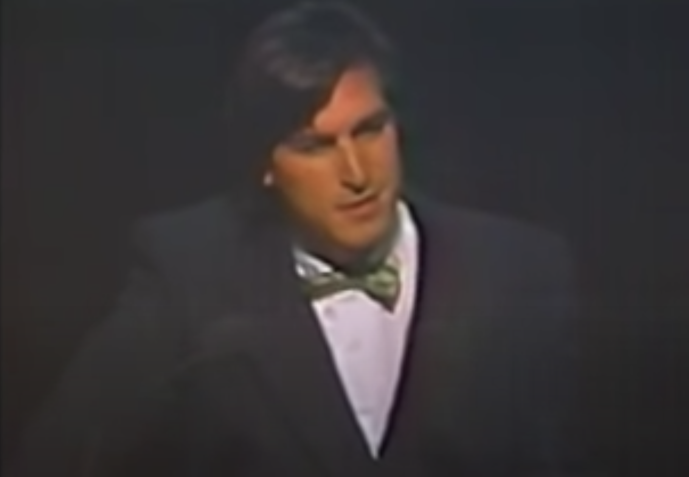 
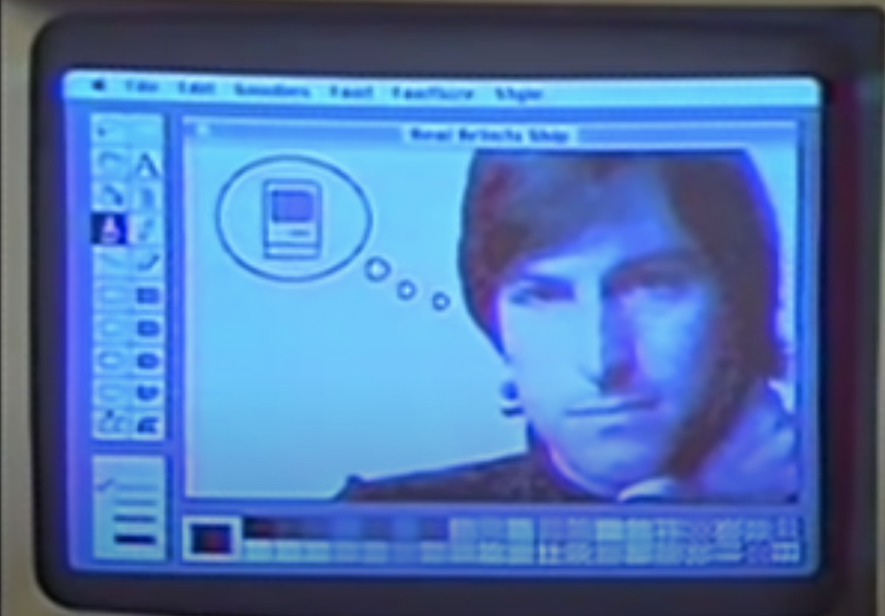 

**It used Motorola’s 16-bit 68000 CPU, and had 64 KB of ROM (Read Only Memory), to support the GUI.**

#### Classic Mac OS (1984 to 2001)
 
**System 1 in 1984 Macintoch 128k** 
**The Macintosh has evolved over the years. Subsequent Motorola CPUs were true 32-bit systems, and later(System 7 1991) still Apple moved to IBM PowerPC CPUs, with RISC 32-bit (and later, 64-bit) architecture.** 

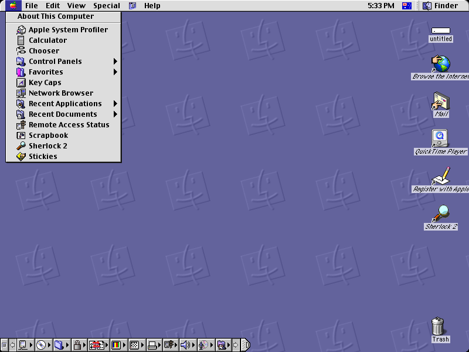 
**System 9 in 1999**
 

#### BSD 
**In 2001 Apple made a major operating system change, releasing Mac OS X, with a new version of the Macintosh GUI on top of Berkeley UNIX. And in 2005 Apple announced that it would be switching to Intel x86 processors.**

**About Berkeley Unix and The Difference with Unix:** 
**[Unix TimeLineBy Eraserhead1, Infinity0, Sav_vas - Levenez Unix History Diagram, Information on the history of IBM&#039;s AIX on ibm.com, CC BY-SA 3.0](https://commons.wikimedia.org/w/index.php?curid=1801948)** 
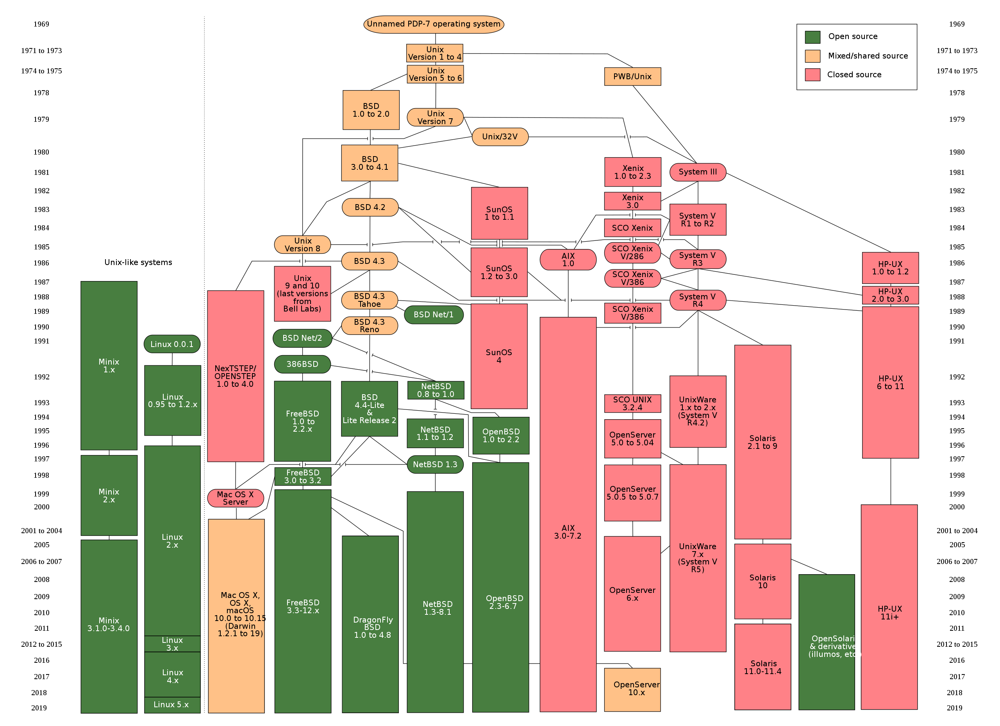 

**In this Photo. We can See a Keyword That Be mentioned in several times -- BSD** 

**The Berkeley Software Distribution (BSD) was an operating system based on Research Unix. As We can See that in the Timeline Above. There are many Branch of BSD: **
**The current three mainstream BSD systems are FreeBSD, NetBSD and OpenBSD:** 
* **FreeBSD is the most popular, targeting high performance and ease of use. Supports 32-bit and 64-bit processors from Intel and AMD.**

* **NetBSD is designed to run on almost any architecture and supports more architectures.**

* **OpenBSD is designed for maximum security, which is not only its declared function, it is also true in practice. It is designed for key systems of banks and other important institutions.**
 

**There are two other important BSD systems DragonFly BSD and Darwin namely Mac OS X. **
**The design goal of DragonFly BSD is to provide an operating system such as a computer cluster running in a multi-threaded environment. **

**Mac OS X and Also IOS is actually based on Darwin, and Darwin is based on BSD. It is a bit different from other BSDs. Although the underlying core and other software are open source BSD code, most of the operating system is closed source Mac OS code that is not public. Apple has developed Mac OS X and iOS on the basis of BSD, so that they don’t have to write the bottom layer of the operating system**
 

**We will Introduce BSD License Soon**
 

#### Linux
**In the Last Note ([Minix](https://github.com/Angold-4/OSDI/blob/master/Chapters/Chapter1/3MINIX.md)). We Introduced the origin of Minix and Why we need Minix** 
**In the Linus Torvalds' autobiography(Just For Fun). We can find the Origin of linux:** 

> **Shortly after MINIX was released, a USENET newsgroup, comp.os.minix, was formed to discuss it. Within weeks, it had 40,000 subscribers, most of whom wanted to add vast numbers of new features to MINIX to make it bigger and better (well, at least bigger). Every day, several hundred of them offered suggestions, ideas, and frequently snippets of source code. The author of MINIX was able to successfully resist this onslaught for several years, in order to keep MINIX clean enough for students to understand and small enough that it could run on computers that students could afford. For people who thought little of MS-DOS, the existence of MINIX (with source code) as an alternative was even a reason to finally go out and buy a PC.**
 

> **One of these people was a Finnish student named Linus Torvalds. Torvalds installed MINIX on his new PC and studied the source code carefully. Torvalds wanted to read USENET newsgroups (such as comp.os.minix) on his own PC rather than at his university, but some features he needed were lacking in MINIX, so he wrote a program to do that, but soon discovered he needed a different termi- nal driver, so he wrote that too. Then he wanted to download and save postings, so he wrote a disk driver, and then a file system. By Aug. 1991 he had produced a primitive kernel. On Aug. 25, 1991, he announced it on comp.os.minix. This announcement attracted other people to help him, and on March 13, 1994 Linux 1.0 was released. Thus was Linux born.** 

**[Linus Github Pages(till 2020.9.1)](https://github.com/torvalds)** 
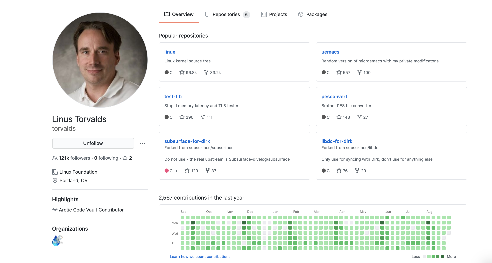

**Linus Also write in his Book(Just For Fun) that this Book (Operating Systems Design and Implementation) is the book that influenced him most**
 

#### GNU and GPL

**Development of the GNU operating system was initiated by Richard Stallman while he worked at MIT Artificial Intelligence Laboratory. It was called the GNU Project, and was publicly announced on September 27, 1983, on the net.unix-wizards and net.usoft newsgroups by Stallman. Software development began on January 5, 1984, when Stallman quit his job at the Lab so that they could not claim ownership or interfere with distributing GNU components as free software. Richard Stallman chose the name by using various plays on words, including the song The Gnu.**
 

> **In 1984, began to develop software such as editor Emacs. In 1985, the GNU Manifesto was issued. In 1989, the GNU General Public License was published. Other parts of the GNU project, such as editors, compilers(gcc), shells, etc., have been completed, and the operating system core is missing.**

**In 1991, Linux appeared. In 1993, FreeBSD was released. All software running in user space in the GNU project can be used on Linux or FreeBSD. Many developers turn to Linux or FreeBSD. Among them, Linux has become a common GNU project software operating platform. Richard Stallman argued that the Linux operating system uses many GNU project software and should be renamed GNU/Linux, but it has not been unanimously approved by the Linux community, which has led to a GNU/Linux naming dispute.**
 

**Linux uses the GNU General Public User License or GPL. If you modify the Linux kernel and distribute it, you must release the modified original code. BSD uses BSD user authorization. If you modify the BSD core or release it, you do not need to make the code public. You are free to do whatever you want with your BSD code. You are not obligated to release the modified code, of course you can release it if you want.**

**[GNU and Linux](https://www.fsf.org/community/)** 
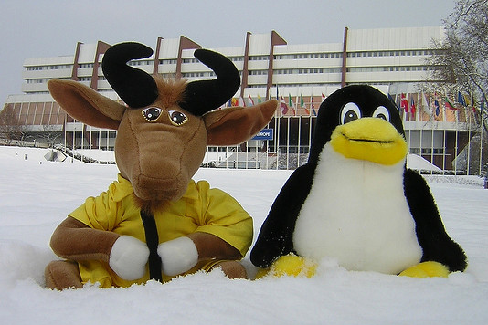
 

#### Microsoft Windows
**To compete with the Macintosh, Microsoft invented Windows. Originally Windows was just a graphical environment on top of 16-bit MS-DOS (i.e., it was more like a shell than a true operating system). However, current versions of Windows are descendants of Windows NT, a full 32-bit system, rewritten from scratch.**
