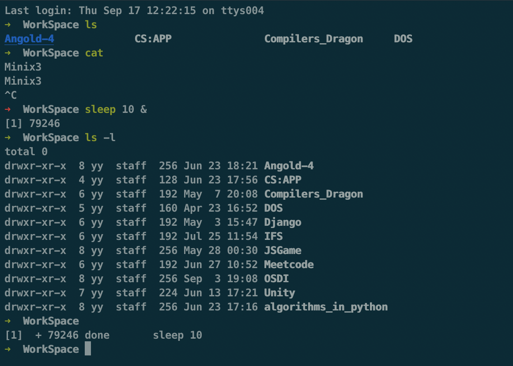
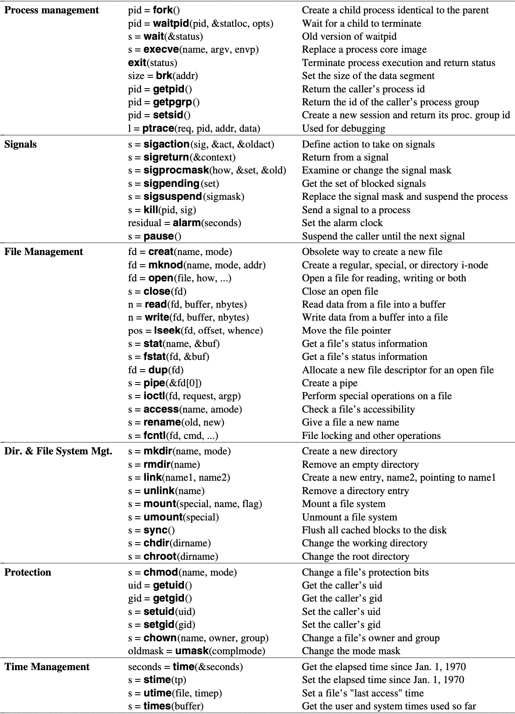
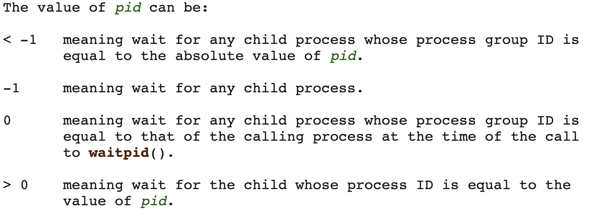
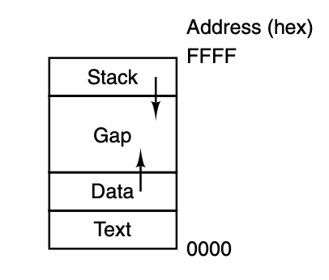
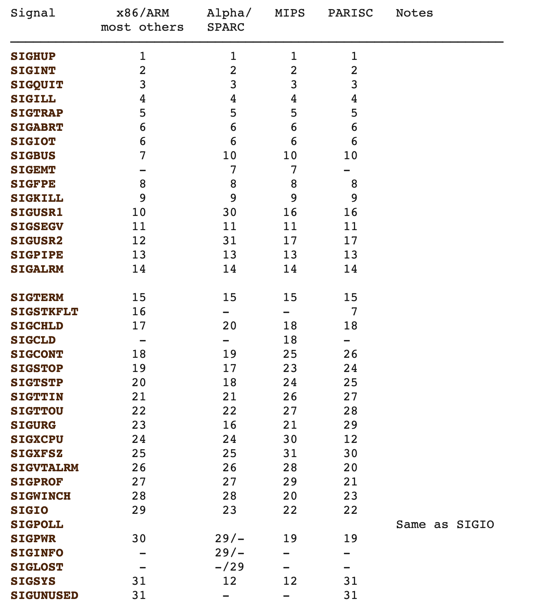
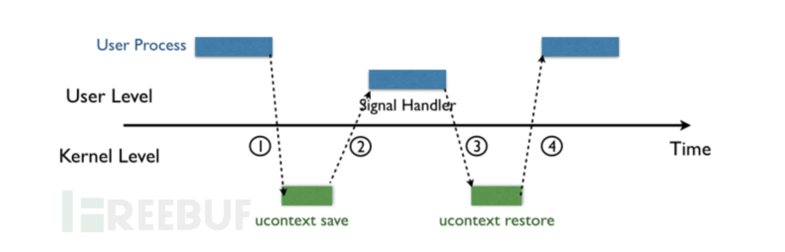
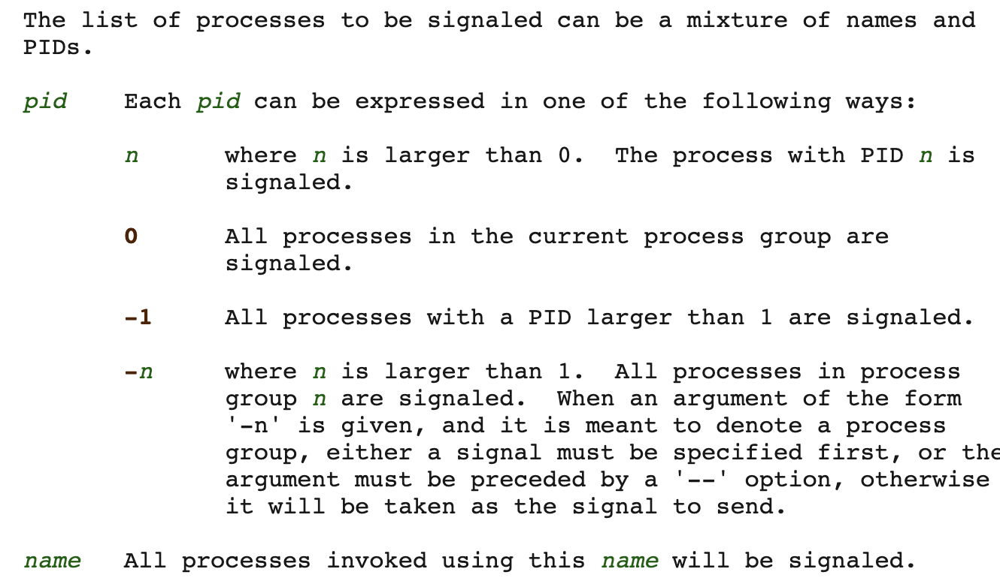
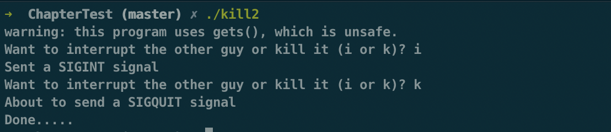
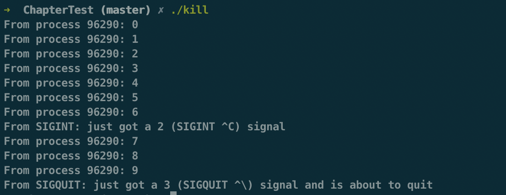

### Operating Systerms Design and Implementation Notes

##### By Jiawei Wang
<br>

## Shell

**In the First Note. We mentioned that: The operating system is the code that carries out the system calls.<br>
Editors, compilers, assemblers, linkers, and command interpreters definitely are not part of the operating system, even though they are important and useful.**
<br>
**The MINIX 3 command interpreter, called the Shell.**<br>
**It is also the primary interface between a user sitting at his terminal and the operating system, unless the user is using a graphical user interface.**<br>



<br>

**When any user logs in, a shell is started up. The shell has the terminal as standard input and standard output (STDIN STDOUT). It starts out by typing the prompt, a character such as a dollar sign, which tells the user that the shell is waiting to accept a command. If the user now types**<br>
```shell
date
```
<br>

<br>

**for example, the shell creates a child process and runs the date program as the child. While the child process is running, the shell waits for it to terminate. When the child finishes, the shell types the prompt again and tries to read the next input line.**<br>

### Example:
**Considering you input that command in shell:**<br>
```shell
cp file1 file2
```
**Used to copy file1 to file2. After the shell has forked, the child process locates and executes the file cp and passes to it the names of the source and target files.**<br>
**The main program of cp (and main program of most other C programs) contains the declaration:**
```c
main(argc, argv, envp)
```
* **where argc is a count of the number of items on the command line, including the program name. For the example above, argc is 3.**
* **The second parameter, argv, is a pointer to an array. Element i of that array is a pointer to the i-th string on the command line. In our example, argv[0] would point to the string ‘‘cp’’, argv[1] would point to the string ‘‘file1’’, and argv[2] would point to the string ‘‘file2’’.**
* **The third parameter of main, envp, is a pointer to the environment, an array of strings containing assignments of the form name=value used to pass information such as the terminal type and home directory name to a program. In Fig. 1-10, no environment is passed to the child, so the third parameter of execve is a zero.**

<br>

# 5. System Calls (1)

<br>

**In a sense, making a system call is like making a special kind of procedure call, only system calls enter the kernel or other privileged operating system components and procedure calls do not.**
<br><br>
**MINIX 3 has a total of 53 main system calls:**<br>
<br>


<!-- vim-markdown-toc GFM -->

* [1. Systerm Calls For Process Management](#1-systerm-calls-for-process-management)
    * [fork -- create a child process](#fork----create-a-child-process)
    * [waitpid -- wait for process to change state](#waitpid----wait-for-process-to-change-state)
    * [wait -- old wait for process to change state](#wait----old-wait-for-process-to-change-state)
    * [execve -- execute program](#execve----execute-program)
    * [exit -- cause normal process termination](#exit----cause-normal-process-termination)
    * [brk, sbrk - change data segment size](#brk-sbrk---change-data-segment-size)
    * [getpid -- get process identification](#getpid----get-process-identification)
    * [getpgrp -- get process group id](#getpgrp----get-process-group-id)
    * [ptrace -- process trace](#ptrace----process-trace)
* [2. Systerm Calls for Signaling](#2-systerm-calls-for-signaling)
    * [sigaction -- examine and change a signal action](#sigaction----examine-and-change-a-signal-action)
    * [sigreturn -- return from signal handler and cleanup stack frame](#sigreturn----return-from-signal-handler-and-cleanup-stack-frame)
    * [signal - ANSI C signal handling](#signal---ansi-c-signal-handling)
    * [kill -- terminate  / send signal to a process](#kill----terminate---send-signal-to-a-process)
    * [alarm - set an alarm clock for delivery of a signal](#alarm---set-an-alarm-clock-for-delivery-of-a-signal)
    * [pause - suspended process and wait for a signal](#pause---suspended-process-and-wait-for-a-signal)

<!-- vim-markdown-toc -->


## 1. Systerm Calls For Process Management
<br>

### fork -- create a child process

**[fork](https://man7.org/linux/man-pages/man2/fork.2.html)( ) creates a new process by duplicating the calling process.<br>
The new process is referred to as the child process.  The calling process is referred to as the parent process.**<br>
* **After the fork, the original process and the copy (the parent and child) go their separate ways.**
* **In most cases, after a fork, the child will need to execute different code from the parent**
* **On success: the PID of the child process is returned in the parent, and 0 is returned in the child.**
* **On failure, -1 is returned in the parent, no child process is created, and errno is set appropriately.**
<br>

### waitpid -- wait for process to change state
**[waitpid](https://man7.org/linux/man-pages/man2/waitpid.2.html)(pid_t pid, int wstatus(pointer), int options)**<br>
**To wait for the child to finish, the parent executes a waitpid system call, which just waits until the child terminates (any child if more than one exists).**
* **The First argument(pid) default is -1: detail see below:** <br>
<br>
* **The Second argument(wstatus) is a pointer. which point to the exit value of the child process(default is Null)**
* **The Third argument default is 0. For the detail you can check this [website](https://man7.org/linux/man-pages/man2/waitpid.2.html)**
* **In normal case: returns the process ID of the child whose state has changed or -1**
<br>

### wait -- old wait for process to change state
**[wait](https://man7.org/linux/man-pages/man2/waitpid.2.html) (wstatus(pointer))**<br>
**The waitpid call replaces the previous wait call, which is now obsolete but is provided for reasons of backward compatibility.**
```c
/* example */
#include <stdlib.h>
#include <unistd.h>
#include <sys/types.h>
#include <sys/wait.h>
main()
{
    pid_t pid;
    int status, i;
    if(fork() == 0)
    {
        printf("This is the child process. pid =%d\n", getpid());
        exit(5);
     }
    else
    {
        sleep(1);
        printf("This is the parent process, wait for child...\n");
        pid = wait(&status);
        i = WEXITSTATUS(status);
        printf("child's pid =%d . exit status=^d\n", pid, i);
    }
}
```
**output:**<br>
```
This is the child process. pid =67313
This is the parent process, wait for child...
child's pid =67313 . exit status=^d
```
**If we remove the sleep(1) in the parent process, the output will be:**
```
This is the parent process, wait for child...
This is the child process. pid =67672
child's pid =67672 . exit status=^d
```
**```wait()``` will temporarily stop the execution of the current process until a signal comes or the child process ends.**
<br>

### execve -- execute program
**[execve](https://man7.org/linux/man-pages/man3/exec.3.html) (command, parameters, env)**<br>
**In the most general case, execve has three parameters: the name of the file to be executed, a pointer to the argument array, and a pointer to the environment**<br>

* **There are many different types of exeve for difference [use](https://man7.org/linux/man-pages/man3/exec.3.html): execl, execlp, execle, execv, execvp, execvpe**
* **The exec functions return only if an error has occurred. -1 and errno is set to indicate the error.**

```c
/*A stripped-down shell */
#define TRUE 1

while (TRUE){                            /* repeat forever */
    typt_prompt()                        /* display prompt on the screen */
    read_command(command, parameters);   /* read input from terminal */

    if (folk()!=0){                      /* fork off child process */
        /*parent code.*/
        waitpid(-1, &status, 0);         /* wait for child to exit */
        }
    else{
        /*child code.*/
        execve(command, parameters, 0);  /* execute command */
        }
    }

```
<br>

### exit -- cause normal process termination
**[exit](https://www.man7.org/linux/man-pages/man3/exit.3.html) (int status)**<br>
**The exit function causes normal process termination and the least significant byte of status (i.e., status & 0xFF) is returned to the parent (see wait(2)).**
<br>

### brk, sbrk - change data segment size
**[brk](https://man7.org/linux/man-pages/man2/brk.2.html) (void addr(pointer))**<br>
**[sbrk](https://man7.org/linux/man-pages/man2/brk.2.html) (intptr_t increment)**<br>
**brk and sbrk change the location of the program break, which defines the end of the process's data segment (i.e., the program break is the first location after the end of the uninitialized data segment)**<br>

<br>
**Processes in MINIX 3 have their memory divided up into three segments: the text segment (i.e., the program code), the data segment (i.e., the variables), and the stack segment. <br>The data segment grows upward and the stack grows down-ward. Between them is a gap of unused address space. The stack grows into the gap automatically, as needed, but expansion of the data segment is done explicitly by using a system call, brk, which specifies the new address where the data segment is to end.**<br>

**As a convenience for programmers, a library routine sbrk is provided that also changes the size of the data segment, only its parameter is the number of bytes to add to the data segment (negative parameters make the data segment smaller).**
<br>


### getpid -- get process identification
**[getpid](https://man7.org/linux/man-pages/man2/getpid.2.html) ( ) returns the process ID (PID) of the calling process.**
<br>

### getpgrp -- get process group id
**[getpgrp](https://man7.org/linux/man-pages/man2/getpgrp.2.html) ( ) returns the process group ID of the calling process**<br>
**[From Wikipedia](https://en.wikipedia.org/wiki/Process_group): A process group denotes a collection of one or more processes. Among other things, a process group is used to control the distribution of a signal; when a signal is directed to a process group, the signal is delivered to each process that is a member of the group.**
<br>


### ptrace -- process trace
**It is used by debugging programs to control the program being debugged. It allows the debugger to read and write the controlled process’ memory and manage it in other ways.**<br>
**For more: [man7.org](https://man7.org/linux/man-pages/man2/ptrace.2.html)**
<br><br>

## 2. Systerm Calls for Signaling

**Although most forms of interprocess communication are planned, situations exist in which unexpected communication is needed. For example, if a user accidently tells a text editor to list the entire contents of a very long file, and then realizes the error, some way is needed to interrupt the editor. <br><br>In MINIX 3, the user can hit the CTRL-C key on the keyboard, which sends a signal to the editor. The editor catches the signal and stops the print-out. Signals can also be used to report certain traps detected by the hardware, such as illegal instruction or floating point overflow. Timeouts are also implemented as signals.**
<br>

### sigaction -- examine and change a signal action
**[sigaction](https://man7.org/linux/man-pages/man2/sigaction.2.html) (int signum, const struct sigaction act(pointer), struct sigaction oldact(pointer) )**<br>
**The sigaction() system call is used to change the action taken by a process on receipt of a specific signal**<br>

* **When a signal is sent to a process that has not announced its willingness to accept that signal, the process is simply killed without further ado.**
* **The first argument(int signum) is an integer which direct to a specific signal, detail see below:**<br>


* **signum specifies the signal and can be any valid signal except SIGKILL and SIGSTOP.**
* **The Second arg act is a pointer which to a signal hander program in the storiage**
* **The Third arg oldact is also a pointer like act. Which point to the address stored by the original handler.(If is Null means don't need to return previous program)**
* **If act is non-NULL, the new action for signal signum is installed from act. If oldact is non-NULL, the previous action is saved in oldact.**
* **After a sigaction call, if a signal of the relevant type is generated (e.g., by pressing CTRL-C), the state of the process is pushed onto its own stack, and then the signal handler is called.**<br>
<br>

**Example:**<br>
**Instead of providing a function to catch a signal, the program may also specify the constant SIG_IGN to have all subsequent signals of the specified type ignored, or SIG_DFL to restore the default action of the signal when it occurs. The default action is either to kill the process or ignore the signal, depending upon the signal. As an example of how SIG_IGN is used, consider what happens when the shell forks off a background process as a result of.**
```
command &
```
<br>

**It would be undesirable for a SIGINT signal (generated by pressing CTRL-C) to affect the background process, so after the fork but before the exec, the shell does**

```
sigaction(SIGINT, SIG_IGN, NULL);
```

<br>

**and**

```
sigaction(SIGQUIT, SIG_IGN, NULL);
```

**To disable the SIGINT and SIGQUIT signals.**
<br>

### sigreturn -- return from signal handler and cleanup stack frame
**[sigreturn](https://www.man7.org/linux/man-pages/man2/sigreturn.2.html)**<br>
**When the signal handling procedure is done, it calls sigreturn to continue where it left off before the signal passively**

**Signal handling has been an integral part of UNIX (and UNIX-like) systems ever since the very first implementation by Dennis Ritchie in the early 1970s.**
> **Signals are an extremely powerful mechanism to deliver asynchronous notifications directly to a process or thread. They are used to kill processes, to tell them that timers have expired, or to notify them about exceptional behavior. The UNIX design has spawned a plethora of UNIX-like “children” of which GNU Linux, several flavours of BSD, Android, iOS/Mac OS X, and Solaris are perhaps the best known ones in active use today. While each flavor handles signals in slightly different ways, the different implementations are all very similar.**
<br>


* **As shown in the figure below, when the kernel delivers a signal to a process, the process will be temporarily suspended and enter the kernel(1)**<br>
<br>
* **Then the kernel saves the corresponding context for the process and jumps to the previously registered signal handler to process the corresponding signal(2)**<br>
* **When the signal handler returns (3), the kernel restores the previously saved context for the process**<br>
* **The execution of the final recovery process (4)**<br>

**If You want to know more about Signal (System Call). You can read this Note:<br>[Sigreturn Oriented Programming Attack Note by Jiawei Wang](https://github.com/Angold-4/OSDI/blob/master/Chapters/Chapter1/SROP/SROPAttack.md)**
<br>

### signal - ANSI C signal handling
```c
#include <signal.h>

typedef void (*sighandler_t)(int);
```
**sighandler_t [signal](https://man7.org/linux/man-pages/man2/signal.2.html) (int signum, sighandler_t handler)**<br>

** signal ( ) sets the disposition of the signal signum to handler, which is either SIG_IGN, SIG_DFL, or the address of a programmer-defined function (a "signal handler").**

**Let's see an [example program](https://www.geeksforgeeks.org/signals-c-language/) in C to understand:**<br>

```c
// default Signal Handler 
#include<stdio.h>
#include<signal.h>

int main()
{
    signal(SIGINT, handle_sigint);
    while (1)
    {
        printf(“hello world\n”);
        sleep(1);
    }
    return 0;
}

```
**Output : Print hello world infinite times. If user presses ctrl-c to terminate the process because of SIGINT signal sent and its default handler to terminate the process.**

```
hello world   
hello world         
hello world         
terminated    
```

**User Defined Signal Handlers:**<br>

```c
// default Signal Handler 
#include<stdio.h>
#include<signal.h>

// Handler for SIGINT, caused by
// Ctrl-C at keyboard
void handle_sigint(int sig)
{
    printf("Caught signal %d\n", sig);
}

int main()
{
    signal(SIGINT, handle_sigint);
    while (1) ;
    return 0;
}
```

**Output :**<br>

```
^CCaught signal 2  // when user presses ctrl-c
^CCaught signal 2
```


### kill -- terminate  / send signal to a process
**[kill](https://man7.org/linux/man-pages/man1/kill.1.html) [-signal|-s signal|-p] [-q value] [-a] [--timeout milliseconds signal] [--] pid|name...**<br>

**If no signal is specified, the TERM signal is sent.  The default action for this signal is to terminate the process.**<br>
**Getting back to the example of background processes used above, suppose a background process is started up, but later it is decided that the process should be terminated.**<br>

* **For the detail of the First argument. Please check that [Link](https://man7.org/linux/man-pages/man1/kill.1.html)**

* **The Second argument pid or name is that:**<br>


<br>

**Another Use of kill syscall is that kill can send message between two processes:**<br>
**To send a signal to another process, we need to use the Unix system [kill()](https://man7.org/linux/man-pages/man2/kill.2.html). The following is the prototype of kill():<br>**
```c
int  kill(pid_t pid, int sig)
```
<br>

**[Send signal to a process](http://www.csl.mtu.edu/cs4411.ck/www/NOTES/signal/kill.html)**
* **System call kill() takes two arguments. The first, pid, is the process ID you want to send a signal to, and the second, sig, is the signal you want to send. Therefore, you have to find some way to know the process ID of the other party.**
* **If the call to kill() is successful, it returns 0; otherwise, the returned value is negative.<br>**


**Here is an Example of kill used in send signal:**<br>

```c
/* ---------------------------------------------------------------- */
/* PROGRAM  process-a.c:                                            */
/*   This program demonstrates the use of the kill() system call.   */
/* This process must run before process-b.c because it creates a    */
/* shared memory segment for storing its process id.                */
/* ---------------------------------------------------------------- */

#include  <stdio.h>
#include  <sys/types.h>
#include  <signal.h>
#include  <sys/ipc.h>
#include  <sys/shm.h>

/* ---------------------------------------------------------------- */
/*                 signal handler function prototypes               */
/* ---------------------------------------------------------------- */

void  SIGINT_handler(int);         /* for SIGINT                    */
void  SIGQUIT_handler(int);        /* for SIGQUIT                   */

/* ---------------------------------------------------------------- */
/*                         global variable                          */
/* ---------------------------------------------------------------- */
int   ShmID;                       /* shared memory ID              */
pid_t *ShmPTR;                     /* shared memory pointer         */

/* ---------------------------------------------------------------- */
/*                   main program starts here                       */
/* ---------------------------------------------------------------- */

void main(void)
{
     int   i;
     pid_t pid = getpid();
     key_t MyKey;

     if (signal(SIGINT, SIGINT_handler) == SIG_ERR) {
          printf("SIGINT install error\n");
          exit(1);
     }
     if (signal(SIGQUIT, SIGQUIT_handler) == SIG_ERR) {
          printf("SIGQUIT install error\n");
          exit(2);
     }

     MyKey   = ftok(".", 's');     /* create a shared memory segment*/
     ShmID   = shmget(MyKey, sizeof(pid_t), IPC_CREAT | 0666);
     ShmPTR  = (pid_t *) shmat(ShmID, NULL, 0);
     *ShmPTR = pid;                /* save my pid there*/

     for (i = 0; ; i++) {
          printf("From process %d: %d\n", pid, i);
          sleep(1);
     }
}

/* ---------------------------------------------------------------- */
/* FUNCTION  SIGINT_handler:                                        */
/*    SIGINT signal handler.  It only reports that a Ctrl-C has     */
/* been received.   Nothing else.                                   */
/* ---------------------------------------------------------------- */

void  SIGINT_handler(int sig)
{
     signal(sig, SIG_IGN);
     printf("From SIGINT: just got a %d (SIGINT ^C) signal\n", sig);
     signal(sig, SIGINT_handler);
}

/* ---------------------------------------------------------------- */
/* FUNCTION  SIGQUIT_handler:                                       */
/*    SIGQUIT signal handler.   When SIGQUIT arrives, this handler  */
/* shows a message, removes the shared memory segment, and exits.   */
/* ---------------------------------------------------------------- */

void  SIGQUIT_handler(int sig)
{
     signal(sig, SIG_IGN);
     printf("From SIGQUIT: just got a %d (SIGQUIT ^\\) signal"
                          " and is about to quit\n", sig);
     shmdt(ShmPTR);
     shmctl(ShmID, IPC_RMID, NULL);          /*shared memory control*/
                                             /*quit*/
     exit(3);
}
```

**If we run this program above. Obviously. It should be like that:<br>**

```
From process 92982: 0
From process 92982: 1
From process 92982: 2
From process 92982: 3
From process 92982: 4
From process 92982: 5
From process 92982: 6
From process 92982: 7
From process 92982: 8
From process 92982: 9
From process 92982: 10
From process 92982: 11
From process 92982: 12
From process 92982: 13
From process 92982: 14
From process 92982: 15
.......Iteration Forever
```

**If we press Ctrl-C. It should be like that:<br>**

```
From process 92982: 15
From SIGINT: just got a 2 (SIGINT ^C) signal
From process 92982: 16
.......Iteration Forever
```

**If we press Ctrl-\ (SIGQUIT):<br>**

```
From SIGQUIT: just got a 3 (SIGQUIT ^\) signal and is about to quit
(No more interation)
```

**The Program runs as expected. Now. Let's see another program:**<br>

```c
/* ---------------------------------------------------------------- */
/* PROGRAM  process-b.c:                                            */
/*   This program demonstrates the use of the kill() system call.   */
/* This process reads in commands and sends the corresponding       */
/* to process-a.  Note that process-a must run before process-b for */
/* process-b to retrieve process-a's pid through the shared memory  */
/* segment created by process-a.                                    */
/* ---------------------------------------------------------------- */

#include  <stdio.h>
#include  <sys/types.h>
#include  <signal.h>
#include  <sys/ipc.h>
#include  <sys/shm.h>

void  main(void)
{
     pid_t   pid;
     key_t MyKey;
     int   ShmID;
     pid_t *ShmPTR;
     char  line[100], c;
     int   i;
     
     MyKey   = ftok(".", 's');          /* obtain the shared memory */
     ShmID   = shmget(MyKey, sizeof(pid_t), 0666);
     ShmPTR  = (pid_t *) shmat(ShmID, NULL, 0);
     pid     = *ShmPTR;                 /* get process-a's ID       */
     shmdt(ShmPTR);                     /* detach shared memory     */
     
     while (1) {                        /* get a command            */
          printf("Want to interrupt the other guy or kill it (i or k)? ");
          gets(line);
          for (i = 0; !(isalpha(line[i])); i++)
               ;
               c = line[i];
          if (c == 'i' || c == 'I') {   /* send SIGINT with kill()  */
               kill(pid, SIGINT);
               printf("Sent a SIGINT signal\n");
          }
          else if (c == 'k' || c == 'K') {
               printf("About to send a SIGQUIT signal\n");
               kill(pid, SIGQUIT);      /* send SIGQUIT with kill() */
               printf("Done.....\n");
               exit(0);
          }
          else
               printf("Wrong keypress (%c).  Try again\n", c);
     }
}
```

* **This program requests the shared memory segment created by the previous program. Since both programs use ftok() to create the key, they should be in the same directory.**
* **Then, it retrieves the process ID stored in the shared memory segment and enters an infinite loop asking for a single character input.**
* **If the input is i, a SIGINT is sent to the other process with kill().**
* **If the input is k, a SIGQUIT is sent to the other process with kill(). After this is done, this program exits.**
<br>

**As you can see: With ```kill ( )```, we do not need to actually press a key to generate a particular signal. Moreover, some signals have no corresponding keys.**
<br>

**Now, let us see how to play with these two programs. The first program is called process-a and the second process-b. Because process-a must create a shared memory segment and save its process ID there, it must run first. So, run this program in one window until some output lines are shown. At this moment, the shared memory has been created and the process ID stored properly.**<br>

**Then, move to another window and run process-b. If you type i, process-b sends a SIGINT to process-a, and if you type k, process-b send a SIGQUIT to process-a.**
<br>
**Hitting CTRL-C is not the only way to send a signal. The kill system call allows a process to signal another process (provided they have the same UID— unrelated processes cannot signal each other)**
<br>

**As you can see : We use ```kill ()``` and C achieve Communication between processes successfully!**<br>

<br>
<br>
<br>


### alarm - set an alarm clock for delivery of a signal

**unsigned int [alarm](https://www.man7.org/linux/man-pages/man2/alarm.2.html) (unsigned int seconds);**<br>
* **alarm() arranges for a SIGALRM signal to be delivered to the calling process in seconds seconds.**
* **If seconds is zero, any pending alarm is canceled.**
* **In any event any previously set alarm() is canceled.**

**For many real-time applications, a process needs to be interrupted after a specific time interval to do something, such as to retransmit a potentially lost packet over an unreliable communication line. To handle this situation, the alarm system call has been provided.**<br>

**The parameter specifies an interval, in seconds, after which a SIGALRM signal is sent to the process. A process may only have one alarm outstanding at any instant.**<br>

**Example:**<br>

> **If an alarm call is made with a parameter of 10 seconds, and then 3 seconds later another alarm call is made with a parameter of 20 seconds, only one signal will be generated, 20 seconds after the second call. The first signal is canceled by the second call to alarm. If the parameter to alarm is zero, any pending alarm signal is canceled. If an alarm signal is not caught, the default action is taken and the signaled process is killed.**

### pause - suspended process and wait for a signal
```
#include <unistd.h>
```
**[int](https://www.man7.org/linux/man-pages/man2/pause.2.html) pause (void)**

**It sometimes occurs that a process has nothing to do until a signal arrives. For example, consider a computer-aided-instruction program that is testing reading speed and comprehension. It displays some text on the screen and then calls alarm to signal it after 30 seconds. While the student is reading the text, the pro- gram has nothing to do. It could sit in a tight loop doing nothing, but that would waste CPU time that another process or user might need. A better idea is to use pause, which
tells MINIX 3 to suspend the process until the next signal.**<br>


