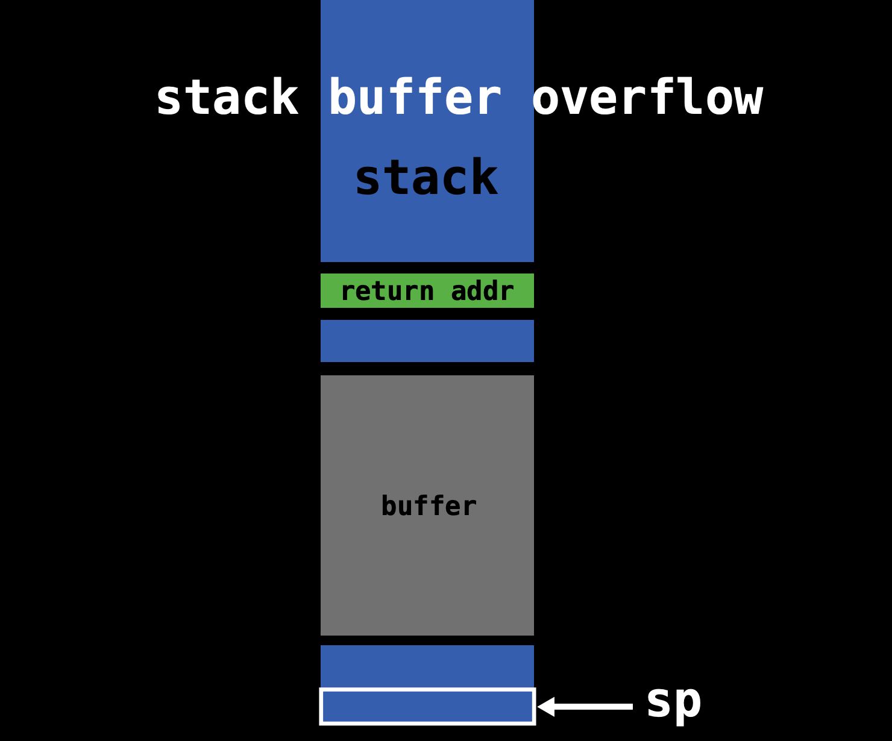
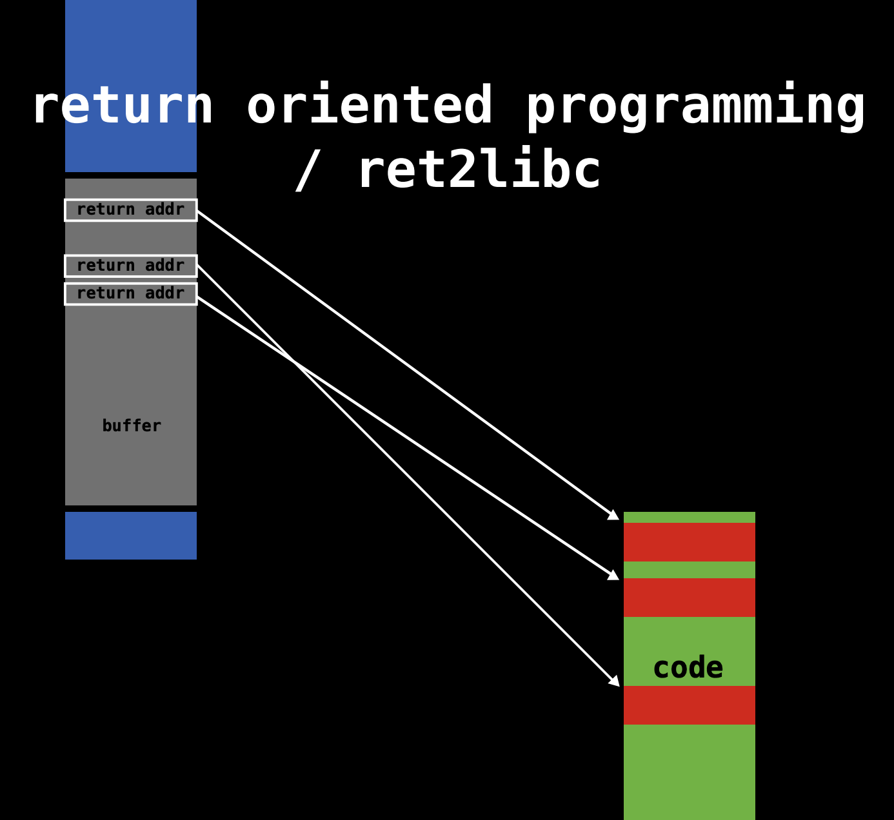
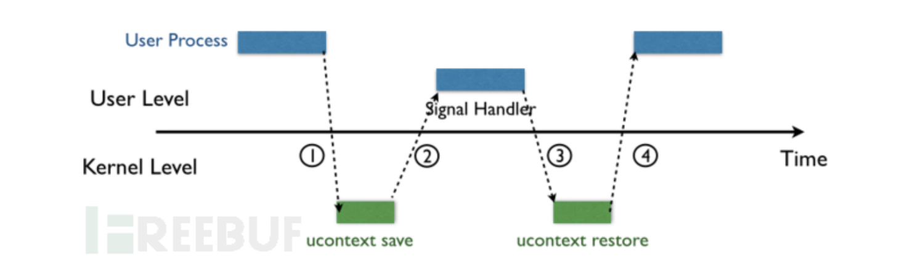
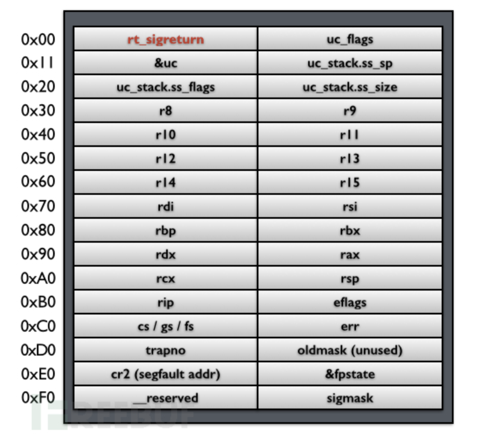
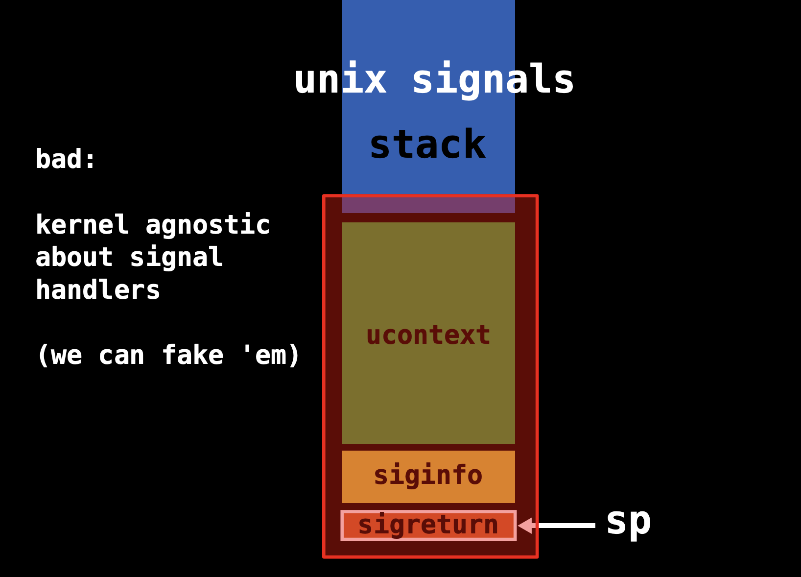
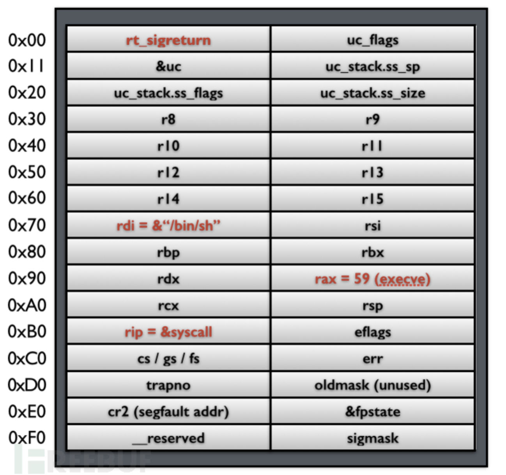
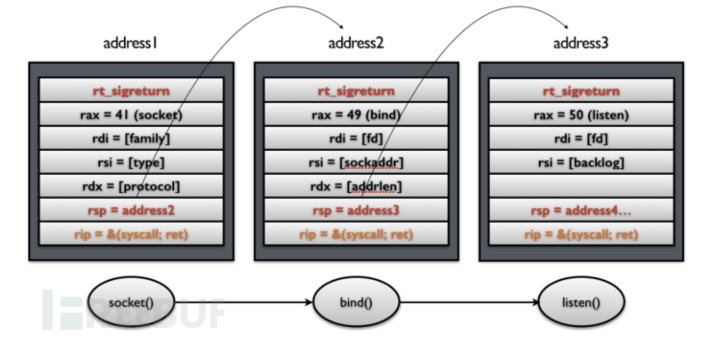
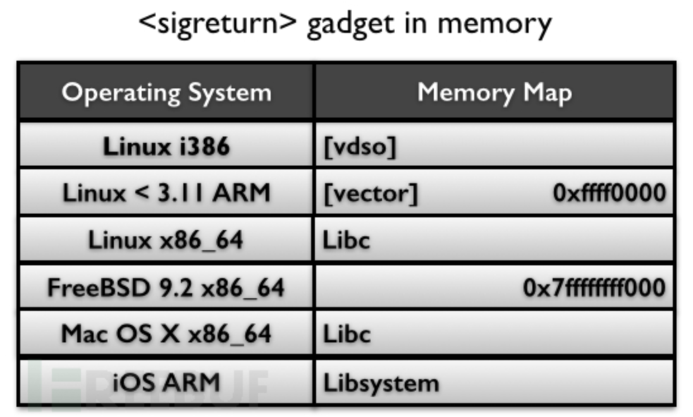
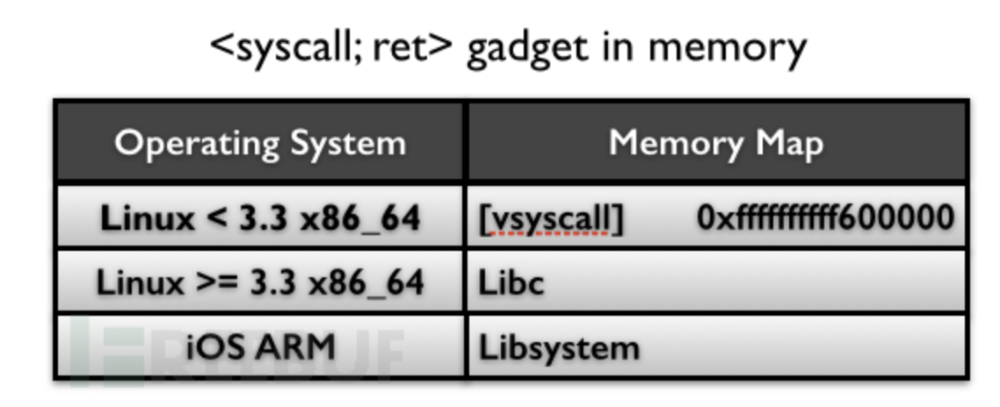

# Sigreturn Oriented Programming Attack

##### By Jiawei Wang

**This is my Notes for This Paper : [Framing Signals — A Return to Portable Shellcode](http://www.ieee-security.org/TC/SP2014/papers/FramingSignals-AReturntoPortableShellcode.pdf)**<br>
**Which Won the [Best Student Paper](http://www.ieee-security.org/TC/SP2014/donors.html) in 35th IEEE Symposium on Security and Privacy. 2014**
<br>


<!-- vim-markdown-toc GFM -->

* [1.Return Oriented Programming Attack](#1return-oriented-programming-attack)
    * [Ways Oprating System Defence](#ways-oprating-system-defence)
        * [Data Execution Protection(DEP)](#data-execution-protectiondep)
        * [Address Space Layout Randomization(ASLR)](#address-space-layout-randomizationaslr)
        * [Stack Destruction Detection(SDD)](#stack-destruction-detectionsdd)
    * [Return Oriented Programming Attack](#return-oriented-programming-attack)
        * [The Core of ROP](#the-core-of-rop)
* [2. Sigreturn Oriented Programming Attack](#2-sigreturn-oriented-programming-attack)
    * [Signal in Unix-like System](#signal-in-unix-like-system)
    * [Signal Mechanism Defect Utilization](#signal-mechanism-defect-utilization)
    * [Example: One of the Simplest Attacks](#example-one-of-the-simplest-attacks)
    * [System Call Chains](#system-call-chains)
    * [Two Gadgets](#two-gadgets)
* [3. The Prevention of SROP Attack](#3-the-prevention-of-srop-attack)
    * [1.Gadgets Prevention](#1gadgets-prevention)
    * [2.Signal Frame Canaries](#2signal-frame-canaries)
    * [3.Break Kernel Agnostic](#3break-kernel-agnostic)

<!-- vim-markdown-toc -->

## 1.Return Oriented Programming Attack
### Ways Oprating System Defence
#### [Data Execution Protection(DEP)](https://en.wikipedia.org/wiki/Executable_space_protection#Windows)
**In computer security, executable-space protection marks memory regions as non-executable, such that an attempt to execute machine code in these regions will cause an exception.**

#### [Address Space Layout Randomization(ASLR)](https://en.wikipedia.org/wiki/Address_space_layout_randomization)
**Address space layout randomization (ASLR) is a computer security technique involved in preventing exploitation of memory corruption vulnerabilities. In order to prevent an attacker from reliably jumping to, for example, a particular exploited function in memory, ASLR randomly arranges the address space positions of key data areas of a process, including the base of the executable and the positions of the stack, heap and libraries.**

#### [Stack Destruction Detection(SDD)](https://github.com/Angold-4/Angold4-CSAPP/blob/master/ChapterNotes/Chapter3/canary.md)
**Canary is a Test area in Stack. Which helps to avoid Stack Overflow**<br>
**Although The Stack Randomization(ASLR) Can counter some forms of attack**<br>
**Random loss to brute force** You will never know what the power of attacker


**Let's see a normal stack:**
```
-------------------------------------
|                                   |
|___________________________________| --> Caller's shallow frame
|          Return address           |
-------------------------------------
|                                   |
|                                   | --> Buffer
|___________________________________|
|             Canary                |
------------------------------------- --> buf = %rsp
```
**Store a special Canary Value between any local buffer and the Caller's shallow frame**<br>

**Let's see an example to figure out that:**
```c
/*echo.c*/
#include <stdio.h>

void echo(){
    char buf[8];
    gets(buf);
    puts(buf);
}
```
**After we compile it:**
```assembly
## echo.s
_echo:                                  ## @echo
	.cfi_startproc
## %bb.0:
	pushq	%rbp
	movq	%rsp, %rbp
	.cfi_def_cfa_register %rbp
	pushq	%rbx
	subq	$24, %rsp
	.cfi_offset %rbx, -24
	movq	___stack_chk_guard@GOTPCREL(%rip), %rax
	movq	(%rax), %rax
	movq	%rax, -16(%rbp)
	leaq	-24(%rbp), %rbx
	movq	%rbx, %rdi
	callq	_gets
	movq	%rbx, %rdi
	callq	_puts
	movq	___stack_chk_guard@GOTPCREL(%rip), %rax
	movq	(%rax), %rax
	cmpq	-16(%rbp), %rax
	jne	LBB0_2
## %bb.1:
	addq	$24, %rsp
	popq	%rbx
	popq	%rbp
	retq
LBB0_2:
	callq	___stack_chk_fail
                                        ## -- End function

```
**We can find that in line 11 at echo.s: ```movq stack_chk_guard@GOTPCREL(%rip), %rax```**<br>
**It is like we create a special position pointer and mov it to %rax(This Special area is Marked as Read-Only)<br>**
**In the next line We move the value into %rax and this value is Canary<br>**


**Before the function ```puts()``` return. The gcc will check the Value of Canary's position whether it is as same as the Value store in The Special position pointer(In Line 20)<br>**
**If not equal(```jne```). Jump to LBB0_2(last line) and cause ```stack_chk_fail```**
<br><br>


### Return Oriented Programming Attack
**Because of These Defences. The earliest code injection attacks are basically unusable in current operating systems, ROP appeared**<br>

**The main idea of ROP is that the attacker does not need to inject code himself (because the injected code is not executable under the protection of DEP), but uses the existing code fragments of the system to construct the attack. It is called ROP here because the way it changes the control flow is to use the return instruction in the system (such as `ret` in x86).**
<br>


**For Example:**<br>

**Here is a simple example to illustrate how to use ROP to implement a memory assignment statement:**
```
Mem[v2] = v1
```
**Which assembly code is:**
```assembly
mov %eax v1;
mov %ebx v2;
mov [%ebx], %eax
```

**We can achieve that Statement by using ROP:**<br>

```
-------------------------------------
|               addr3               |
|                v2                 | 
|               addr2               |  --> Stack
|                v1                 |
|               addr1               |
-------------------------------------
```

```
-------------------------------------
addr1: pop %eax; ret                |
addr2: pop %ebx; ret                |  --> Memory
addr3: mov [%ebx]; %eax;            |
-------------------------------------
```
**Among them, `addr1`, `addr2`, and `addr3` are the memory addresses of the corresponding instructions. We call each line a "gadget". The same effect as the compilation above can be achieved by constructing the data on the stack as shown in the figure above.**<br>

**Before trying to understand The Detail of ROP. We need to understand the Core of ROP:**<br>
**When ASLR and DEP are turned on, the memory location of the program will change every time the program is executed and the executable location cannot be written, and the writeable location cannot be executed, so try to combine the original fragments of the program to form a meaningful attack process.**<br>

**The small fragments of these programs are called gadgets, such as pop eax; ret; fragments, these fragments mostly exist at the end of the function (because there is ret), you can use tools to find available gadgets**
<br>

#### The Core of ROP
**As we mentioned before: Because of ASLR and DEP. The Program which is executable cannot be written, and the Program which is writeable cannot be executed.**<br>
**If The Attack wants to run his attack program in a computer. The ROP attack need to modify the writeable program(Stack) to control the executable program(Code)<br>**

**And the Only Way Link Between Stack and Code is ```ret``` in x86**
<br><br>
**Procedure:**
* **First. The Attacker need to find a buffer overflow loophole**
<br>
* **Then. It is very important and troublesome to distribute all gadgets in memory and stack<br>(One to one correspondence)<br>**
<br>
* **Last. Call the Program which have a buffer overflow loophole. and Execute it<br>When overflow. The return addr is addr1. and the Kernel will execute addr1 code in memory and so on automatically.<br>**
<br>
**That makes the attacker can run his attack code in target computer**
<br><br>
**Although it will works sometimes. But ASLR makes this work harder.<br>**
**And for an attacker, he needs to carefully construct a large number of gadgets separately to attack each different application, which also makes the reusability of ROP very poor.**
<br><br>

## 2. Sigreturn Oriented Programming Attack

**Here `sigreturn` is a system call, it will be called indirectly when a signal occurs in the unix system**<br>
**Before starting to introduce the attack principle of SROP. Let's introduce ```signal```. Which is a system call in Unix-like system:** 
<br>

### Signal in Unix-like System
**Signal handling has been an integral part of UNIX (and UNIX-like) systems ever since the very first implementation by Dennis Ritchie in the early 1970s.**
> **Signals are an extremely powerful mechanism to deliver asynchronous notifications directly to a process or thread. They are used to kill processes, to tell them that timers have expired, or to notify them about exceptional behavior. The UNIX design has spawned a plethora of UNIX-like “children” of which GNU Linux, several flavours of BSD, Android, iOS/Mac OS X, and Solaris are perhaps the best known ones in active use today. While each flavor handles signals in slightly different ways, the different implementations are all very similar.**
<br>


* **As shown in the figure below, when the kernel delivers a signal to a process, the process will be temporarily suspended and enter the kernel(1)**<br>
<br>
* **Then the kernel saves the corresponding context for the process and jumps to the previously registered signal handler to process the corresponding signal(2)**<br>
* **When the signal handler returns (3), the kernel restores the previously saved context for the process**<br>
* **The execution of the final recovery process (4)**<br>

**In the four-step process, the third step is the key:**<br>
**How to make the signal handler in user mode return to the kernel mode smoothly after execution?**<br>

**In various UNIX-like systems, this process is slightly different, but the general process is the same. Here is an example of Linux:**
<br>

**In the second step, the kernel will help the user process save its context on the stack of the process**<br>
**Then fill in an address `rt_sigreturn` at the top of the stack, this address points to a piece of code, in which the `sigreturn` system call will be called.**<br>
**That means After Step 3 signal hander finished. The Stack Pointer(%rsp) point to `rt_sigreturn` and Execute that code passively**<br>

**The following figure shows the user process context, signal related information, and `rt_sigreturn` saved on the stack:**<br>
<br>
**We called this: Signal Frame**<br>
**In the kernel `sigreturn` system call processing function, the process context will be restored according to the `Signal Frame` pointed to by the current stack pointer, and return to the user state, and resume execution from the suspension point.**<br>
<br>

### Signal Mechanism Defect Utilization
**From the Introduction below We can find two Defects:**<br>
* **`Signal Frame` is stored in the address space of the user process and is readable and writable by the user process**
* **The kernel does not compare the saving process with the recovery process. The kernel does not judge that the current `Signal Frame` is the `Signal Frame` saved by the kernel for the user process.**
<br>



**To Some Extent, "kernel agnostic about signal handlers" is both an advantage and disadvantage:**<br>
**The advantage is that Because the kernel does not need to spend energy to record the signal, and the disadvantage is that Because we can't fake them. A malicious user process can forge it!**
<br>

### Example: One of the Simplest Attacks
**Let us first assume that an attacker can control the stack of the user process, then it can forge a `Signal Frame`, as shown in the figure below:**<br>


* **In this fake `Signal Frame`, set `%rax` to 59 (the `execve` system call number)**
* **Set `rdi` to the address of the string `/bin/sh`**
* **Set `rip` to the memory address of the system call instruction `syscall`**
* **Set `rt_sigreturn` manually to the memory address of the `sigreturn` system call**
<br>

**In this example, once `sigreturn` returns, it will execute the `execve` system call and open a shell.**
<br>
**This is the simplest attack. In this attack, there are 4 prerequisites:**<br>
* **Attackers can control the contents of the stack through vulnerabilities such as stack buffer overflow** 
* **Know the address of the stack (for example, you need to know the address of the string `/bin/sh` you constructed)**
* **Know the address of the `syscall` instruction in memory**
* **Know the memory address of the `sigreturn` system call**
<br>

**Compared with traditional ROP, this simplest SROP attack only needs to find two gadgets. Seems more easier**
<br>

### System Call Chains
**The Simple Attack below Worked! But the effect produced by the attacker can only call a syscall. When the syscall returns, the control of the execution flow is lost, which obviously cannot meet most of the requirements.**<br>

**So, how do we use the above mechanism to make system calls continuously? In fact, the method is very simple. In addition to the above steps, you only need to add an additional control to the stack pointer `rsp`, as shown in the following figure:**<br>


**In addition, we need to replace the original simple `syscall` gadget with `syscall; ret` gadget so that every time `syscall` returns, the stack pointer will point to the next `Signal Frame`.<br>**
**Therefore, when the `ret` instruction is executed at this time, the `sigreturn` system call will be called again. In this way, the effect of continuous system calls can be achieved by operating the stack.**
<br>

### Two Gadgets
**Another difference with normal ROP is that both of the two gadgets that SROP needed can be found in a specific location in memory:**<br>
* **```Sigreturn```**<br>
**Because Normal applications will not actively call it. The kernel fills the corresponding address on the stack, making the application process passively call.**<br>
**Therefore, there is usually a piece of code in the system dedicated to calling `sigreturn`, The author of the paper found that in different UNIX-like systems, this code will appear in different locations, as shown in the following figure:**<br>
<br>
> **Among them, in `Linux <3.11 ARM` (the kernel used by most of Android), and `FreeBSB 9.2 x86_64`, this gadget can be found in a fixed memory address, while in other systems, it is generally stored in In the memory of the `libc` library, it seems that it is not so easy to find if it is protected by ASLR.**<br>

* **```syscall; ret```**<br>

**If it is Linux <3.3 x86_64 (the default kernel in Debian 7.0, Ubuntu long-term support, CentOS 6 system). You can find this code snippet directly in the fixed address [vsyscall].**<br>
**In addition to the two gadgets mentioned above that may exist at fixed addresses, in other systems, these two gadgets seem to be not so easy to find, especially in systems with ALSR protection.**<br>

**However, if we compare it with traditional ROP, we can find that it reduces the cost of the entire attack by a notch.**<br>
> **SROP is among the lowest hanging fruit available to an attacker!**

<br><br>

## 3. The Prevention of SROP Attack
**Finally, let's mention the prevention of SROP. From three perspectives, the author proposes three methods:**
<br>

### 1.Gadgets Prevention
**In the notes above We metioned that The two gadgets `sigreturn` and `syscall; ret` are very easy to find, especially in the presence of a particularly insecure mechanism like `vsyscall`. Therefore, we should try to avoid this mechanism and make the best use of protection mechanisms such as ASLR, making it difficult for attackers to find these gadgets.**<br>

**Of course, this method does not essentially solve the problem of SROP**
<br>

### 2.Signal Frame Canaries
**As we metioned that before. Borrowing from [stack canaries](https://en.wikipedia.org/wiki/Buffer_overflow_protection#Canaries) mechanism (Also see [my Note](https://github.com/Angold-4/Angold4-CSAPP/blob/master/ChapterNotes/Chapter3/canary.md))**<br>
**Insert a randomly generated byte before the `rt_sigreturn` field of the `Signal Frame`. If an overflow occurs, the byte will be destroyed, so that it will be detected before the `sigreturn` occurs.**
<br>
**Of course, there are many attacks against stack canaries, which also cannot essentially prevent the occurrence of SROP.**
<br>

### 3.Break Kernel Agnostic
**This will go back to the essence of SROP -- Unknowability of the Kernel to Signal**<br>
<br>
**If we judge whether the current `Signal Frame` was created before the kernel when the kernel processes the `sigreturn` system call, then this problem can be fundamentally solved. Of course, this involves modifying some of the underlying design of the kernel, and it may also introduce some new problems.**<br>
