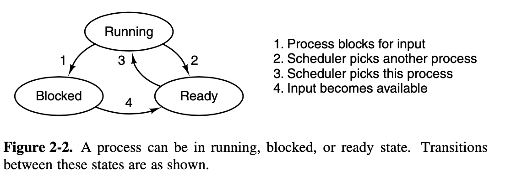

### Operating Systerms Design and Implementation Notes

# 1. Introduction to Progresses
##### By Jiawei Wang

While, strictly speaking, at any instant of time, the CPU is running only one program, in the course of 1 second, it may work on several programs, thus giving the users the illusion of parallelism. called **pseudoparallelism**.<br>

## 1. Sequential Processes
**This model (Sequential Processes) that makes parallelism easier to deal with.**<br>


### Process vs Program:
* **Process:** A process is just an executing `program` with values of  `program counter`,`registers` and `variables`.
* **Program:** An algorithm expressed in some suitable notation.

### Key Idea:
**A process is an activity of some kind. It has a program, input, output, and a state.<br>A single processor may be shared among several processes, with some scheduling algorithm being used to determine when to stop work on one process and service a different one.**


## 2. Creation and Termination
**A new process is created by having an existing process execute a process creation system call.**<br>

### Creation -> `fork()`
* **After the `fork`, the two processes, the parent and the child, have the same [memory image](https://stackoverflow.com/questions/32655960/what-is-a-memory-image-in-nix-systems)<br> the same environment strings, and the same open files.**<br>

* **After a process is created both the parent and child have their own distinct address spaces.<br> In short, The child’s initial address space is a copy of the parent’s,** the child can read parent spaces' variables and program text, but no writable memory is shared.

**Example: [Codes/process.c](Codes/process.c)**
```c
int main(int argc, char* argv[]) {
    int x = 2;
    int pid = fork();
    if (pid == -1) {
        return -1;
    }

    if (pid == 0) {
        x++;
    }
    printf("Process id %d\n", getpid());
    printf("x is equal to %d\n", x);
    if (pid != 0) {
        wait(NULL);
    }
    return 0;
}
```
```
❯ ./a.out
Process id 62895
x is equal to 2
Process id 62896
x is equal to 3
```

### Termination

**There are four principal events that cause processes to be created:**
1. System initialization.
2. Execution of a process creation system call by a running process.
3. A user request to create a new process.
4. Initiation of a batch job.


## 3. Process Hierarchies
**A process, its children, and further descendants together may form a process group.**<br> When a user sends a signal from the keyboard, the signal may be delivered to all members of the process group currently associated with the keyboard.


## 4. Process States
1. Running (actually using the CPU at that instant).
2. Ready (runnable; temporarily stopped to let another process run).
3. Blocked (unable to run until some external event happens).



### Process scheduler
**Process scheduler is a part of the operating system.**<br>In my opinion, The core of Processes in OS, is the algorithms of process scheduler.<br>
<br>
The subject of **scheduling**—deciding which process should run when and for how long—is an important one.<br>
How to **balance** the competing demands of **efficiency** for the system as a whole and fairness to individual processes?<br>
Which is also the key of this hole chapter notes, we will talk about in the following notes.


