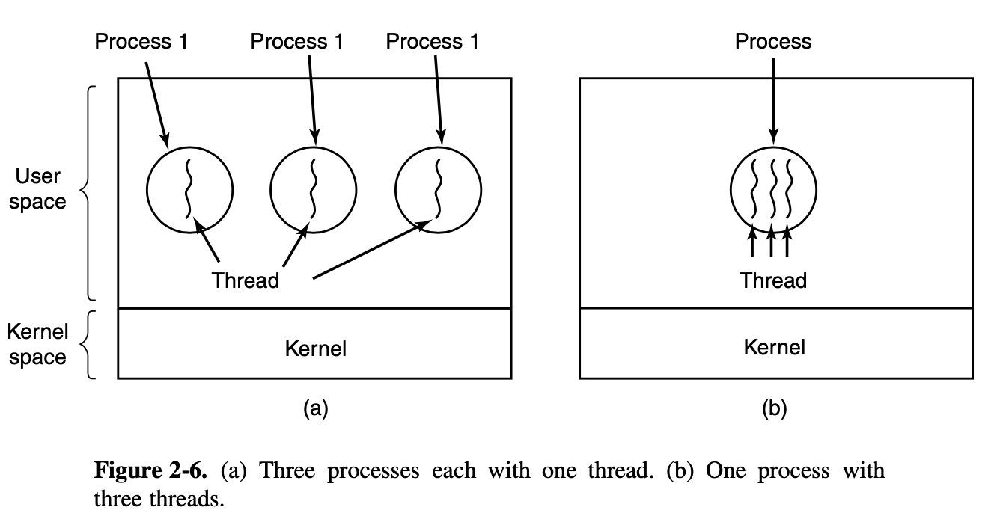
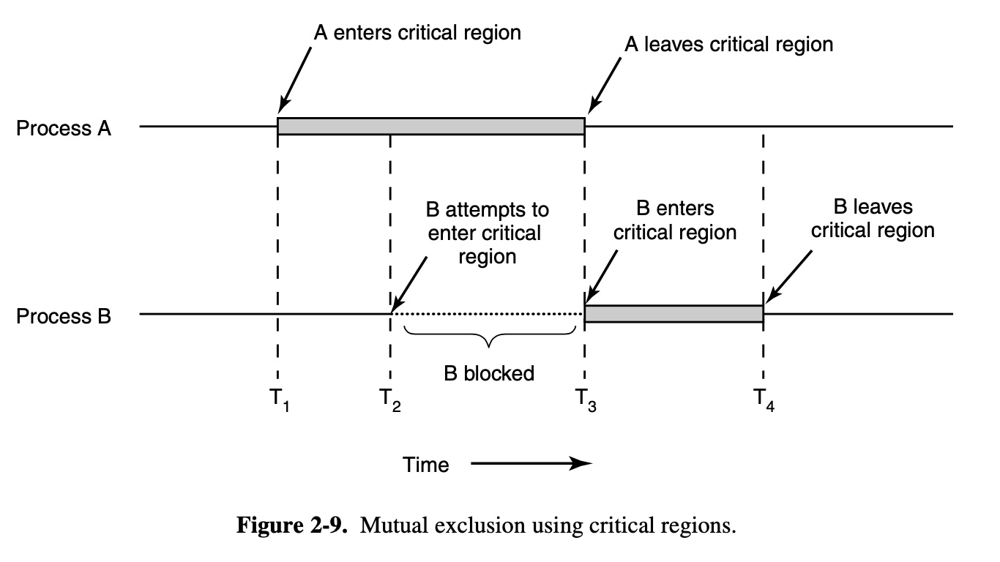

## Operating Systerms Design and Implementation Notes

# 2. Interprocess Communication
##### By Jiawei Wang

In this note, we will look at some of the issues related to this **Interprocess Communication(IPC)** <br>
There are three issues here:<br>
1. How one process can pass information to another?
2. How can we make sure two or more processes do not get into each other’s way when engaging in critical activities?
3. How to make sure the sequence of related processes?(i.e. one process must run after another)

## 1. Thread
**Thread** is also called as "**lightweight process**".<br>Means there are often situations to have multiple processes of control in the **same address space**.
### Introduction
**Example: [Codes/threads.c](https://github.com/Angold-4/OSDI/blob/master/Chapter/Chapter2/Codes/threads.c)**
```c
int x = 2;

// threads shared memory
void* routine() {
    x++;
    printf("Test from threads %d\n", getpid());
    sleep(3);
    printf("The value of x is %d\n", x);
}

void* routine2() {
    printf("Test from threads %d\n", getpid());
    sleep(3);
    printf("The value of x is %d\n", x);
}

int main(int argc, char* argv[]) {
    pthread_t t1, t2;
    // pthread_create 2nd parameter is the property of this thread
    // 4th parameter is the arguments of function(3rd parameter)
    if (pthread_create(&t1, NULL, &routine, NULL) != 0) return 1;
    if (pthread_create(&t2, NULL, &routine2, NULL) != 0) return 2;

    // pthread_join is used for waiting the return of the thread (otherwise the thread will not be executed)
    // the 2nd parameter is the addr of storing the return value
    pthread_join(t1, NULL);
    pthread_join(t2, NULL);
    return 0;
}
```
We use the POSIX P-threads package to simulating threads in C language.<br>
**Output:**
```
❯ ./a.out
Test from threads 81205
Test from threads 81205
The value of x is 3
The value of x is 3
```

These two threads shares the same address location and belong to the same process.<br>


### Thread vs Process


**Note that in order to facilitate implementation in C language,<br>I will use threads instead of processes to introduce some interprocess examples.<br>**
Below we will discuss the problem in the context of **threads**.<br>But please keep in mind that the same problems and solutions also apply to **processes**.<br>


## 2. Race Condition
**Example: [Codes/race.c](https://github.com/Angold-4/OSDI/blob/master/Chapter/Chapter2/Codes/race.c)**
```c
int mails = 0;

void* routine() {
    for (int i = 0; i < 1000000; i++) {
        mails++;
        // read mails:  
        // movl _mails(%rip), %eax

        // increment
        // addl $1, %eax
        
        // write mails
        // movl %eax, _mails(%rip)
    }
}

int main(int argc, char* argv[]) {
    pthread_t p1, p2;
    if (pthread_create(&p1, NULL, &routine, NULL) != 0) {
        return 1;
    }
    if (pthread_create(&p2, NULL, &routine, NULL) != 0) {
        return 2;
    }

    // waiting for threads finish
    pthread_join(p1, NULL);
    pthread_join(p2, NULL);

    // race condition
    printf("Number of mails: %d\n", mails);  // Number of mails: 1289819 

    return 0;
    }
}
```
**Before I give the output, let's see the program - which plus one to the mails `(1000000 x 2)` times**
```
❯ ./a.out
Number of mails: 1289819
```
**But it give me the `1289819` instead of `2000000` we expected**.<br>
**Why this happend?**<br>

Processes or threads that are working together may share some common storage that each one can read and write.<br>
When two or more processes(threads) are reading or writing some shared data at the same time. <br>
This may cause **Race Condition.**<br>

[This](https://www.youtube.com/watch?v=FY9livorrJI) video explains the causes of **Race Condition**.<br>

**When we check the assembly code of `mail++;` inside the for loop:<br>**
```assembly
    movl    _mails(%rip), %eax   ## read mails
    addl    $1, %eax             ## increment
    movl    %eax, _mails(%rip)   ## write mails
```
**As I metioned in [Introduction to Processes](https://github.com/Angold-4/OSDI/blob/master/Chapter/Chapter2/1Introprogress.md): <br>**
> At any instant of time, the CPU is running only one program

Imagine that when thread#1 executes at `mail++`. At that time he executes the first line of the assembly code.<br>Which put the current mail value into a CPU register `%eax`.<br>
Then assume the **Prcocess Scheduler** temporary blocked this thread#1 let's say the algorithm may think that it runs too long. And let thread#2 who is waiting to run.<br>
**Let's assume at that time, the value of  `mail` is `27`. Now stored in register `%eax` of thread#1.**<br>
Then thread#2 start to run. At some time (like 0.1 secs after), the **Process Scheduler** temporary blocked thread#2 and wake up thread#1 because of the same reason.<br>
**thread#2 add `mails` multiple times, let's assume the value of `mails` is `48`.**<br>
<br>
**Now here comes the Race Condition:<br>**
Back to thread#1, When thread#1 restore all the value of registers and start running (`movl %eax, _mails(%rip)`).<br>
**Now the `mails` becomes `28`! instead of `49` we wished!**<br>
**The difficulty above occurred because thread#2 started using one of the shared variables before thread#1 was finished with it.**


## 3. Mutual Exclusion
**How to avoid Race Conditions?**<br>
The key to preventing trouble here and in many other situations involving shared memory, shared files, and shared everything else is to find some way to **prohibit more than one process from reading and writing the shared data at the same time. <br>**


Put in other words, what we need is **mutual exclusion** — some way of making sure that if one process is using a shared variable or file, the other processes will be excluded from doing the same thing.<br>
<br>
**Here I will give two ways to avoid Race Conditions:**
1. Strict Alternation
2. Mutexes (Binary Semaphore)

### Strict Alternation
**Example: [Codes/mutual.c](Codes/mutual.c)**<br>
```c
int mails = 0;
int turn = 0;

void* routine1() {
    for (int i = 0; i < 1000000; i++) {
        while(turn != 0); // busy waiting
        mails++;
        turn = 1;
    }
}

void* routine2() {
    for (int i = 0; i < 1000000; i++) {
        while(turn != 1); // busy waiting
        mails++;
        turn = 0;
    }
}

int main(int argc, char* argv[]) {
    pthread_t p1, p2;
    if (pthread_create(&p1, NULL, &routine1, NULL) != 0) {
        return 1;
    }
    if (pthread_create(&p2, NULL, &routine2, NULL) != 0) {
        return 2;
    }

    // waiting for threads finish
    pthread_join(p1, NULL);
    pthread_join(p2, NULL);

    // race condition
    printf("Number of mails: %d\n", mails);  // Number of mails: 2000000

    return 0; 
}
```
**By adding an int variable `turn` to the program.<br>We can make sure in any time, only one thread can run in the critical region.**

This code gives us the right example in most cases.<br>But in some cases, like thread#2 runs much long in noncritical region than thread#1:<br>
> Page 92:<br>**When process 0 leaves the critical region, it sets turn to 1, to allow process 1 to enter its critical region.<br>Suppose that process 1 finishes its critical region quickly, so both processes are in their noncritical regions, with turn set to 0. Now process 0 executes its whole loop quickly, exiting its critical region and setting turn to 1. At this point turn is 1 and both processes are executing in their noncritical regions.**

> **Suddenly, process 0 finishes its noncritical region and goes back to the top of its loop. Unfortunately, it is not permitted to enter its critical region now, because turn is 1 and process 1 is busy with its noncritical region. It hangs in its while loop until process 1 sets turn to 0. Put differently, taking turns is not a good idea when one of the processes is much slower than the other.**

**Another problem it will caused is called "Busy Waiting"**<br>
Inside the for-loop each iterations, there is a while-loop continuously testing a variable until some value appearsm.<br>This is called **busy waiting**.<br>
It should usually be avoided, since it wastes CPU time. Only when there is a reasonable expectation that the wait will be short is busy waiting used.<br>


### Mutexes 
**A mutex is a variable that can be in one of two states: unlocked or locked.**<br>
**Two procedures are used with mutexes:**<br>
* When a process (or thread) needs access to a critical region, it calls `mutex_lock()`. <br>If the mutex is currently unlocked (meaning that the critical region is available), the call succeeds and the calling thread is free to enter the critical region.<br>
* On the other hand, if the mutex is already locked, the caller is blocked until the process in the critical region is finished and calls `mutex_unlock()`.

**Example [Codes/mutex.c](Codes/mutex.c)**

```c
int mails = 0;
pthread_mutex_t mutex;

void* routine() {
    for (int i = 0; i < 1000000; i++) {
        pthread_mutex_lock(&mutex);
        mails++; // any time, only one thread can run this instruction
        pthread_mutex_unlock(&mutex);
    }
}

int main(int argc, char* argv[]) {
    pthread_t p1, p2;
    pthread_mutex_init(&mutex, NULL); // deafult
    if (pthread_create(&p1, NULL, &routine, NULL) != 0) {
        return 1;
    }
    if (pthread_create(&p2, NULL, &routine, NULL) != 0) {
        return 2;
    }

    // waiting for threads finish
    pthread_join(p1, NULL);
    pthread_join(p2, NULL);

    pthread_mutex_destroy(&mutex);
    printf("Number of mails: %d\n", mails);  // Number of mails: 2000000

    return 0;
}
```

## 4. Condition Variable
**Let's now focus on the 3rd question we metioned in the begining:**<br>

> **How to make sure the sequence of related processes?**
<br>

Consider that case - A **gas station.**<br>
**Assumue that a gas station can produce 15 liter petrol per seconds, and there are many cars waiting for refueling.<br>**
**Each cars need to be fueled 40 liters once and then leave.**<br>
<br>
**In this case, we cannot recieve more cars when the gas station is out of fuel.**<br>
There must have a sequence between two events:<br>
* The gas station has more than 40 liter gas.
* Here comes the car to be refueled.


The solution lies in the introduction of **condition variables**.<br> Along with three operations on them, **`wait`**,  **`signal`** and **`boardcast`**.<br>


* **`wait`** This action causes the calling process(thread) to **block**, and **waiting** for the `signal` from other processes(threads) to wake it up.

* **`signal`** Wake up one process(thread) waiting on this condition variable (if any). <br> If a signal is done on a condition variable on which several processes are waiting, only one of them, determined by the **process scheduler**, is revived.

* **`boardcast`** Wake up all waiting processes(threads)

**Example: [Code/conditionvar.c](Code/conditionvar.c)**

```c
// condition variable -- for sequence

pthread_mutex_t mutexFuel;
pthread_cond_t condFuel;
int fuel = 0;

void* fuel_filling(void* arg) {
    while (1) {
        pthread_mutex_lock(&mutexFuel);
        fuel += 15;
        printf("Filled fuel... %d\n", fuel);
        pthread_mutex_unlock(&mutexFuel);
        pthread_cond_signal(&condFuel);
        sleep(1);
    }
}

void* car(void* arg) {
    pthread_mutex_lock(&mutexFuel);
    while (1) {
        while (fuel < 40) {
            printf("No fuel. Waiting...\n");
            // every time when got a signal from other threads by calling pthread_cond_signal()
            // it will be executed after that wait 
            pthread_cond_wait(&condFuel, &mutexFuel);
        } 
        fuel -= 40;
        printf("Got fuel. Now left: %d\n", fuel);
        pthread_mutex_unlock(&mutexFuel);
    }
}
```


