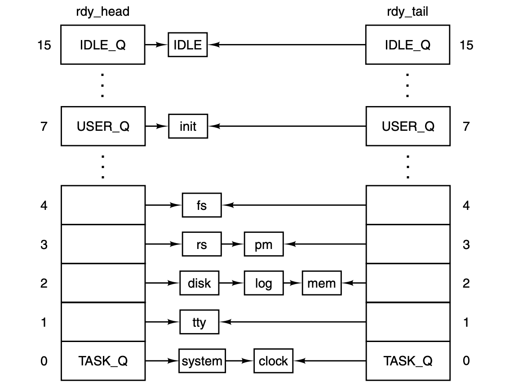

## Operating Systems Design and Implementation Notes

# 5. Process Scheduler
##### By Jiawei Wang


At the end of last note, we introduced that if a running process uses up its quantum without interruption and returning (still runable) inside **a clock tick.**<br>

The **`clock_task()`** will call **`do_clocktick()`** and this function will execute the follwoing code:<br>
```c
  if (prev_ptr->p_ticks_left <= 0 && priv(prev_ptr)->s_flags & PREEMPTIBLE) {
        dequeue(prev_ptr);		/* take it off the queues */
        enqueue(prev_ptr);		/* and reinsert it again */ 
  }
```

We only know that these two functions **`dequeue()`** and **`enqueue()`** will reinsert the current unfinished process into a **"Ready"** status process queue and **pick another process to run**.

* **How to pick next process from countless processes to run?**
* **How to design this process scheduler to manage these processes with piority?**

**NOTE**: Since **interrupts** are **not** enabled while kernel code is running in Minix3, we do not consider any **interruption** in this note. And in next note, we will talk about more about **interrupt** with **interprocess communication**.<br>


## 1. Scheduling in Minix3
**MINIX 3 uses a multilevel scheduling algorithm to mantain processes inside 16 queues of runnable processes, scheduling is round robin in each queue.**<br>
For example, in the **[previous note](https://github.com/Angold-4/OSDI/blob/master/Chapter/Chapter2/4ClockTick.md#kernelmainc)**, when we talk about the start of the Minix3, the **`main()`** function of minix3 will initialize the boot process table. Then processes are given initial priorities that are related to the structure shown in Fig. 2-29.<br>


* The **clock** and **system tasks** in layer 1 receive the highest priority. 
* The **device drivers** of layer 2 get lower priority, but they are not all equal. 
* **Server processes** in layer 3 get lower priorities than drivers, but some less than others. 
* **User processes** start with less priority than any of the system processes, and initially are all equal.
<br>

The scheduler maintains 16 queues of **runnable processes**, although not all of them may be used at a particular moment.<br>



Whenever a running process becomes blocked or finished, or a runnable process is killed by a signal, that process is removed from the scheduler’s queues. **Only runnable processes are queued.**

* The array **`rdy_head`** has one entry for each queue, with that entry pointing to the process at the head of the queue. 
* **`rdy_tail`** is an array whose entries point to the last process on each queue.
* If a running process uses up its quantum it is moved to the **tail** of its queue and given a new quantum.
* When a blocked process is awakened, it is put at the **head** of its queue if it had any part of its quantum left when it blocked, it gets only what it had **left** when it blocked.


## 2. Process Scheduler
In essence, **`pick_proc()`** in **[kernel/proc.c](https://github.com/Angold-4/OSDI/blob/master/Minix3/kernel/proc.c#L1297)** from line 1297 to 1332 is the **scheduler**.<br>

### The Scheduling Algorithm
**Find the highest priority queue that is not empty and pick the process at the head of that queue. The IDLE process is always ready, and is in the lowest priority queue. If all the higher priority queues are empty, IDLE is run.**
```c
PRIVATE void pick_proc()
{
/* Decide who to run now.  A new process is selected by setting 'next_ptr'.
 * When a billable process is selected, record it in 'bill_ptr', so that the 
 * clock task can tell who to bill for system time.
 */
  register struct proc *rp;			/* process to run */
  int q;				/* iterate over queues */

  NOREC_ENTER(pick);

  /* Check each of the scheduling queues for ready processes. The number of
   * queues is defined in proc.h, and priorities are set in the task table.
   * The lowest queue contains IDLE, which is always ready.
   */
  for (q=0; q < NR_SCHED_QUEUES; q++) {	
	int found = 0;
	if(!(rp = rdy_head[q])) {
		TRACE(VF_PICKPROC, printf("queue %d empty\n", q););
		continue;
	}
	TRACE(VF_PICKPROC, printf("found %s / %d on queue %d\n", 
		rp->p_name, rp->p_endpoint, q););
	next_ptr = rp;			/* run process 'rp' next */
	vmassert(proc_ptr != next_ptr);
	vmassert(!next_ptr->p_rts_flags);
	if (priv(rp)->s_flags & BILLABLE)	 	
		bill_ptr = rp;		/* bill for system time */
	NOREC_RETURN(pick, );
  }
  minix_panic("no runnable processes", NO_NUM);
}
```
Each queue is tested. **`TASK_Q`** is tested first, and if a process on this queue is ready, **`pick_proc`** sets **`proc_ptr`** and returns immediately. Otherwise, the next **lower priority** queue is tested, all the way down to **`IDLE_Q`**.


### Put a Process into Queue

The **`sched()`** function picks which queue to put a newly-ready process on, and whether to put it on the head or the tail of that queue.
```c
PRIVATE void sched(rp, queue, front)
register struct proc *rp;			/* process to be scheduled */
int *queue;					/* return: queue to use */
int *front;					/* return: front or back */
{
/* This function determines the scheduling policy.  It is called whenever a
 * process must be added to one of the scheduling queues to decide where to
 * insert it.  As a side-effect the process' priority may be updated.  
 */
  int time_left = (rp->p_ticks_left > 0);	/* quantum fully consumed */

  /* Check whether the process has time left. Otherwise give a new quantum 
   * and lower the process' priority, unless the process already is in the 
   * lowest queue.  
   */
  if (! time_left) {				/* quantum consumed ? */
      rp->p_ticks_left = rp->p_quantum_size; 	/* give new quantum */
      if (rp->p_priority < (IDLE_Q-1)) {  	 
          rp->p_priority += 1;			/* lower priority */
      }
  }

  /* If there is time left, the process is added to the front of its queue, 
   * so that it can immediately run. The queue to use simply is always the
   * process' current priority. 
   */
  *queue = rp->p_priority;
  *front = time_left;
}
```
**It check is made to see if the entire quantum was used:**
* If not, it will be **restarted** with whatever it had left from its last turn.(Set front=1 means this process need to be insert to the front of the queue)
* if the entire quantum was used but other processes have had a chance to run, the **priority** of this process minus one.(lower the priority)


## 3. Transitions between Status
**This Fig 2-2 was metioned in the [Chapter2/1.Introduction to Processes](https://github.com/Angold-4/OSDI/blob/master/Chapter/Chapter2/1Introprogress.md)**.<br>


Most of these transitions can be done by two functions: **`enqueue()`** and **`dequeue()`**:
1. **Running -> Blocked**
