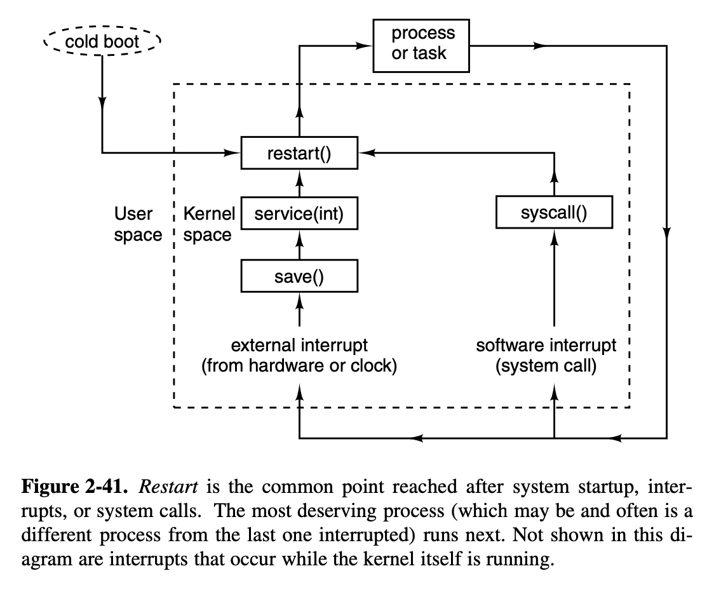
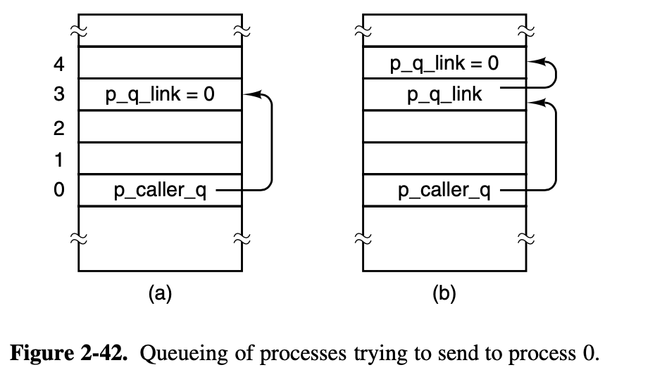

## Operating Systems Design and Implementation Notes

# 6. Interrupt
##### By Jiawei Wang

In the previous two notes (**[4. Inside a Hole Clock Tick](https://github.com/Angold-4/OSDI/blob/master/Chapter/Chapter2/4ClockTick.md)** and **[5. Process Scheduler](https://github.com/Angold-4/OSDI/blob/master/Chapter/Chapter2/5Scheduler.md)**) we focus on the implementation of **clock** and **process scheduler**. These components help us understand the OS concretly.<br>

But there are also a lot of things we didn't considered, like **Interprocess Communication** and how a process do **System Call** to apply for a service from os that we metioned in Chapter1, or what would happen when there comes an interrupt and so on...  These are also in the field of **Process**.<br>

Since each part of the OS was **indivisible**. We should admit that **it impossible to understand a hole part without the understanding of the other parts.**<br>

## 1. Interrupts


### Hardware Interrupt
In **[4. Inside a Hole Clock Tick](https://github.com/Angold-4/OSDI/blob/master/Chapter/Chapter2/4ClockTick.md#interrupt-request-irq)** we talked about the **Hardware Interrupt**:<br>There are 15 different **`IRQ`** lines in the 8259 interrupt controller, each line connect with one or more hardware device(s) that genarate electrical signals. <br>


When user input something at the connected devices like keyboard **`(IRQ1)`**, it will cause a **Hardware Interrupt** through the IRQ line and then the 8259 interrupt controller will expand the coorespond assembly marco **`hwint_master(i)`** or **`hwint_slave(i)`** and execute it.<br>

It will call the corresponding **`irq_handler(hook)`** which be placed into the interrupt table at initialization **`put_irq_handler(hook)`** is called for each process(driver) that must respond to an interrupt(`sys_irqctl`).
```c
PUBLIC void intr_handle(hook)
irq_hook_t *hook;
{
/* Call the interrupt handlers for an interrupt with the given hook list.
 * The assembly part of the handler has already masked the IRQ, reenabled the
 * controller(s) and enabled interrupts.
 */

  /* Call list of handlers for an IRQ. */
  while (hook != NULL) {
      /* For each handler in the list, mark it active by setting its ID bit,
       * call the function, and unmark it if the function returns true.
       */
      irq_actids[hook->irq] |= hook->id;
      if ((*hook->handler)(hook)) irq_actids[hook->irq] &= ~hook->id;
      hook = hook->next;
  }

  /* The assembly code will now disable interrupts, unmask the IRQ if and only
   * if all active ID bits are cleared, and restart a process.
   */
}
```

> For example: In the figure 2-39, interrupt signals arrive on the various IRQ n lines shown at the right. The connection to the CPU’s **INT** pin tells the processor that an **interrupt has occurred**. The **INTA** (interrupt acknowledge) signal from the CPU causes the controller responsible for the interrupt to **put data on the system data bus telling the processor which service routine(handler) to execute.**


### Software Interrupt
There are more cases that a running **process wants to cause an interrupt**.<br>
Actually, in Minix3, all **Interprocess Communication** were done by **software interrupt**.<br>

If a process wants to send a message to **`dst_ptr`** with message **`m`**. it will use this statement:<br>
```c
send(*dst_ptr, &m);
```
And **`send`** function was a asssembly marco which was defined in **[include/minix/ipc.h line143](https://github.com/Angold-4/OSDI/blob/master/Minix3/include/minix/ipc.h#L143):**<br>
```c
#define send		_send
```
The hole assembly code are in the [lib/i386/rts/ipc.s line20](https://github.com/Angold-4/OSDI/blob/master/Minix3/lib/i386/rts/_ipc.s#L20):

```assembly
__send:
	push	ebp
	mov	ebp, esp
	push	ebx
	mov	eax, SRC_DST(ebp)	! eax = dest-src
	mov	ebx, MESSAGE(ebp)	! ebx = message pointer
	mov	ecx, SEND		! _send(dest, ptr)
	int	SYSVEC			! trap to the kernel
	pop	ebx
	pop	ebp
	ret
```

This piece of assembly code `_send` put the **`dst`** and **`m`** arguments into register.<br>And then cause a software interrupt **`int SYSVEC`**.

#### `_s_call`
**`s_call`** is the system call counterpart of the interrupt-handling mechanism. Control arrives at s call following a software interrupt, that is, execution of an **`int <nnn>`** instruction.

```assembly
/*===========================================================================*/
/*				_s_call					     */
/*===========================================================================*/
.balign	16
s_call:
p_s_call:
	cld	/* set direction flag to a known value */
	sub	$4, %esp	/* skip RETADR */
	pusha			/* save "general" registers */
	pushw	%ds
	pushw	%es
	pushw	%fs
	pushw	%gs

	mov	%ss, %si	/* ss is kernel data segment */
	mov	%si, %ds	/* load rest of kernel segments */
	mov	%si, %es	/* kernel does not use fs, gs */
	incb	k_reenter	/* increment kernel entry count */
	mov	%esp, %esi	/* assumes P_STACKBASE == 0 */
	mov	$k_stktop, %esp
	xor	%ebp, %ebp	/* for stacktrace */
/* end of inline save */
/* now set up parameters for sys_call() */
	push	%edx	/* event set or flags bit map  */
	push	%ebx	/* pointer to user message */
	push	%eax	/* source / destination */
	push	%ecx	/* call number (ipc primitive to use) */

	call	sys_call	/* sys_call(call_nr, src_dst, m_ptr, bit_map) */
/* caller is now explicitly in proc_ptr */
	mov	%eax, AXREG(%esi)

/* Fall into code to restart proc/task running. */

```
* The first part of the **`s_call`** code resembles an inline expansion of save and saves the additional registers that must be preserved.
* Just as in **`save`**, a **`mov esp, k_stktop`** instruction then switches to the **kernel stack**.
* The similarity of a software interrupt to a hardware interrupt extends to **both disabling all interrupts**
* Following this comes a call to **`sys_call`**, which we will discuss in the next section. It causes a message to be delivered, and that this in turn causes the **process scheduler** to call **`enqueue(dst_ptr)`** to set the **`next_ptr`**.
* Since the **`restart`** function is in the next line of **`s_call`**, after **`sys_call`** return, it will pick another process to run.

#### `restart`
**`restart`** is an assembly language routine in **[kernel/arch/i386/mpx386.s line436](https://github.com/Angold-4/OSDI/blob/master/Minix3/kernel/arch/i386/mpx386.S#L436)**.<br>
It causes a **context switch**, so the process pointed to by **next_ptr** will run.<br>
**`restart` is executed again and again as tasks, servers, and user processes are given their opportunities to run and then are suspended, either to wait for input or to give other processes their turns.**
```assembly
/*===========================================================================*/
/*				restart					     */
/*===========================================================================*/
restart:

/* Restart the current process or the next process if it is set.  */

	cli
	call	schedcheck
	movl	proc_ptr, %esp	/* will assume P_STACKBASE == 0 */
	lldt	P_LDT_SEL(%esp)	/* enable process' segment descriptors  */
	cmpl	$0, P_CR3(%esp)
	jz	0f
	mov	P_CR3(%esp), %eax
	cmpl	loadedcr3, %eax
	jz	0f
	mov	%eax, %cr3
	mov	%eax, loadedcr3
	mov	proc_ptr, %eax
	mov	%eax, ptproc
	movl	$0, dirtypde
0:
	lea	P_STACKTOP(%esp), %eax	/* arrange for next interrupt */
	movl	%eax, tss+TSS3_S_SP0	/* to save state in process table */
restart1:
	decb	k_reenter
	popw	%gs
	popw	%fs
	popw	%es
	popw	%ds
	popal
	add	$4, %esp	/* skip return adr */
	iret	/* continue process */

```

* When **`restart`** is reached, interrupts are disabled, so the **`next_ptr`** (mostly assign by **process scheduler** **`pick_proc()`**) cannot be changed.
* The process table was carefully constructed so it begins with a stack frame, and the instruction on this line **`movl    proc_ptr, %esp`** points the CPU’s stack pointer register at the stack frame.
* **`lldt    P_LDT_SEL(%esp) `**: this instruction then loads the processor’s local descriptor table register from the stack frame. This prepares the processor to use the memory segments belonging to the next process to be run.<br>

### Summary
**Up to so far. In the Previous Notes of this [Chapter2 Process](https://github.com/Angold-4/OSDI/tree/master/Chapter/Chapter2). <br>
We've seen that `restart` is reached in several ways:**<br>
1. By a call from main when the system **[starts](https://github.com/Angold-4/OSDI/blob/master/Chapter/Chapter2/4ClockTick.md#kernelmainc) (cold boot) ([kernel/main.c](https://github.com/Angold-4/OSDI/blob/master/Minix3/kernel/main.c#L211)).**
2. By a jump from **`hwint_master`** or **`hwint_slave`** after a **[hardware interrupt](https://github.com/Angold-4/OSDI/blob/master/Chapter/Chapter2/4ClockTick.md#hwint_master0)**.
3. By falling through from s call after a **[system call]()**.


Fig. 2-41 is a simplified summary of how control passes back and forth between processes and the kernel via **`restart`**.<br>

## 2. Interprocess Communication
Processes in MINIX 3 communicate by **messages**, using the **rendezvous** principle. <br>
The high-level code for **interprocess communication** is found in **[proc.c](https://github.com/Angold-4/OSDI/blob/master/Minix3/kernel/proc.c#L220)**<br>

**The kernel’s job is to translate either a hardware interrupt or a software interrupt into a message.**<br>
* **Hardware Interrupt:** Ask the **interrupt controller** to put data on the system data bus and telling the processor which service routine to execute **(interrupt handler) (drivers)**.
* **Software Interrupt:** The **`sys_call(call_nr, src_dst, m_ptr)`** function in **`s_call`** converts a software interrupt into a message. After all the tests have been passed, one of the functions **`mini_send()`**, **`mini receive()`**, or **`mini notify()`** is called to do the real work.

```c
  /* Now check if the call is known and try to perform the request. The only
   * system calls that exist in MINIX are sending and receiving messages.
   *   - SENDREC: combines SEND and RECEIVE in a single system call
   *   - SEND:    sender blocks until its message has been delivered
   *   - RECEIVE: receiver blocks until an acceptable message has arrived
   *   - NOTIFY:  asynchronous call; deliver notification or mark pending
   *   - SENDA:   list of asynchronous send requests
   */
  switch(call_nr) {
  case SENDREC:
	/* A flag is set so that notifications cannot interrupt SENDREC. */
	caller_ptr->p_misc_flags |= MF_REPLY_PEND;
	/* fall through */
  case SEND:			
	result = mini_send(caller_ptr, src_dst_e, m_ptr, 0);
	if (call_nr == SEND || result != OK)
		break;				/* done, or SEND failed */
	/* fall through for SENDREC */
  case RECEIVE:			
	if (call_nr == RECEIVE)
		caller_ptr->p_misc_flags &= ~MF_REPLY_PEND;
	result = mini_receive(caller_ptr, src_dst_e, m_ptr, 0);
	break;
  case NOTIFY:
	result = mini_notify(caller_ptr, src_dst_e);
	break;
  case SENDNB:
        result = mini_send(caller_ptr, src_dst_e, m_ptr, NON_BLOCKING);
        break;
  case SENDA:
	result = mini_senda(caller_ptr, (asynmsg_t *)m_ptr, (size_t)src_dst_e);
	break;
  default:
	result = EBADCALL;			/* illegal system call */
  }

```

The functions **`mini_send()`**, **`mini_receive()`**, and **`mini_notify()`** are the heart of the normal message passing mechanism of MINIX 3 and deserve careful study.<br>
**NOTE:** I use Minix 3.1 version of these three functions, you can find them through the link: **[Bootlin Minix V3.1.0](https://elixir.ortiz.sh/minix/v3.1.0/source/kernel/proc.c#L200)**<br>

### `mini_send()`
When a process does a **`send()`.** **The lowest layer of the kernel checks to see if the destination is waiting for a message from the sender**(or from ANY sender).<br>If so, the message is copied from the blocked sender to the receiver, and **both are marked as runnable**. If the destination is not waiting for a message from the sender, **the sender is marked as blocked** and put onto a **queue of processes** waiting to send to the receiver.

```c
PRIVATE int mini_send(caller_ptr, dst, m_ptr, flags)
register struct proc *caller_ptr;	/* who is trying to send a message? */
int dst;				/* to whom is message being sent? */
message *m_ptr;				/* pointer to message buffer */
unsigned flags;				/* system call flags */
{
/* Send a message from 'caller_ptr' to 'dst'. If 'dst' is blocked waiting
 * for this message, copy the message to it and unblock 'dst'. If 'dst' is
 * not waiting at all, or is waiting for another source, queue 'caller_ptr'.
 */
  register struct proc *dst_ptr = proc_addr(dst);
  register struct proc **xpp;
  register struct proc *xp;

```

* **deadlock:** the caller and destination are trying to send to each other.

```c
  /* Check for deadlock by 'caller_ptr' and 'dst' sending to each other. */
  xp = dst_ptr;
  while (xp->p_rts_flags & SENDING) {		/* check while sending */
  	xp = proc_addr(xp->p_sendto);		/* get xp's destination */
  	if (xp == caller_ptr) return(ELOCKED);	/* deadlock if cyclic */
  }

```

* The key test in **`mini send`** is a check is made to see if the destination is blocked on a **`receive`**, as shown by the **`RECEIVING`** bit in the **`p_rts`** flags field of its process table entry. 
* If it is waiting, then the next question is: **"Who is it waiting for?"** If it is waiting for the sender, or for ANY, the **`CopyMess`** macro is used to copy the message and the receiver is unblocked by resetting its **`RECEIVING`** bit. Then **`enqueue`** is called to give the receiver an opportunity to the receiver an opportunity to run.

```c
  /* Check if 'dst' is blocked waiting for this message. The destination's 
   * SENDING flag may be set when its SENDREC call blocked while sending.  
   */
  if ( (dst_ptr->p_rts_flags & (RECEIVING | SENDING)) == RECEIVING &&
       (dst_ptr->p_getfrom == ANY || dst_ptr->p_getfrom == caller_ptr->p_nr)) {
	/* Destination is indeed waiting for this message. */
	CopyMess(caller_ptr->p_nr, caller_ptr, m_ptr, dst_ptr,
		 dst_ptr->p_messbuf);
	if ((dst_ptr->p_rts_flags &= ~RECEIVING) == 0) enqueue(dst_ptr);
```

* If, on the other hand, the receiver is not blocked, or is blocked but waiting for a message from someone else. then the caller will be blocked and **`mini_receive()`** will put it into the destination's queue.
* All processes wanting to send to a given destination are strung together on a **linked list**, with the destination’s **`p_callerq`** field pointing to the process table entry of the process at the head of the queue.

```c
  } else if ( ! (flags & NON_BLOCKING)) {
	/* Destination is not waiting.  Block and dequeue caller. */
	caller_ptr->p_messbuf = m_ptr;
	if (caller_ptr->p_rts_flags == 0) dequeue(caller_ptr);
	caller_ptr->p_rts_flags |= SENDING;
	caller_ptr->p_sendto = dst;

	/* Process is now blocked.  Put in on the destination's queue. */
	xpp = &dst_ptr->p_caller_q;		/* find end of list */
	while (*xpp != NIL_PROC) xpp = &(*xpp)->p_q_link;	
	*xpp = caller_ptr;			/* add caller to end */
	caller_ptr->p_q_link = NIL_PROC;	/* mark new end of list */
  } else {
	return(ENOTREADY);
  }
  return(OK);
}
```




### `mini_notify()`
**`mini_notify`** is used to effectuate a notification.<br>
Just as its name implies, a notification is a message which have a higher priority than ordinary messages. <br>
Another difference is that: **If the sender send the notification to the reciever. He do not wish to get reply immediately, on the other words, the sender would not blocked after realize that the reciever is not waiting for it.**

```c
PRIVATE int mini_notify(caller_ptr, dst)
register struct proc *caller_ptr;	/* sender of the notification */
int dst;				/* which process to notify */
{
  register struct proc *dst_ptr = proc_addr(dst);
  int src_id;				/* source id for late delivery */
  message m;				/* the notification message */
```

If the target is also waiting for this message, then like **`mini_send()`**, it will build the message and then call **`enqueue()`** to change the **`next_ptr`** and then return to run it.
```c
  /* Check to see if target is blocked waiting for this message. A process 
   * can be both sending and receiving during a SENDREC system call.
   */
  if ((dst_ptr->p_rts_flags & (RECEIVING|SENDING)) == RECEIVING &&
      ! (priv(dst_ptr)->s_flags & SENDREC_BUSY) &&
      (dst_ptr->p_getfrom == ANY || dst_ptr->p_getfrom == caller_ptr->p_nr)) {

      /* Destination is indeed waiting for a message. Assemble a notification 
       * message and deliver it. Copy from pseudo-source HARDWARE, since the
       * message is in the kernel's address space.
       */ 
      BuildMess(&m, proc_nr(caller_ptr), dst_ptr);
      CopyMess(proc_nr(caller_ptr), proc_addr(HARDWARE), &m, 
          dst_ptr, dst_ptr->p_messbuf);
      dst_ptr->p_rts_flags &= ~RECEIVING;	/* deblock destination */
      if (dst_ptr->p_rts_flags == 0) enqueue(dst_ptr);
      return(OK);
  } 
```

To store a notification, all that is required is a **bitmap** in which each bit corresponds to a process that can send a notification. When a notification cannot be sent, the bit corresponding to the sender is set in the recipient’s bitmap.

```c
  /* Destination is not ready to receive the notification. Add it to the 
   * bit map with pending notifications. Note the indirectness: the system id 
   * instead of the process number is used in the pending bit map.
   */ 
  src_id = priv(caller_ptr)->s_id;
  set_sys_bit(priv(dst_ptr)->s_notify_pending, src_id); 
  return(OK);
}
```


### `mini_receive()`

**`mini_recieve()`** first checking the bitmap of every waiting notifications (if any), if there isn't any, then check if there are any process is blocked and waiting for the reply. If still not, then the caller process just blocked and waiting for the messages or notifications.
```c
PRIVATE int mini_receive(caller_ptr, src, m_ptr, flags)
register struct proc *caller_ptr;	/* process trying to get message */
int src;				/* which message source is wanted */
message *m_ptr;				/* pointer to message buffer */
unsigned flags;				/* system call flags */
{
/* A process or task wants to get a message.  If a message is already queued,
 * acquire it and deblock the sender.  If no message from the desired source
 * is available block the caller, unless the flags don't allow blocking.  
 */
  register struct proc **xpp;
  register struct notification **ntf_q_pp;
  message m;
  int bit_nr;
  sys_map_t *map;
  bitchunk_t *chunk;
  int i, src_id, src_proc_nr;
```

Check whether **there are any notifications.**<br>If yes, then build the message and copy it to the caller's message buffer.

```c
  /* Check to see if a message from desired source is already available.
   * The caller's SENDING flag may be set if SENDREC couldn't send. If it is
   * set, the process should be blocked.
   */
  if (!(caller_ptr->p_rts_flags & SENDING)) {

    /* Check if there are pending notifications, except for SENDREC. */
    if (! (priv(caller_ptr)->s_flags & SENDREC_BUSY)) {

        map = &priv(caller_ptr)->s_notify_pending;
        for (chunk=&map->chunk[0]; chunk<&map->chunk[NR_SYS_CHUNKS]; chunk++) {

            /* Find a pending notification from the requested source. */ 
            if (! *chunk) continue; 			/* no bits in chunk */
            for (i=0; ! (*chunk & (1<<i)); ++i) {} 	/* look up the bit */
            src_id = (chunk - &map->chunk[0]) * BITCHUNK_BITS + i;
            if (src_id >= NR_SYS_PROCS) break;		/* out of range */
            src_proc_nr = id_to_nr(src_id);		/* get source proc */
            if (src!=ANY && src!=src_proc_nr) continue;	/* source not ok */
            *chunk &= ~(1 << i);			/* no longer pending */

            /* Found a suitable source, deliver the notification message. */
            BuildMess(&m, src_proc_nr, caller_ptr);	/* assemble message */
            CopyMess(src_proc_nr, proc_addr(HARDWARE), &m, caller_ptr, m_ptr);
            return(OK);					/* report success */
        }
    }
```

Check whether **there are any pending process waiting for its reply**<br>If yes, then copy message to the message buffer and call **`enqueue()`** to awake this pending process.

```c
    /* Check caller queue. Use pointer pointers to keep code simple. */
    xpp = &caller_ptr->p_caller_q;
    while (*xpp != NIL_PROC) {
        if (src == ANY || src == proc_nr(*xpp)) {
	    /* Found acceptable message. Copy it and update status. */
	    CopyMess((*xpp)->p_nr, *xpp, (*xpp)->p_messbuf, caller_ptr, m_ptr);
            if (((*xpp)->p_rts_flags &= ~SENDING) == 0) enqueue(*xpp);
            *xpp = (*xpp)->p_q_link;		/* remove from queue */
            return(OK);				/* report success */
	}
	xpp = &(*xpp)->p_q_link;		/* proceed to next */
    }
  }
```
If there **don't have any message or notification.**<br>
Call **`dequeue(caller_ptr)`** to block the caller, and set the **`p_rts_flags = RECEIVCING`**. Waiting for the message and notifications.

```c
  /* No suitable message is available or the caller couldn't send in SENDREC. 
   * Block the process trying to receive, unless the flags tell otherwise.
   */
  if ( ! (flags & NON_BLOCKING)) {
      caller_ptr->p_getfrom = src;		
      caller_ptr->p_messbuf = m_ptr;
      if (caller_ptr->p_rts_flags == 0) dequeue(caller_ptr);
      caller_ptr->p_rts_flags |= RECEIVING;		
      return(OK);
  } else {
      return(ENOTREADY);
  }
}
```
