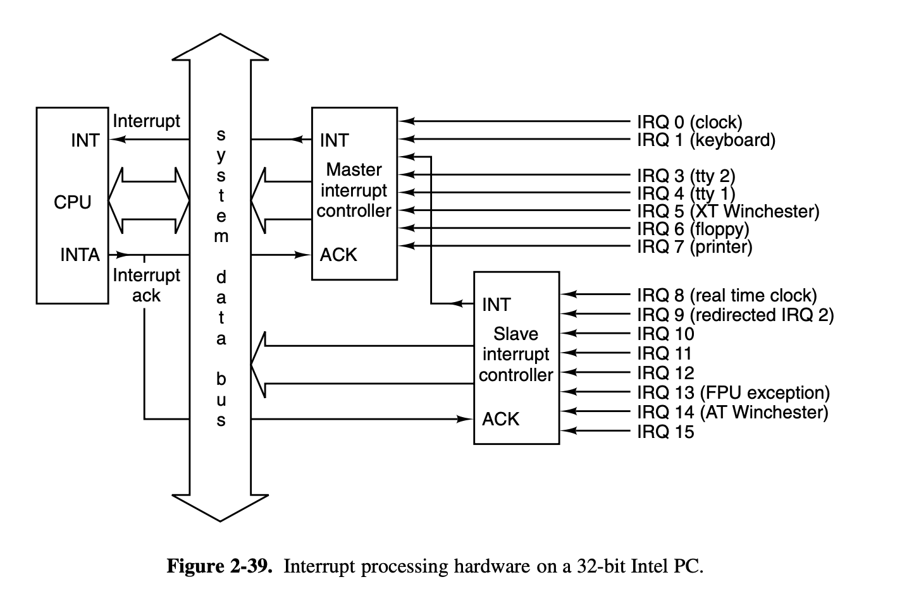

## Operating Systems Design and Implementation Notes

# 6. Interrupt
##### By Jiawei Wang

In the previous two notes (**[4. Inside a Hole Clock Tick](https://github.com/Angold-4/OSDI/blob/master/Chapter/Chapter2/4ClockTick.md)** and **[5. Process Scheduler](https://github.com/Angold-4/OSDI/blob/master/Chapter/Chapter2/5Scheduler.md)**) we focus on the implementation of **clock** and **process scheduler**. These components help us understand the OS concretly.<br>

But there are also a lot of things we didn't considered, like **interprocess communication** and how a process do **System Call** to apply for a service from os that we metioned in Chapter1, or what would happen when there comes an interrupt and so on...  These are also in the field of **Process**.<br>

Since each part of the OS was **indivisible**. We should admit that **it impossible to understand a hole part without the understanding of the other parts.**<br>

## 1. Interrupts


### Hardware Interrupt
In **[4. Inside a Hole Clock Tick](https://github.com/Angold-4/OSDI/blob/master/Chapter/Chapter2/4ClockTick.md#interrupt-request-irq)** we talked about the **Hardware Interrupt**:<br>There are 15 different **`IRQ`** lines in the 8259 interrupt controller, each line connect with one or more hardware device(s) that genarate electrical signals. <br>


* When user input something at the connected devices like keyboard**`(IRQ1)`**, it will cause a **Hardware Interrupt** through the IRQ line and then the 8259 interrupt controller will expand the coorespond assembly marco **`hwint_master(i)`** or **`hwint_slave(i)`** and execute it. 
* It will call the corresponding **`irq_handler(hook)`** which be placed into the interrupt table at initialization **`put_irq_handler(hook)`** is called for each process(driver) that must respond to an interrupt(`sys_irqctl`).
```c
PUBLIC void intr_handle(hook)
irq_hook_t *hook;
{
/* Call the interrupt handlers for an interrupt with the given hook list.
 * The assembly part of the handler has already masked the IRQ, reenabled the
 * controller(s) and enabled interrupts.
 */

  /* Call list of handlers for an IRQ. */
  while (hook != NULL) {
      /* For each handler in the list, mark it active by setting its ID bit,
       * call the function, and unmark it if the function returns true.
       */
      irq_actids[hook->irq] |= hook->id;
      if ((*hook->handler)(hook)) irq_actids[hook->irq] &= ~hook->id;
      hook = hook->next;
  }

  /* The assembly code will now disable interrupts, unmask the IRQ if and only
   * if all active ID bits are cleared, and restart a process.
   */
}
```

> For example: In the figure 2-39, interrupt signals arrive on the various IRQ n lines shown at the right. The connection to the CPU’s **INT** pin tells the processor that an **interrupt has occurred**. The **INTA** (interrupt acknowledge) signal from the CPU causes the controller responsible for the interrupt to **put data on the system data bus telling the processor which service routine(handler) to execute.**


### Software Interrupt
There are more cases that a running **process wants to cause an interrupt**.<br>
Actually, in Minix3, all **Interprocess Communication** were done by **software interrupt**.<br>

If a process wants to send a message to **`dst_ptr`** with message **`m`**. it will use this statement:<br>
```c
send(*dst_ptr, &m);
```
And **`send`** function was a asssembly marco which was defined in **[include/minix/ipc.h line143](https://github.com/Angold-4/OSDI/blob/master/Minix3/include/minix/ipc.h#L143):**<br>
```c
#define send		_send
```
The hole assembly code are in the [lib/i386/rts/ipc.s line20](https://github.com/Angold-4/OSDI/blob/master/Minix3/lib/i386/rts/_ipc.s#L20):

```assembly
__send:
	push	ebp
	mov	ebp, esp
	push	ebx
	mov	eax, SRC_DST(ebp)	! eax = dest-src
	mov	ebx, MESSAGE(ebp)	! ebx = message pointer
	mov	ecx, SEND		! _send(dest, ptr)
	int	SYSVEC			! trap to the kernel
	pop	ebx
	pop	ebp
	ret
```

This piece of assembly code `_send` put the **`dst`** and **`m`** arguments into register.<br>And then cause a software interrupt **`int SYSVEC`**.

#### `_s_call`
**`s_call`** is the system call counterpart of the interrupt-handling mechanism. Control arrives at s call following a software interrupt, that is, execution of an **`int <nnn>`** instruction.

```assembly
/*===========================================================================*/
/*				_s_call					     */
/*===========================================================================*/
.balign	16
s_call:
p_s_call:
	cld	/* set direction flag to a known value */
	sub	$4, %esp	/* skip RETADR */
	pusha			/* save "general" registers */
	pushw	%ds
	pushw	%es
	pushw	%fs
	pushw	%gs

	mov	%ss, %si	/* ss is kernel data segment */
	mov	%si, %ds	/* load rest of kernel segments */
	mov	%si, %es	/* kernel does not use fs, gs */
	incb	k_reenter	/* increment kernel entry count */
	mov	%esp, %esi	/* assumes P_STACKBASE == 0 */
	mov	$k_stktop, %esp
	xor	%ebp, %ebp	/* for stacktrace */
/* end of inline save */
/* now set up parameters for sys_call() */
	push	%edx	/* event set or flags bit map  */
	push	%ebx	/* pointer to user message */
	push	%eax	/* source / destination */
	push	%ecx	/* call number (ipc primitive to use) */

	call	sys_call	/* sys_call(call_nr, src_dst, m_ptr, bit_map) */
/* caller is now explicitly in proc_ptr */
	mov	%eax, AXREG(%esi)

/* Fall into code to restart proc/task running. */

```
* The first part of the **`s_call`** code resembles an inline expansion of save and saves the additional registers that must be preserved.
* Just as in **`save`**, a **`mov esp, k_stktop`** instruction then switches to the **kernel stack**.
* The similarity of a software interrupt to a hardware interrupt extends to **both disabling all interrupts**
* Following this comes a call to **`sys_call`**, which we will discuss in the next section. It causes a message to be delivered, and that this in turn causes the **process scheduler** to call **`enqueue(dst_ptr)`** to set the **`next_ptr`**.
* Since the **`restart`** function is in the next line of **`s_call`**, after **`sys_call`** return, it will pick another process to run.

#### `restart`
**`restart`** is an assembly language routine in **[kernel/arch/i386/mpx386.s line436](https://github.com/Angold-4/OSDI/blob/master/Minix3/kernel/arch/i386/mpx386.S#L436)**.<br>
It causes a **context switch**, so the process pointed to by **next_ptr** will run.<br>
**`restart` is executed again and again as tasks, servers, and user processes are given their opportunities to run and then are suspended, either to wait for input or to give other processes their turns.**
```assembly
/*===========================================================================*/
/*				restart					     */
/*===========================================================================*/
restart:

/* Restart the current process or the next process if it is set.  */

	cli
	call	schedcheck
	movl	proc_ptr, %esp	/* will assume P_STACKBASE == 0 */
	lldt	P_LDT_SEL(%esp)	/* enable process' segment descriptors  */
	cmpl	$0, P_CR3(%esp)
	jz	0f
	mov	P_CR3(%esp), %eax
	cmpl	loadedcr3, %eax
	jz	0f
	mov	%eax, %cr3
	mov	%eax, loadedcr3
	mov	proc_ptr, %eax
	mov	%eax, ptproc
	movl	$0, dirtypde
0:
	lea	P_STACKTOP(%esp), %eax	/* arrange for next interrupt */
	movl	%eax, tss+TSS3_S_SP0	/* to save state in process table */
restart1:
	decb	k_reenter
	popw	%gs
	popw	%fs
	popw	%es
	popw	%ds
	popal
	add	$4, %esp	/* skip return adr */
	iret	/* continue process */

```

* When **`restart`** is reached, interrupts are disabled, so the **`next_ptr`** (mostly assign by **process scheduler** **`pick_proc()`**) cannot be changed.
* The process table was carefully constructed so it begins with a stack frame, and the instruction on this line **`movl    proc_ptr, %esp`** points the CPU’s stack pointer register at the stack frame.
* **`lldt    P_LDT_SEL(%esp) `**: this instruction then loads the processor’s local descriptor table register from the stack frame. This prepares the processor to use the memory segments belonging to the next process to be run.<br>

### Summary
**Up to so far. In the Previous Notes of this [Chapter2 Process](https://github.com/Angold-4/OSDI/tree/master/Chapter/Chapter2). <br>
We've seen that `restart` is reached in several ways:**<br>
1. By a call from main when the system **[starts](https://github.com/Angold-4/OSDI/blob/master/Chapter/Chapter2/4ClockTick.md#kernelmainc) (cold boot) ([kernel/main.c](https://github.com/Angold-4/OSDI/blob/master/Minix3/kernel/main.c#L211)).**
2. By a jump from **`hwint_master`** or **`hwint_slave`** after a **[hardware interrupt](https://github.com/Angold-4/OSDI/blob/master/Chapter/Chapter2/4ClockTick.md#hwint_master0)**.
3. By falling through from s call after a **[system call]()**.


Fig. 2-41 is a simplified summary of how control passes back and forth between processes and the kernel via **`restart`**.<br>


## 2. Interprocess Communication

## 3. System Task


