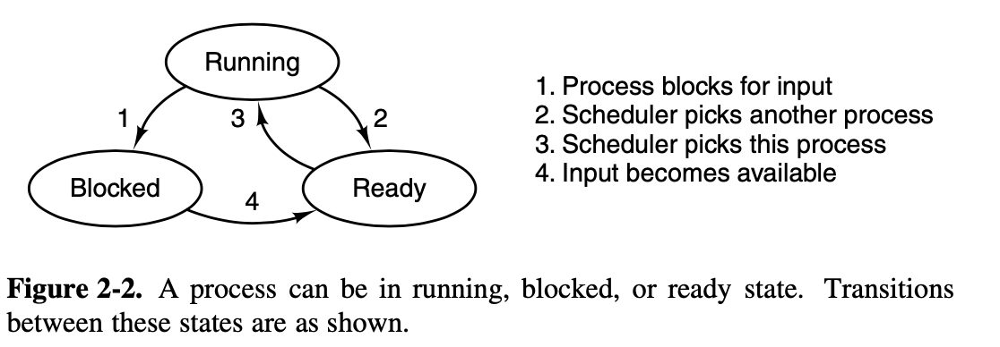
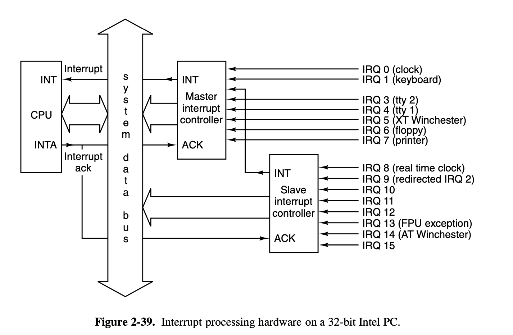
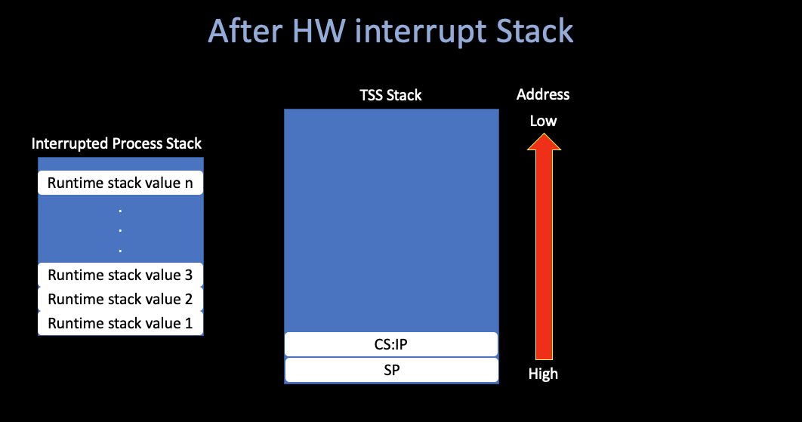
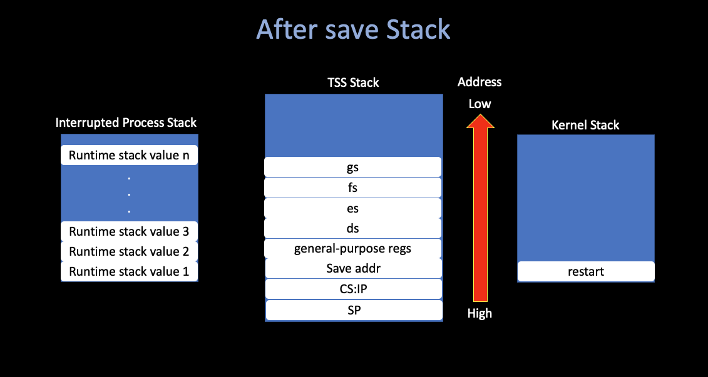

## Operating Systems Design and Implementation Notes

# 7. Interrupt ii

##### By Jiawei Wang


This note is an extra part of prev **[OSDI 6. Interrupt](https://github.com/Angold-4/OSDI/blob/master/Chapter/Chapter2/6Interrupt.md).**<br>
**If you want to understand how MINIX 3 works at the lowest level, perhaps the most important thing is to understand how exceptions, hardware interrupts, or int <nnn> instructions lead to the execution of the various pieces of code that has been written to service them.**



## 1. TSS

### i. Real Mode VS. Protect Mode

#### Real Mode
* **Early Computers, Small Storage**
* **CS:IP -> Physical Address** <br>
* **`Physical Address = CS << 4 + IP`**
* **Security Issue: Hackers can access any part of storiage by setting CS:IP register**

#### Protected Mode

* **3 Types of Addresses:**
    * Logical Address
        * Used by program 
        * **(`segment reg(cs, ss, ds...) + offset (ip, sp...)`)**
    * Virtual Address
        * An 32-bit unsigned integer
        * Represent 4GB address
    * Physical Address
        * OS -> Passing to RAM address


1. **Detect Error (Segmentation Error)**
2. **Access Large Amount of Memory Effectively**


### ii. GDT
* Global Descriptor Table.
* Each Processor can only have one GDT.
* Store the **segment descriptor**


### iii. TSS
* Task State Segment.
* TSS Descriptor is Stored in GDT
* **Key to Understand Interrupt**


**The task-switching mechanism of a 32-bit Intel processor is complex (handle interrupt).**<br>
**If you do not understand the "hidden" work in TSS, it is hard to figure out what happends.**<br>

When the CPU receives an interrupt while running a process, it sets up a **new stack** for use during the interrupt service.<br>
**The location of this stack is determined by an entry in the Task State Segment (TSS).**<br>
**The new stack created by an interrupt always starts at the end of the `stackframe_s` structure within the process table entry of the interrupted process.**
<br>

**The CPU automatically pushes several key registers onto this new stack**, including those necessary to **reinstate the interrupted process’ own stack** and **restore its program counter**. When the interrupt handler code starts running, it uses this area in the process table as its stack. and much of the information needed to return to the interrupted process will have already been stored. <br>The interrupt handler pushes the contents of additional registers, filling the stackframe, and then switches to a stack provided by the kernel while it does whatever must be done to service the interrupt.

**Nothing is stored on the interrupted process’ working stack when a user process is interrupted!**

**Furthermore, because the stack is created in a known location (determined by the TSS) after an interrupt, control of multiple processes is simplified.**


## 2. Runtime


### i. Hardware Interrupt
##### Using Clock interrupt as an hardware interrupt example



**Please make sure that you've read [OSDI 4. Inside a Whole Clocktick](https://github.com/Angold-4/OSDI/blob/master/Chapter/Chapter2/4ClockTick.md), to follow the following contents:**



#### `hwint_master`

```asm
/*===========================================================================*/
/*				hwint00 - 07				                               */
/*===========================================================================*/
/* Note this is a macro, it just looks like a subroutine. */
#define hwint_master(irq)	\
	call	save			/* save interrupted process state */;\
	push	$irq							    ;\
	call	irq_handle		/* irq_handle(irq) 		  */;\
	pop	%ecx							    ;\
	movb	$END_OF_INT, %al						    ;\
	outb	$INT_CTL			/* reenable master 8259		  */;\
	ret				/* restart (another) process      */

/* Each of these entry points is an expansion of the hwint_master macro */
.balign	16
hwint00:
/* Interrupt routine for irq 0 (the clock). */
	hwint_master(0)
```

#### `save`

```asm
!*===========================================================================*
!*				save					                                   *
!*===========================================================================*
! Save for protected mode.
! This is much simpler than for 8086 mode, because the stack already points
! into the process table, or has already been switched to the kernel stack.

	.align	16
save:
	cld			! set direction flag to a known value
	pushad			! save "general" registers
    o16	push	ds		! save ds
    o16	push	es		! save es
    o16	push	fs		! save fs
    o16	push	gs		! save gs
	mov	dx, ss		! ss is kernel data segment
	mov	ds, dx		! load rest of kernel segments
	mov	es, dx		! kernel does not use fs, gs
	mov	eax, esp	! prepare to return
	incb	(_k_reenter)	! from -1 if not reentering
	jnz	set_restart1	! stack is already kernel stack
	mov	esp, k_stktop
	push	_restart	! build return address for int handler
	xor	ebp, ebp	! for stacktrace
	jmp	RETADR-P_STACKBASE(eax)

	.align	4
set_restart1:
	push	restart1
	jmp	RETADR-P_STACKBASE(eax)
```



#### `restart`

```asm
!*===========================================================================*
!*				restart					                                *     
!*===========================================================================*
_restart:

! Restart the current process or the next process if it is set. 

	cmp	(_next_ptr), 0		! see if another process is scheduled
	jz	0f
	mov 	eax, (_next_ptr)
	mov	(_proc_ptr), eax	! schedule new process 
	mov	(_next_ptr), 0
0:	mov	esp, (_proc_ptr)	! will assume P_STACKBASE == 0
	lldt	P_LDT_SEL(esp)		! enable process' segment descriptors 
	lea	eax, P_STACKTOP(esp)	! arrange for next interrupt
	mov	(_tss+TSS3_S_SP0), eax	! to save state in process table
restart1:
	decb	(_k_reenter)
    o16	pop	gs
    o16	pop	fs
    o16	pop	es
    o16	pop	ds
	popad
	add	esp, 4		! skip return adr
	iretd			! continue process
```


