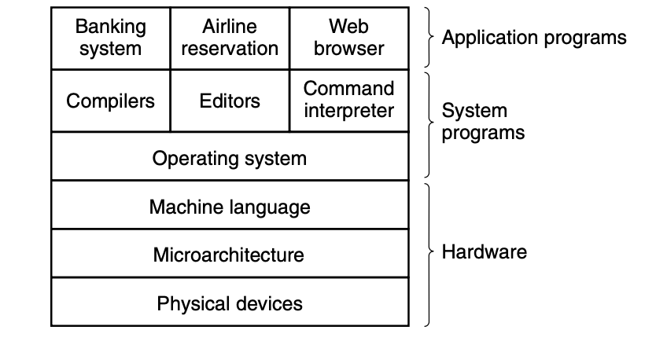

## Operating Systerms Design and Implementation Notes

#### 1. Introduce to Operating Systerm
##### By Jiawei Wang
 

**As We all know that: A modern Computer can be divided into two pieces:   -- Hardware and Software** 
**And Software also can be divided into two kinds:   -- Systerm programs and Application Programs** 

**System programs, which manage the operation of the computer itself. 
Application programs, which perform the actual work the user wants.**

#### The most fundamental system program is the operating system

**A major function of the operating system is to hide all this complexity and give the programmer a more convenient set of instructions to work with**

**We can try to understand Oprating Systerm from two aspects:**
#### 1. Program
**OS is a Very big program  From the previous layer picture we can see found that OS is not equal to Systerm programs but a part of it** 
**So What the difference between OS and Other Systerm Programs? **
**On top of the operating system is the rest of the system software Here we find the command interpreter (shell), window systems, compilers, editors, GUI, and similar application-independent programs. **
 
**The difference between OS and Other Systerm Programs is that the operating system is (usually) that portion of the software that runs in kernel mode or supervisor mode. It is protected from user tampering by the hardware **
**For Example: Compilers and editors run in user mode. If a user does not like a particular compiler, he is free to write his own if he so chooses; he is not free to write his own clock interrupt handler, which is part of the operating system and is normally protected by hardware against attempts by users to modify it**
  
**In Conclusion: Everything running in kernel mode is clearly part of the operating systerm. Which means can't be easily changed by the user**
#### 2. Machine
