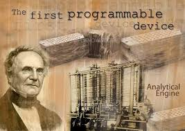
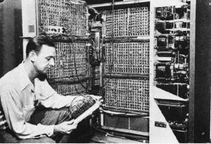
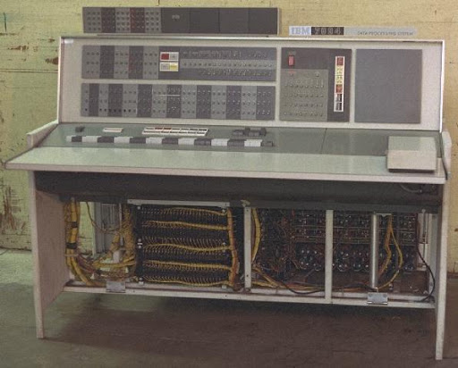
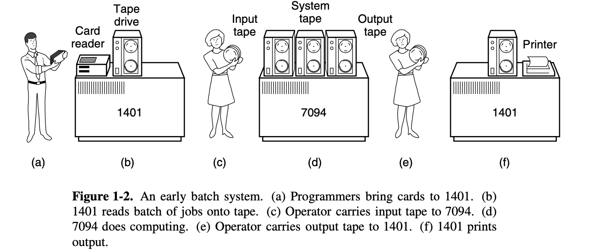
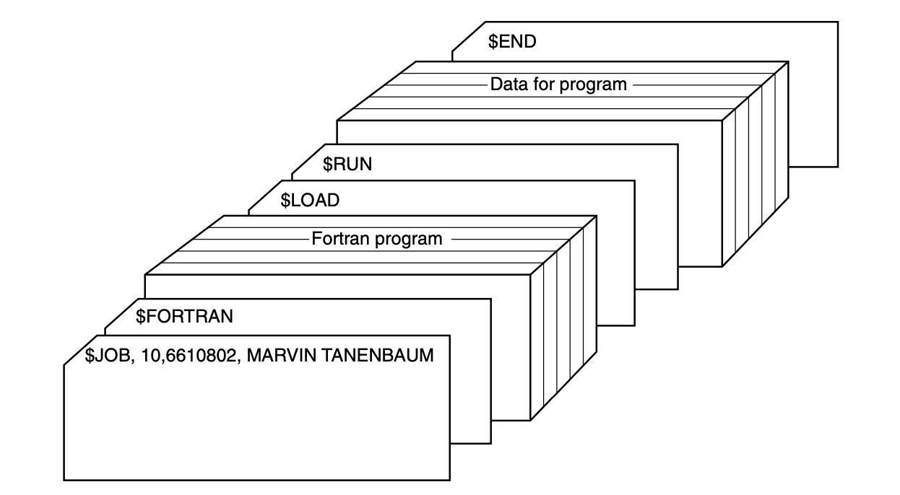
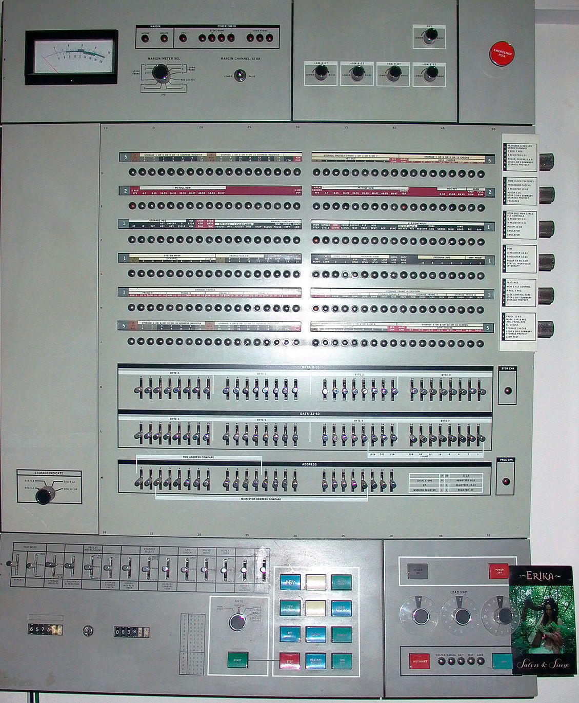

### Operating Systerms Design and Implementation Notes

# 2. The History of Oprating Systerm(Early)
##### By Jiawei Wang
 

<!-- vim-markdown-toc GFM -->

* [1. The First Generation (1945–55) Vacuum Tubes and Plugboards](#1-the-first-generation-194555-vacuum-tubes-and-plugboards)
* [2. The Second Generation (1955–65) Transistors and Batch Systems](#2-the-second-generation-195565-transistors-and-batch-systems)
    * [3. The Third Generation (1965–1980) ICs and Multiprogramming](#3-the-third-generation-19651980-ics-and-multiprogramming)

<!-- vim-markdown-toc -->

 
**Operating systems have been evolving through the years.** 
**The first true digital computer was designed by the English mathematician Charles Babbage (1792–1871).  Although Babbage spent most of his life and for trying to build his ‘‘analytical engine,’’ he never got it working properly because it was purely mechanical, and the technology of his day could not produce the required wheels, gears, and cogs to the high precision that he needed. Needless to say, the analytical engine did not have an operating system.** 

## 1. The First Generation (1945–55) Vacuum Tubes and Plugboards
 
**After Babbage’s unsuccessful efforts, little progress was made in constructing digital computers until World War II. Around the mid-1940s, Howard Aiken at Harvard University, John von Neumann at the Institute for Advanced Study in Princeton, J. Presper Eckert and John Mauchley at the University of Pennsylvania, and Konrad Zuse in Germany, among others, all succeeded in building calculating engines.**
**The Calculating Engines used mechanical relays but were very slow, with cycle times measured in seconds.**  
**Then were replaced by vancuum tubes. These machines were enormous, filling up entire rooms with tens of thousands of vacuum tubes, but they were still millions of times slower than even the cheapest personal computers available today.**

**In these early days, a single group of people designed, built, programmed, operated, and maintained each machine. All programming was done in absolute machine language, often by wiring up plugboards to control the machine’s basic functions. At that time. Programming languages were unknown (even assembly language was unknown). Operating systems were unheard of!**

> The usual mode of operation was for the programmer to sign up for a block of time on the signup sheet on the wall, then come down to the machine room, insert his or her plugboard into the computer, and spend the next few hours hoping that none of the 20,000 or so vacuum tubes would burn out during the run. Virtually all the problems were straightforward numerical calculations, such as grinding out tables of sines, cosines, and logarithms.

## 2. The Second Generation (1955–65) Transistors and Batch Systems

[IBM7094 from colunbia.edu](http://www.columbia.edu/cu/computinghistory/7094.html) 
**The introduction of the transistor in the mid-1950s changed the picture radically.** 
**At that time Computers became reliable enough that they could be manufactured and sold to paying customers with the expectation that they would continue to function long enough to get some useful work done.** 
**And that is the first time, there was a clear separation between designers, builders, operators, programmers, and maintenance personnel.** 
> **These machines, now called mainframes, were locked away in specially air-conditioned computer rooms, with staffs of specially-trained professional operators to run them. Only big corporations or major government agencies or univer- sities could afford their multimillion dollar price tags. To run a job (i.e., a pro- gram or set of programs), a programmer would first write the program on paper (in FORTRAN or possibly even in assembly language), then punch it on cards. He would then bring the card deck down to the input room and hand it to one of the operators and go drink coffee until the output was ready.**

> **When the computer finished whatever job it was currently running, an operator would go over to the printer and tear off the output and carry it over to the out- put room, so that the programmer could collect it later. Then he would take one of the card decks that had been brought from the input room and read it in. If the FORTRAN compiler was needed, the operator would have to get it from a file cabinet and read it in.** 

**Much computer time was wasted while operators were walking around the machine room.**
 
**To save time and the Computing sources(Computer is a high cost equipment). The solution generally adopted was the <u>batch system</u>**
 
**The idea behind it was to collect a tray full of jobs in the input room and then read them onto a magnetic tape using a small (relatively) inexpensive computer, such as the IBM 1401, which was very good at reading cards, copying tapes, and printing output, but not at all good at numerical calculations. Other, much more expensive machines, such as the IBM 7094, were used for the real computing.**
 
**Here are the Process:** 

 
> **After about an hour of collecting a batch of jobs, the tape was rewound and brought into the machine room, where it was mounted on a tape drive. The opera- tor then loaded a special program (the ancestor of today’s operating system), which read the first job from tape and ran it. The output was written onto a second tape, instead of being printed.** 

> **After each job finished, the operating system automatically read the next job from the tape and began running it. When the whole batch was done, the operator removed the input and output tapes, replaced the input tape with the next batch, and brought the output tape to a 1401 for printing off line (i.e., not connected to the main computer).**
 

**To make a better understand. Let's see more details of the input job:** 
+ **It started out with a $JOB card, specifying the maximum run time in minutes, the account number to be charged, and the programmer’s name.**
+ **Then came a $FORTRAN card, telling the operating system to load the FORTRAN compiler from the system tape. It was followed by the program to be compiled. **
+ **Then a $LOAD card, directing the operating system to load the object program just compiled. (Compiled programs were often written on scratch tapes and had to be loaded explicitly.)** 
+ **Next came the $RUN card, telling the operating system to run the program with the data following it.**
+ **Finally, the $END card marked the end of the job.**

**These primitive control cards were the forerunners of modern job control languages and command interpreters.** 
 

**Large second-generation computers were used mostly for scientific and engineering calculations, such as solving the partial differential equations that often occur in physics and engineering. They were largely programmed in FORTRAN and assembly language. Typical operating systems were FMS (the Fortran Monitor System) and IBSYS, IBM’s operating system for the 7094.**
 

### 3. The Third Generation (1965–1980) ICs and Multiprogramming

**By the early 1960s, most computer manufacturers had two distinct, and totally incompatible, product lines. On the one hand there were the word-oriented, large-scale scientific computers, such as the 7094, which were used for numerical calculations in science and engineering. On the other hand, there were the character-oriented, commercial computers, such as the 1401, which were widely used for tape sorting and printing by banks and insurance companies.** 

**Developing, maintaining, and marketing two completely different product lines was an expensive proposition for the computer manufacturers. In addition, many new computer customers initially needed a small machine but later outgrew it and wanted a bigger machine that had the same architectures as their current one so it could run all their old programs, but faster.** 

**The advent of System/360 means that computers in the world have a common way of interacting. They all share the operating system codenamed OS/360, and not all other products have replaced the customized operating system. Applying a single operating system to the entire series of products is the key to System/360's success. And because of that: Application-level compatibility (with some restrictions) for System/360 software is maintained to the present day with the System z mainframe servers.**
 

[IBM Systerm 360 Model 65 upload by Michael J.Ross](http://www.corestore.org)

> **The development process of System/360 is regarded as the biggest gamble in the history of computer development. In order to develop System/360, a large computer, IBM decided to recruit more than 60,000 new employees and establish five new factories.**

> **Gene Amdal is the chief architect of the system, and then the project manager Frederick P. Brooks (Jr.) later wrote ["The Mythical Man-Month: The Way of Software Project Management"](https://en.wikipedia.org/wiki/The_Mythical_Man-Month) based on the development experience of this project**

> **The 360 was a series of software-compatible machines ranging from 1401-sized to much more powerful than the 7094. The machines dif- fered only in price and performance (maximum memory, processor speed, number of I/O devices permitted, and so forth). Since all the machines had the same architecture and instruction set, programs written for one machine could run on all the others, at least in theory. Furthermore, the 360 was designed to handle both scientific (i.e., numerical) and commercial computing. Thus a single family of machines could satisfy the needs of all customers. In subsequent years, IBM has come out with compatible successors to the 360 line, using more modern technology, known as the 370, 4300, 3080, 3090, and Z series.**

 

**The 360 was the first major computer line to use (small-scale) Integrated Circuits (ICs), thus providing a major price/performance advantage over the second generation machines, which were built up from individual transistors. It was an immediate success, and the idea of a family of compatible computers was soon adopted by all the other major manufacturers.**
