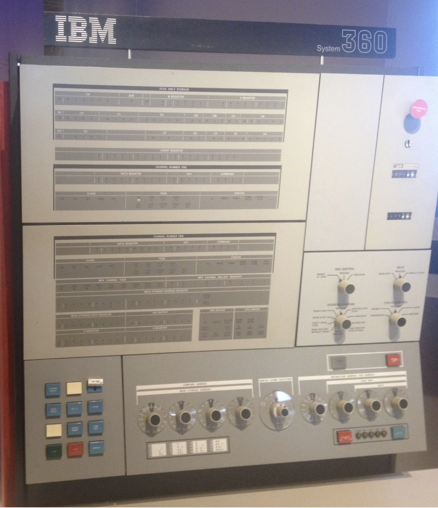
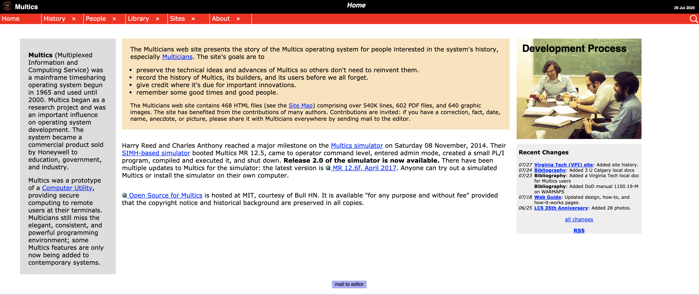
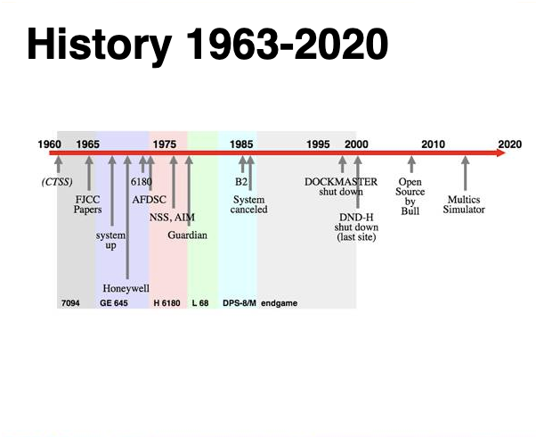

### Operating Systerms Design and Implementation Notes

# 3. MINIX
##### By Jiawei Wang
 

<!-- vim-markdown-toc GFM -->

* [1. The Problem of Systerm/360](#1-the-problem-of-systerm360)
* [2. CTSS and MULTICS](#2-ctss-and-multics)
* [3. Unix](#3-unix)
* [4. Minix](#4-minix)

<!-- vim-markdown-toc -->

> **In 1964, IBM announced the launch of a total of six specifications of the System 360 series of computers (the price ranges from the lowest 130,000 dollars to the top version asking for 5.5 million dollars)**

**The Greatness of System 360 is not that it has any superior design or performance (although it did excel in this field at the time), but that it completely reversed people's overall understanding of computer systems. Starting with the System 360 series, compatibility between different hosts and different models has become the fundamental value of the information industry, and each "computer" has since become a set of "computer systems" with fixed specifications. **

**That also means the development of peripherals such as watch machines, software, and memory finally has profitable value (there are fixed specifications between computers, so that peripherals can be universally compatible with them), and IBM has created the entire industry almost exclusively by hand.**
  

### 1. The Problem of Systerm/360

**The greatest strength of the ‘‘one family’’ idea was simultaneously its greatest weakness. The intention was that all software, including the operating system, OS/360, had to work on all models. It had to run on small systems.  There was no way that IBM (or anybody else) could write a piece of software to meet all those conflicting requirements. The result was an enormous and extraordinarily complex operating system, probably two to three orders of magnitude larger than FMS. It consisted of millions of lines of assembly language written by thousands of programmers, and contained thousands upon thousands of bugs, which necessitated a continuous stream of new releases in an attempt to correct them. Each new release fixed some bugs and introduced new ones, so the number of bugs probably remained constant in time.**
  
**Although third-generation operating systems were well suited for big scientific calculations and massive commercial data processing runs, they were still basically batch systems.** 
**Many programmers pined for the first-generation days when they had the machine all to themselves for a few hours, so they could debug their programs quickly. With third-generation systems, the time between submitting a job and getting back the output was often hours, so a single misplaced comma could cause a compilation to fail, and the programmer to waste half a day.**
  

### 2. CTSS and MULTICS
**[multicians.org](https://www.multicians.org/) **
 

**This desire for quick response time paved the way for timesharing, a variant of multiprogramming, in which each user has an online terminal. In a timesharing system, if 20 users are logged in and 17 of them are thinking or talking or drinking coffee, the CPU can be allocated in turn to the three jobs that want service. Since people debugging programs usually issue short commands (e.g., compile a five page procedure) rather than long ones (e.g., sort a million-record file), the computer can provide fast, interactive service to a number of users and perhaps also work on big batch jobs in the background when the CPU is otherwise idle.   
The first serious timesharing system, CTSS (Compatible Time Sharing System), was developed at M.I.T. on a specially modified 7094 (Corbato ́et al., 1962).**
  

**After the success of the CTSS system, MIT, Bell Labs, and General Electric decided to embark on the development of a ‘‘computer utility,’’ a machine that would support hundreds of simultaneous timesharing users.**
 
> **Their model was the electricity distribution system—when you need electric power, you just stick a plug in the wall, and within reason, as much power as you need will be there.**
 

**The designers of this system, known as MULTICS (MULTiplexed Information and Computing Service), envisioned one huge machine providing computing power for everyone in the Boston area. 
It was designed to support hundreds of users on a machine only slightly more powerful than an Intel 80386-based PC. In addition, MULTICS was enormously ambitious for its time, much like Charles Babbage’s analytical engine in the nineteenth century.** 

### 3. Unix

**MULTICS introduced many seminal ideas into the computer literature. But turning it into a serious product and a commercial success was a lot harder than anyone had expected.** 
**In 1969, Bell Labs dropped out of the project. Then General Electric quit the computer business altogether.**  
**However, M.I.T. persisted and eventually got MULTICS working.**

> **It was ultimately sold as a commercial product by the company that bought GE’s computer business (Honeywell) and installed by about 80 major companies and universities worldwide. While their numbers were small.**

> **MULTICS users were fiercely loyal. General Motors, Ford, and the U.S. National Security Agency, for example, only shut down their MULTICS systems in the late 1990s. The last MULTICS running, at the Canadian Department of National Defence, shut down in October 2000.**

 

**Despite its lack of commercial success, MULTICS had a huge influence on subsequent operating systems.**
 

**One of the computer scientists at Bell Labs who had worked on the MULTICS project, Ken Thompson, subsequently found a small PDP-7 minicomputer that no one was using and set out to write a stripped-down, one-user version of MULTICS. This work later developed into the UNIX operating system, which became popular in the academic world, with government agencies, and with many companies.** 

> **Another major development during the third generation was the phenomenal growth of minicomputers, starting with the Digital Equipment Company (DEC) PDP-1 in 1961. The PDP-1 had only 4K of 18-bit words, but at $120,000 per ma- chine (less than 5 percent of the price of a 7094), it sold like hotcakes. For certain kinds of nonnumerical work, it was almost as fast as the 7094 and gave birth to a whole new industry. It was quickly followed by a series of other PDPs (unlike IBM’s family, all incompatible) culminating in the PDP-11.**

**[PDP-7 from wikipedia](https://en.wikipedia.org/wiki/PDP-7#/media/File:Pdp-7-oslo-2004.jpeg) **

### 4. Minix

**When UNIX was young (Version 6), the source code was widely available, under AT&T license, and frequently studied. John Lions, of the University of New South Wales in Australia, even wrote a little booklet describing its operation, line by line (Lions, 1996). This booklet was used (with permission of AT&T) as a text in many university operating system courses. [J.lions Unix](https://cs3210.cc.gatech.edu/r/unix6.pdf)**
 

**But When AT&T released Version 7, it dimly began to realize that UNIX was a valuable commercial product, so it issued Version 7 with a license that prohibited the source code from being studied in courses, in order to avoid endangering its status as a trade secret. Many universities complied by simply dropping the study of UNIX and teaching only theory.**

**To remedy this situation, one of the authors of this book (Tanenbaum) decided to write a new operating system from scratch that would be compatible with UNIX from the user’s point of view, but completely different on the inside. By not using even one line of AT&T code, this system avoided the licensing restrictions, so it could be used for class or individual study. In this manner, readers could dissect a real operating system to see what is inside, just as biology students dissect frogs. It was called MINIX and was released in 1987 with its complete source code for anyone to study or modify.**
 

**[Minix3](https://en.wikipedia.org/wiki/MINIX_3) **

**Comparing with Unix. Minix has these advantages:**
* **The name MINIX stands for mini-UNIX. Because it is small enough (In Minix3. It only has about 4000 lines C codes)**
* **UNIX was designed to be efficient. But MINIX was designed to be readable.**

**In the Next Note. We will continue talk about The Development of Computer Oprating Systerm**
