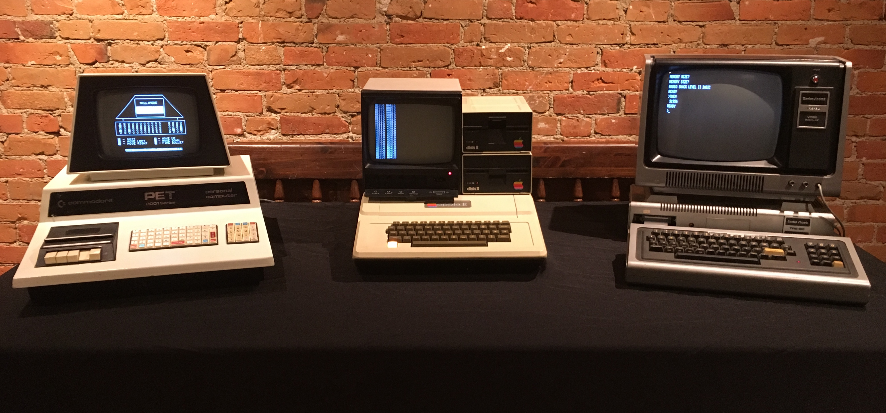
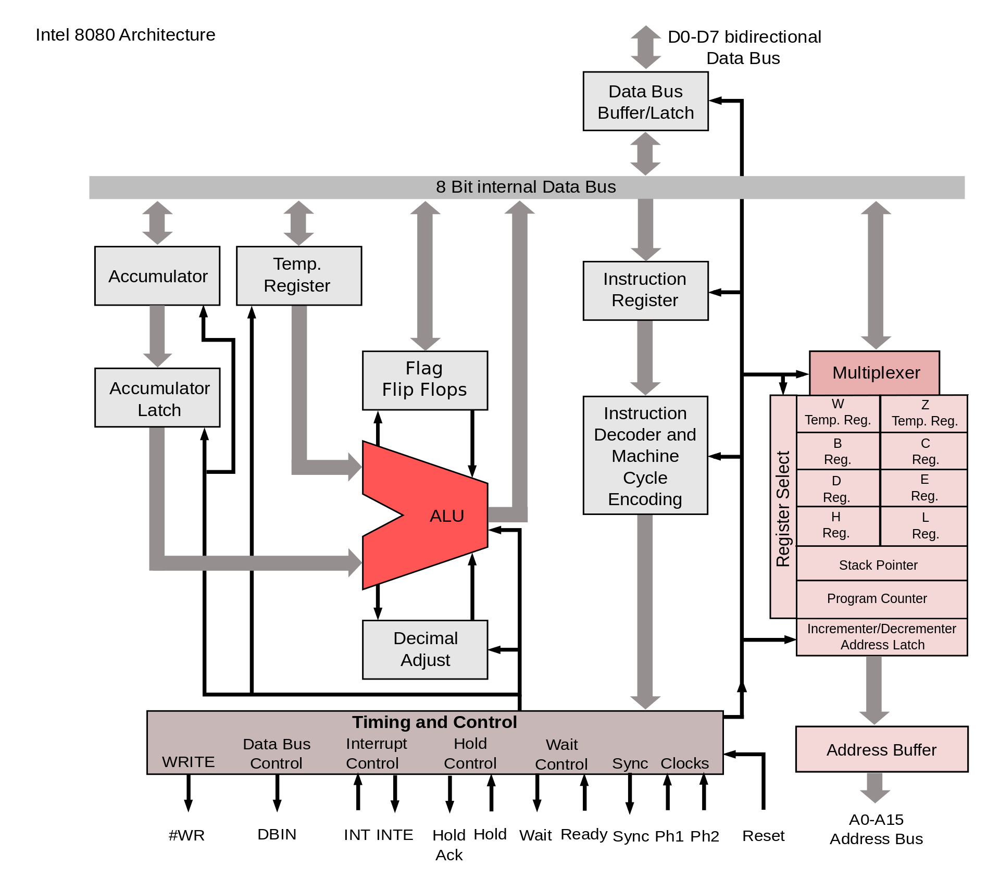
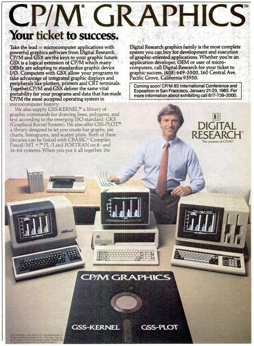
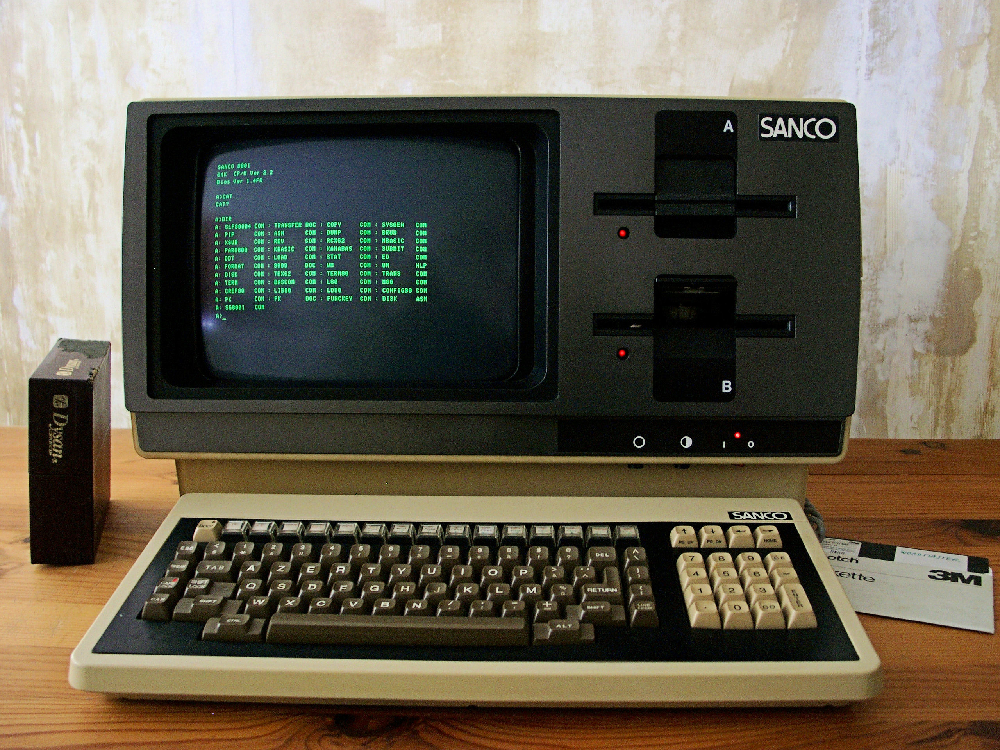

### Operating Systerms Design and Implementation Notes

# 4.1. The 8 Bit Ages
##### By Jiawei Wang
 

## 1 Microcomputer
**With the development of LSI (Large Scale Integration) circuits, chips containing thousands of transistors on a square centimeter of silicon, the age of the microprocessor-based personal computer dawned.**

 
**[By Springsgrace - CC BY-SA 4.0](https://commons.wikimedia.org/w/index.php?curid=79216985)**

1977 Trinity" of home computing: the Commodore PET 2001, the Apple II, and the TRS-80 Model I

> **In terms of architecture, personal computers (initially called microcomputers) were not all that different from minicomputers of the PDP-11 class, but in terms of price they certainly were different.** 
> **The minicomputer made it possible for a department in a company or university to have its own computer. The microcomputer made it possible foran individual to have his or her own computer.**

 
## 2 Intel 8080

**There were several families of microcomputers. In April 1974, Intel came out with the 8080, the first general-purpose 8-bit microprocessor**

**[By Konstantin Lanzet - CPU collectionCamera: Canon EOS 400D, CC BY-SA 3.0](https://commons.wikimedia.org/w/index.php?curid=7028099) **

**Let's see the architecture of Intel 8080. We can see that its design concept is very close to Nowadays Intel's architecture:**

**[By Appaloosa - Own work, CC BY-SA 3.0](https://commons.wikimedia.org/w/index.php?curid=5197867)**

 
## 3 CP/M
 
**[CP/M By Digital Research - Scanned from the November 29, 1982 InfoWorld magazine, Public Domain](https://commons.wikimedia.org/w/index.php?curid=30603370)** 

**CP/M originally standing for Control Program/Monitor and later Control Program for Microcomputers, is a mass-market operating system created in 1974 for Intel 8080/85-based microcomputers by Gary Kildall of Digital Research, Inc. Initially confined to single-tasking on 8-bit processors and no more than 64 kilobytes of memory.** 

**Many application programs were written to run on CP/M, and it dominated the personal computing world for about 5 years.**

**[A SANCO Computer which runs CP/M at 1982 By Mspecht - Own work, CC BY-SA 3.0](https://commons.wikimedia.org/w/index.php?curid=16374059)**

**A minimal 8-bit CP/M system would contain the following components: **
> * **A computer terminal using the ASCII character set** 
> * **An Intel 8080 (and later the 8085) or Zilog Z80 microprocessor** 
> * **At least 16 kilobytes of RAM, beginning at address 0** 
> * **A means to bootstrap the first sector of the diskette**
> * **At least one floppy disk drive**

**However, because of a missed opportunity in the conversion to a 16-bit CPU, it lost miserably to Microsoft's MS-DOS in the 16-bit PC market centered on IBM PC/AT and IBM PC compatible machines,**
**and thus disappeared from the market. Although CP/M introduced the "CP/M 86" designed for Intel 8086 and the "CP/M 68k" designed for Motorola 68000, there are almost no users.**
