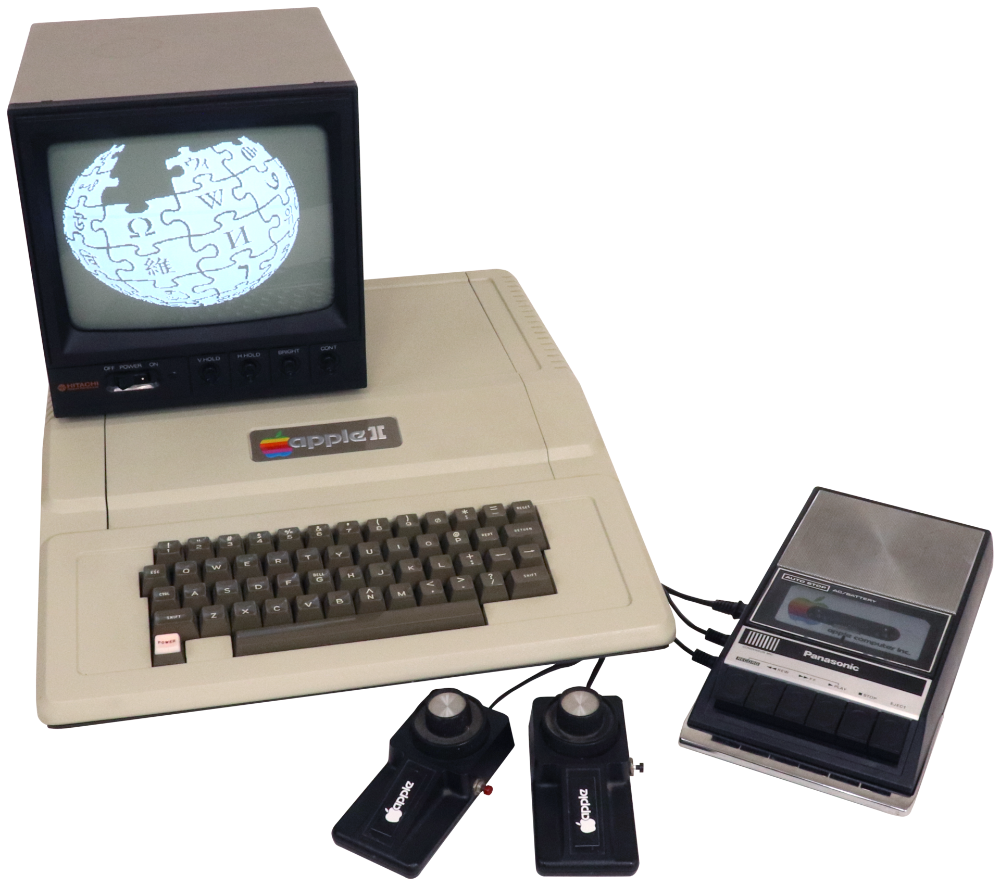
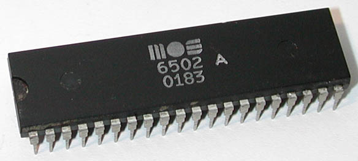
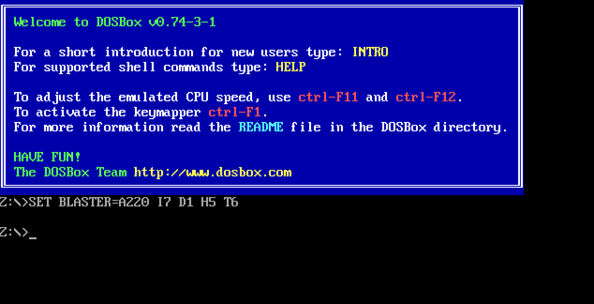

### Operating Systerms Design and Implementation Notes
##### By Jiawei Wang
 

# 4.2. Apple and Microsoft

## 1. Apple II
**Like Intel, Motorola also produced an 8-bit microprocessor, the 6800.**
**A group of Motorola engineers left to form MOS Technology and manufacture the 6502 CPU after Motorola rejected their suggested improvements to the 6800. The 6502 was the CPU of several early systems. One of these, the Apple II, became a major competitor for CP/M systems in the home and educational markets.**

**[Apple-II By FozzTexx - Own work, CC BY-SA 4.0](https://commons.wikimedia.org/w/index.php?curid=79580939)** 

### MOS Technology
> **Like 8080 and Z-80, 6502 is an 8-bit CPU that can address up to 64KB of memory. Just like the Zilog Z-80 is based on the earlier Intel 8080 CPU, the MOS 6502 is based on the Motorola 6800 CPU (released in the same year as the 8080, the price is $360 the same as the 8080).**

> **The 6502's design goal is "a better performance and lower price alternative than the 6800". When the 6502 as launched in the second half of 1975, its price tag was 25 dollars**

> **In response, Motorola drastically reduced the price of the 6800 from 175 to 69 dollars (MOS Technology has also developed a 6501 CPU that can directly replace the 6800 on the circuit board, but due to Motorola's lawsuit, MOS Technology abandoned the 6501 plan and paid Motorola USD200,000).**
 

**At the Beginning of this Note. We see three Computers. Because all of them released at 1977. and Two of them use MOS-6502(AppleII and PET) another(TRS-80) using Zilog Z-80. We call them Trinity-1977.**

 

### Apple-DOS
> **When Apple Computer introduced the Apple II in April 1977, the new computer had no disk drive or disk operating system (DOS). Although Apple co-founder Steve Wozniak designed the Disk II controller late that year, and believed that he could have written a DOS, his co-founder Steve Jobs decided to outsource the task. The company considered using Digital Research's CP/M, but Wozniak sought an operating system that was easier to use. On 10 April 1978 Apple signed a $13,000 contract with Shepardson Microsystems to write a DOS and deliver it within 35 days.(with Assembly language)**
 

### Disk Oprating Systerm(DOS)

**CP/M. Apple-DOS. and MS-DOS(We will introduce later). All of them were DOS(Disk Oprating Systerm)**

**From [Wikipedia](https://en.wikipedia.org/wiki/Disk_operating_system):**
> **In the early days of computers, there were no disk drives, floppy disks or modern flash storage devices. Early storage devices such as delay lines, core memories, punched cards, punched tape, magnetic tape, and magnetic drums were used instead.**

**In these days. If you want to run a program. You have two choices: **
* **Using punched cards. Like IBM 1401 -- Slow and not very easy to carry**
* **Program and data entry was done at front panel switches directly into memory or through a computer terminal / keyboard. -- When power was turned off any information was lost.**

> **In the early 1960s, as disk drives became larger and more affordable, various mainframe and minicomputer vendors began introducing disk operating systems and modifying existing operating systems to exploit disks.**
 

> **Both hard disks and floppy disk drives require software to manage rapid access to block storage of sequential and other data. For most microcomputers, a disk drive of any kind was an optional peripheral; systems could be used with a tape drive or booted without a storage device at all. The disk operating system component of the operating system was only needed when a disk drive was used.**
 

**That Software is called Disk Oprating Systerm(DOS)** 

**[DOSBox is a DOS-emulator that uses the SDL-library which makes DOSBox very easy to port to different platforms. DOSBox has already been ported to many different platforms, such as Windows, BeOS, Linux, MacOS X...](https://www.dosbox.com)**

 
## 2. MS-DOS

**In the Beginning of 1.Apple II. We metioned that the Apple II, became a major competitor for CP/M systems in the home and educational markets.** 

**But CP/M was so popular that many owners of Apple II computers purchased Z-80 coprocessor add-on cards to run CP/M, since the 6502 CPU was not compatible with CP/M. The CP/M cards were sold by a little company called Microsoft, which also had a market niche supplying BASIC interpreters used by a number of microcomputers running CP/M.**
 

### 86-DOS
**The next generation of microprocessors were 16-bit systems. Intel came out with the 8086 at July 1, 1979**

**[Intel 8086 Photo By Thomas Nguyen - Own work, CC BY-SA 4.0](https://commons.wikimedia.org/w/index.php?curid=46809082)**

**[From Wikipedia](https://en.wikipedia.org/wiki/MS-DOS)**
> **MS-DOS was a renamed form of 86-DOS ‚which owned by Seattle Computer Products, written by Tim Paterson. Development of 86-DOS took only six weeks, as it was basically a clone of Digital Research's CP/M (for 8080/Z80 processors), ported to run on 8086 processors and with two notable differences compared to CP/M: an improved disk sector buffering logic, and the introduction of FAT12 instead of the CP/M filesystem. This first version was shipped in August 1980.** 

> **Microsoft, which needed an operating system for the IBM Personal Computer, hired Tim Paterson in May 1981 and bought 86-DOS 1.10 for US$75,000 in July of the same year. Microsoft kept the version number, but renamed it MS-DOS. They also licensed MS-DOS 1.10/1.14 to IBM, which, in August 1981, offered it as PC DOS 1.0 as one of three operating systems for the IBM 5150, or the IBM PC.**

> **Within a year, Microsoft licensed MS-DOS to over 70 other companies. It was designed to be an OS that could run on any 8086-family computer. Each computer would have its own distinct hardware and its own version of MS-DOS, similar to the situation that existed for CP/M**
