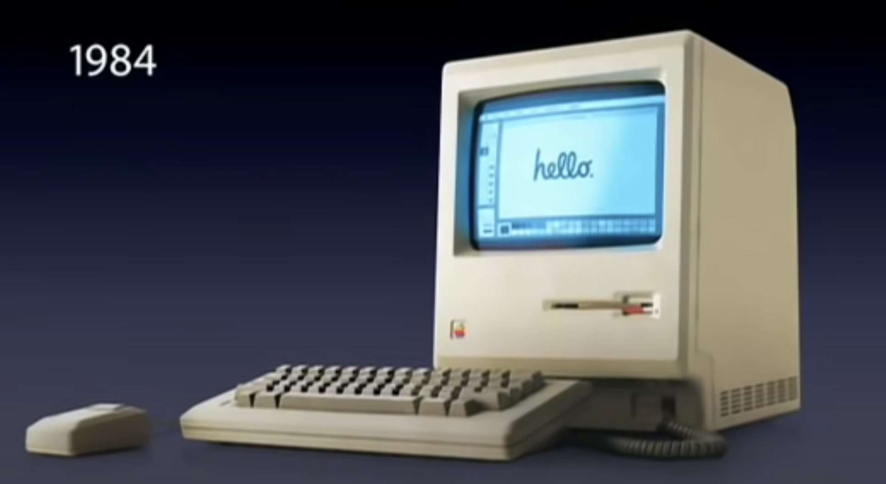
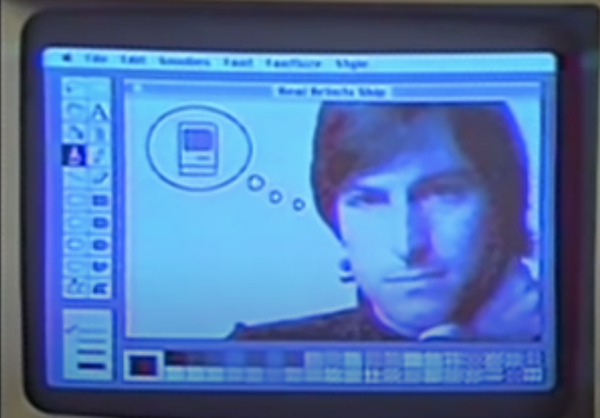
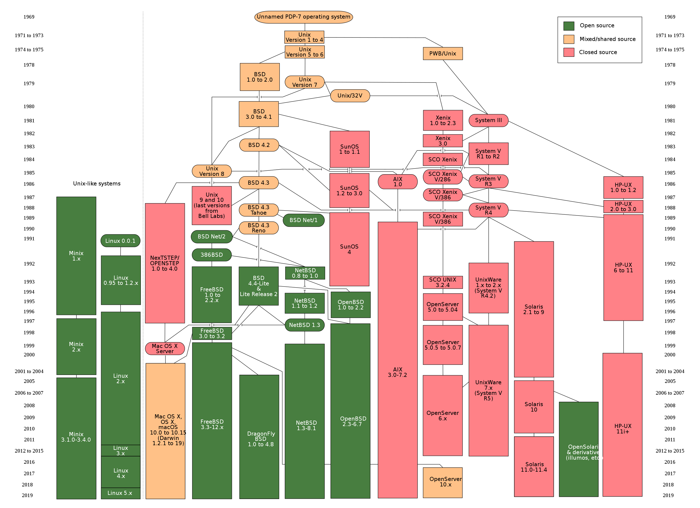
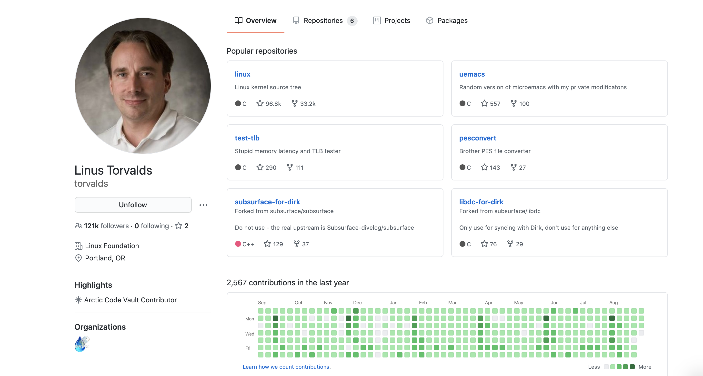
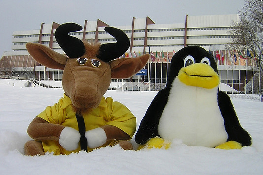

# 4.3. Modern System
### Operating Systerms Design and Implementation Notes
##### By Jiawei Wang
 

**CP/M, MS-DOS, and the Apple DOS were all command-line systems: users typed commands at the keyboard.**

**In the late 1960s, researchers at the Stanford Research Institute, led by Douglas Engelbart, developed the On-Line System (NLS), which used text-based hyperlinks manipulated with a then-new device: the mouse. and complete with windows, icons, menus, and mouse. We call them GUI(Graphical User Interface)** 

 
## 1. Apple Macintoch
**Apple's Steve Jobs saw the possibility of a truly user-friendly personal computer (for users who knew nothing about computers and did not want to learn), and the Apple Macintosh was announced in early 1984 with US dollars 2,495.**

**[Macintoch 128k announced in 1984 by Steve Jobs](https://www.youtube.com/watch?v=2B-XwPjn9YY&t=28s)**

**It used Motorola's 16-bit 68000 CPU, and had 64 KB of ROM (Read Onl Memory), to support the GUI.**

### Classic Mac OS (1984 to 2001)

**System 1 in 1984 Macintoch 128k**

**The Macintosh has evolved over the years. Subsequent Motorola CPUs were true 32-bit systems, and later(System 7 1991) Apple moved to IBM PowerPC CPUs, with RISC 32-bit (and later, 64-bit) architecture.** 

 
**System 9 in 1999**

 
## 2. BSD 
**In 2001 Apple made a major operating system change, releasing Mac OS X, with a new version of the Macintosh GUI on top of Berkeley UNIX. And in 2005 Apple announced that it would be switching to Intel x86 processors.**

**About Berkeley Unix and The Difference with Unix:**

**[Unix TimeLineBy Eraserhead1, Infinity0, Sav_vas - Levenez Unix History Diagram, Information on the history of IBM&#039;s AIX on ibm.com, CC BY-SA 3.0](https://commons.wikimedia.org/w/index.php?curid=1801948)** 

**In this Photo. We can See a Keyword That Be mentioned in several times -- BSD** 

**The Berkeley Software Distribution (BSD) was an operating system based on Research Unix. As We can See that in the Timeline Above. There are many Branch of BSD: **
**The current three mainstream BSD systems are FreeBSD, NetBSD and OpenBSD:** 

* **FreeBSD is the most popular, targeting high performance and ease of use. Supports 32-bit and 64-bit processors from Intel and AMD.**

* **NetBSD is designed to run on almost any architecture and supports more architectures.**

* **OpenBSD is designed for maximum security, which is not only its declared function, it is also true in practice. It is designed for key systems of banks and other important institutions.**
 

**There are two other important BSD systems DragonFly BSD and Darwin namely Mac OS X. **
**The design goal of DragonFly BSD is to provide an operating system such as a computer cluster running in a multi-threaded environment. **

**Mac OS X and Also IOS is actually based on Darwin, and Darwin is based on BSD. It is a bit different from other BSDs. Although the underlying core and other software are open source BSD code, most of the operating system is closed source Mac OS code that is not public. Apple has developed Mac OS X and iOS on the basis of BSD, so that they don't have to write the bottom layer of the operating system**

**We will Introduce BSD License Soon**

 
## 3. Linux
**In the Last Note ([Minix](https://angoldwange.github.io/OSDINotes/#!Chapters/Chapter1/3MINIX.md)). We Introduced the origin of Minix and Why we need Minix** 
**In the Linus Torvalds' autobiography(Just For Fun). We can find the Origin of linux:** 

> **Shortly after MINIX was released, a USENET newsgroup, comp.os.minix, was formed to discuss it. Within weeks, it had 40,000 subscribers, most of whom wanted to add vast numbers of new features to MINIX to make it bigger and better (well, at least bigger). Every day, several hundred of them offered suggestions, ideas, and frequently snippets of source code. The author of MINIX was able to successfully resist this onslaught for several years, in order to keep MINIX clean enough for students to understand and small enough that it could run on computers that students could afford. For people who thought little of MS-DOS, the existence of MINIX (with source code) as an alternative was even a reason to finally go out and buy a PC.**
 

> **One of these people was a Finnish student named Linus Torvalds. Torvalds installed MINIX on his new PC and studied the source code carefully. Torvalds wanted to read USENET newsgroups (such as comp.os.minix) on his own PC rather than at his university, but some features he needed were lacking in MINIX, so he wrote a program to do that, but soon discovered he needed a different termi- nal driver, so he wrote that too. Then he wanted to download and save postings, so he wrote a disk driver, and then a file system. By Aug. 1991 he had produced a primitive kernel. On Aug. 25, 1991, he announced it on comp.os.minix. This announcement attracted other people to help him, and on March 13, 1994 Linux 1.0 was released. Thus was Linux born.** 

**[Linus Github Pages(till 2020.9.1)](https://github.com/torvalds)**

**Linus Also write in his Book(Just For Fun) that this Book (Operating Systems Design and Implementation) is the book that influenced him most**
 

## 4. GNU and GPL

**Development of the GNU operating system was initiated by Richard Stallman while he worked at MIT Artificial Intelligence Laboratory. It was called the GNU Project, and was publicly announced on September 27, 1983, on the net.unix-wizards and net.usoft newsgroups by Stallman. Software development began on January 5, 1984, when Stallman quit his job at the Lab so that they could not claim ownership or interfere with distributing GNU components as free software. Richard Stallman chose the name by using various plays on words, including the song The Gnu.**
 

> **In 1984, began to develop software such as editor Emacs. In 1985, the GNU Manifesto was issued. In 1989, the GNU General Public License was published. Other parts of the GNU project, such as editors, compilers(gcc), shells, etc., have been completed, and the operating system core is missing.**

**In 1991, Linux appeared. In 1993, FreeBSD was released. All software running in user space in the GNU project can be used on Linux or FreeBSD. Many developers turn to Linux or FreeBSD. Among them, Linux has become a common GNU project software operating platform. Richard Stallman argued that the Linux operating system uses many GNU project software and should be renamed GNU/Linux, but it has not been unanimously approved by the Linux community, which has led to a GNU/Linux naming dispute.**
 

**Linux uses the GNU General Public User License or GPL. If you modify the Linux kernel and distribute it, you must release the modified original code. BSD uses BSD user authorization. If you modify the BSD core or release it, you do not need to make the code public. You are free to do whatever you want with your BSD code. You are not obligated to release the modified code, of course you can release it if you want.**

**[GNU and Linux](https://www.fsf.org/community/)**

 
## 5. Microsoft Windows
**To compete with the Macintosh, Microsoft invented Windows. Originally Windows was just a graphical environment on top of 16-bit MS-DOS (i.e., it was more like a shell than a true operating system). However, current versions of Windows are descendants of Windows NT, a full 32-bit system, rewritten from scratch.**
