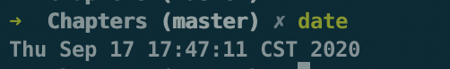
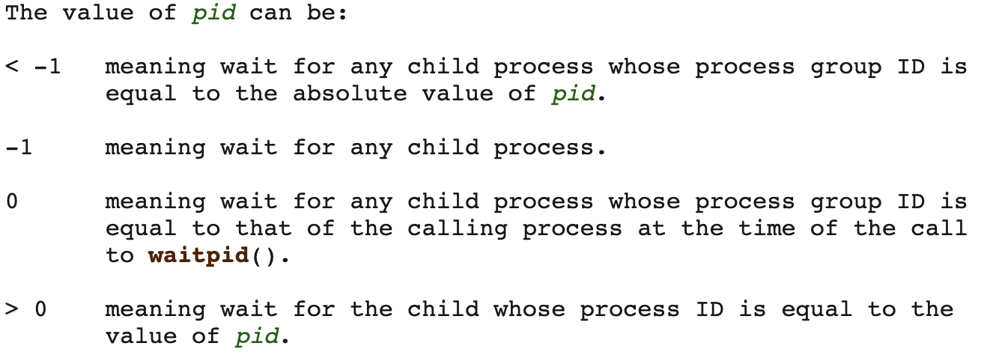
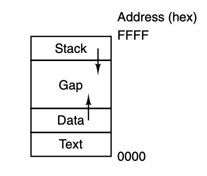
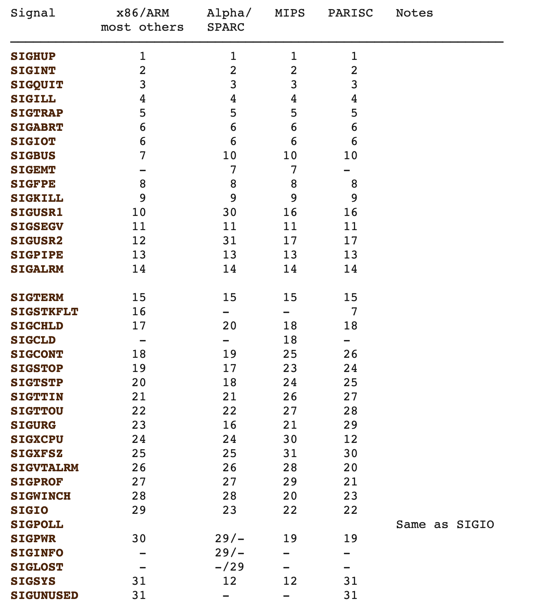

### Operating Systerms Design and Implementation Notes

##### By Jiawei Wang
<br>

## Shell

**In the First Note. We mentioned that: The operating system is the code that carries out the system calls.<br>
Editors, compilers, assemblers, linkers, and command interpreters definitely are not part of the operating system, even though they are important and useful.**
<br>
**The MINIX 3 command interpreter, called the Shell.**<br>
**It is also the primary interface between a user sitting at his terminal and the operating system, unless the user is using a graphical user interface.**<br>


<br>

**When any user logs in, a shell is started up. The shell has the terminal as standard input and standard output (STDIN STDOUT). It starts out by typing the prompt, a character such as a dollar sign, which tells the user that the shell is waiting to accept a command. If the user now types**<br>
```shell
date
```
<br>

<br>

**for example, the shell creates a child process and runs the date program as the child. While the child process is running, the shell waits for it to terminate. When the child finishes, the shell types the prompt again and tries to read the next input line.**<br>

### Example:
**Considering you input that command in shell:**<br>
```shell
cp file1 file2
```
**Used to copy file1 to file2. After the shell has forked, the child process locates and executes the file cp and passes to it the names of the source and target files.**<br>
**The main program of cp (and main program of most other C programs) contains the declaration:**
```c
main(argc, argv, envp)
```
* **where argc is a count of the number of items on the command line, including the program name. For the example above, argc is 3.**
* **The second parameter, argv, is a pointer to an array. Element i of that array is a pointer to the i-th string on the command line. In our example, argv[0] would point to the string ‘‘cp’’, argv[1] would point to the string ‘‘file1’’, and argv[2] would point to the string ‘‘file2’’.**
* **The third parameter of main, envp, is a pointer to the environment, an array of strings containing assignments of the form name=value used to pass information such as the terminal type and home directory name to a program. In Fig. 1-10, no environment is passed to the child, so the third parameter of execve is a zero.**

<br>

# 5. Systerm Calls

<br>

**In a sense, making a system call is like making a special kind of procedure call, only system calls enter the kernel or other privileged operating system components and procedure calls do not.**
<br><br>
**MINIX 3 has a total of 53 main system calls:**<br>
<br>


<!-- vim-markdown-toc GFM -->

* [1. Systerm Calls For Process Management](#1-systerm-calls-for-process-management)
    * [fork -- create a child process](#fork----create-a-child-process)
    * [waitpid -- wait for process to change state](#waitpid----wait-for-process-to-change-state)
    * [wait -- old wait for process to change state](#wait----old-wait-for-process-to-change-state)
    * [execve -- execute program](#execve----execute-program)
    * [exit -- cause normal process termination](#exit----cause-normal-process-termination)
    * [brk, sbrk - change data segment size](#brk-sbrk---change-data-segment-size)
    * [getpid -- get process identification](#getpid----get-process-identification)
    * [getpgrp -- get process group id](#getpgrp----get-process-group-id)
    * [ptrace -- process trace](#ptrace----process-trace)
* [2. Systerm Calls for Signaling](#2-systerm-calls-for-signaling)
    * [sigaction -- examine and change a signal action](#sigaction----examine-and-change-a-signal-action)
    * [sigreturn -- return  from  signal handler and cleanup stack frame](#sigreturn----return--from--signal-handler-and-cleanup-stack-frame)

<!-- vim-markdown-toc -->


## 1. Systerm Calls For Process Management
<br>

### fork -- create a child process

**[fork](https://man7.org/linux/man-pages/man2/fork.2.html)( ) creates a new process by duplicating the calling process.<br>
The new process is referred to as the child process.  The calling process is referred to as the parent process.**<br>
* **After the fork, the original process and the copy (the parent and child) go their separate ways.**
* **In most cases, after a fork, the child will need to execute different code from the parent**
* **On success: the PID of the child process is returned in the parent, and 0 is returned in the child.**
* **On failure, -1 is returned in the parent, no child process is created, and errno is set appropriately.**
<br>

### waitpid -- wait for process to change state
**[waitpid](https://man7.org/linux/man-pages/man2/waitpid.2.html)(pid_t pid, int wstatus(pointer), int options)**<br>
**To wait for the child to finish, the parent executes a waitpid system call, which just waits until the child terminates (any child if more than one exists).**
* **The First argument(pid) default is -1: detail see below:** <br>
<br>
* **The Second argument(wstatus) is a pointer. which point the exit value of the child process(default is Null)**
* **The Third argument default is 0. For the detail you can check the [website](https://man7.org/linux/man-pages/man2/waitpid.2.html)**
* **In normal case: returns the process ID of the child whose state has changed or -1**
<br>

### wait -- old wait for process to change state
**[wait](https://man7.org/linux/man-pages/man2/waitpid.2.html) (wstatus(pointer))**<br>
**The waitpid call replaces the previous wait call, which is now obsolete but is provided for reasons of backward compatibility.**
<br>

### execve -- execute program
**[execve](https://man7.org/linux/man-pages/man3/exec.3.html) (command, parameters, env)**<br>
**In the most general case, execve has three parameters: the name of the file to be executed, a pointer to the argument array, and a pointer to the environment**<br>

* **There are many different types of exeve for difference [use](https://man7.org/linux/man-pages/man3/exec.3.html): execl, execlp, execle, execv, execvp, execvpe**
* **The exec functions return only if an error has occurred. -1 and errno is set to indicate the error.**

```c
/*A stripped-down shell */
#define TRUE 1

while (TRUE){                            /* repeat forever */
    typt_prompt()                        /* display prompt on the screen */
    read_command(command, parameters);   /* read input from terminal */

    if (folk()!=0){                      /* fork off child process */
        /*parent code.*/
        waitpid(-1, &status, 0);         /* wait for child to exit */
        }
    else{
        /*child code.*/
        execve(command, parameters, 0);  /* execute command */
        }
    }

```
<br>

### exit -- cause normal process termination
**[exit](https://www.man7.org/linux/man-pages/man3/exit.3.html) (int status)**<br>
**The exit function causes normal process termination and the least significant byte of status (i.e., status & 0xFF) is returned to the parent (see wait(2)).**
<br>

### brk, sbrk - change data segment size
**[brk](https://man7.org/linux/man-pages/man2/brk.2.html) (void addr(pointer))**<br>
**[sbrk](https://man7.org/linux/man-pages/man2/brk.2.html) (intptr_t increment)**<br>
**brk and sbrk change the location of the program break, which defines the end of the process's data segment (i.e., the program break is the first location after the end of the uninitialized data segment)**<br>

<br>
**Processes in MINIX 3 have their memory divided up into three segments: the text segment (i.e., the program code), the data segment (i.e., the variables), and the stack segment. <br>The data segment grows upward and the stack grows down-ward. Between them is a gap of unused address space. The stack grows into the gap automatically, as needed, but expansion of the data segment is done explicitly by using a system call, brk, which specifies the new address where the data segment is to end.**<br>

**As a convenience for programmers, a library routine sbrk is provided that also changes the size of the data segment, only its parameter is the number of bytes to add to the data segment (negative parameters make the data segment smaller).**
<br>


### getpid -- get process identification
**[getpid](https://man7.org/linux/man-pages/man2/getpid.2.html) ( ) returns the process ID (PID) of the calling process.**
<br>

### getpgrp -- get process group id
**[getpgrp](https://man7.org/linux/man-pages/man2/getpgrp.2.html) ( ) returns the process group ID of the calling process**<br>
**[From Wikipedia](https://en.wikipedia.org/wiki/Process_group): A process group denotes a collection of one or more processes. Among other things, a process group is used to control the distribution of a signal; when a signal is directed to a process group, the signal is delivered to each process that is a member of the group.**
<br>


### ptrace -- process trace
**It is used by debugging programs to control the program being debugged. It allows the debugger to read and write the controlled process’ memory and manage it in other ways.**<br>
**For more: [man7.org](https://man7.org/linux/man-pages/man2/ptrace.2.html)**
<br><br>

## 2. Systerm Calls for Signaling

**Although most forms of interprocess communication are planned, situations exist in which unexpected communication is needed. For example, if a user accidently tells a text editor to list the entire contents of a very long file, and then realizes the error, some way is needed to interrupt the editor. <br><br>In MINIX 3, the user can hit the CTRL-C key on the keyboard, which sends a signal to the editor. The editor catches the signal and stops the print-out. Signals can also be used to report certain traps detected by the hardware, such as illegal instruction or floating point overflow. Timeouts are also implemented as signals.**
<br>

### sigaction -- examine and change a signal action
**[sigaction](https://man7.org/linux/man-pages/man2/sigaction.2.html) (int signum, const struct sigaction act(pointer), struct sigaction oldact(pointer) )**<br>
**The sigaction() system call is used to change the action taken by a process on receipt of a specific signal**<br>

* **When a signal is sent to a process that has not announced its willingness to accept that signal, the process is simply killed without further ado.**
* **The first argument(int signum) is an integer which direct to a specific signal, detail see below:**<br>


* **signum specifies the signal and can be any valid signal except SIGKILL and SIGSTOP.**
* **The Second arg act is a pointer which to a signal hander program in the storiage**
* **The Third arg oldact is also a pointer like act. Which point to the address stored by the original handler.(If is Null means don't need to return previous program)**
* **If act is non-NULL, the new action for signal signum is installed from act. If oldact is non-NULL, the previous action is saved in oldact.**
* **After a sigaction call, if a signal of the relevant type is generated (e.g., by pressing CTRL-C), the state of the process is pushed onto its own stack, and then the signal handler is called.**<br>
<br>

### sigreturn -- return  from  signal handler and cleanup stack frame


