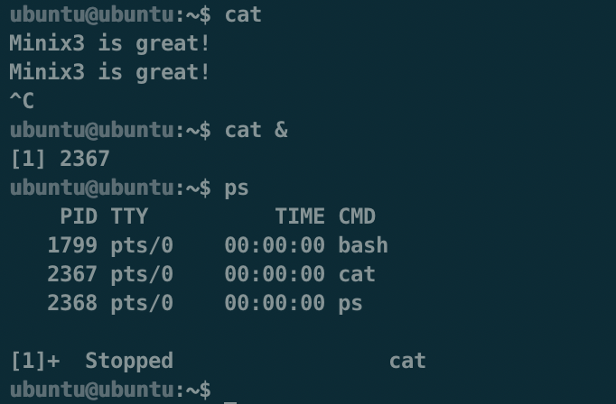
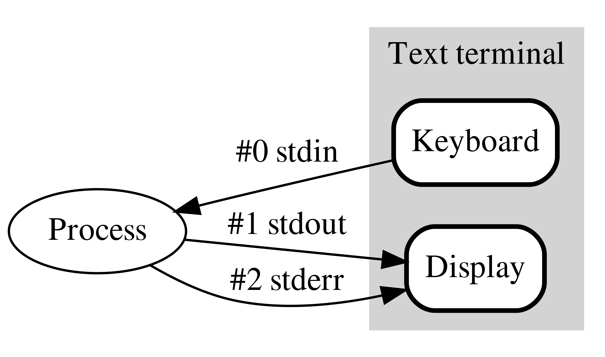
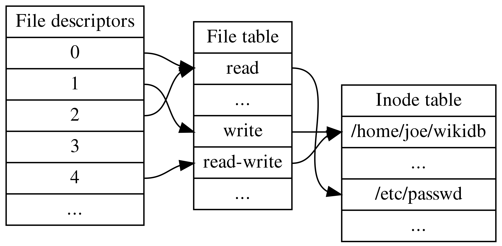
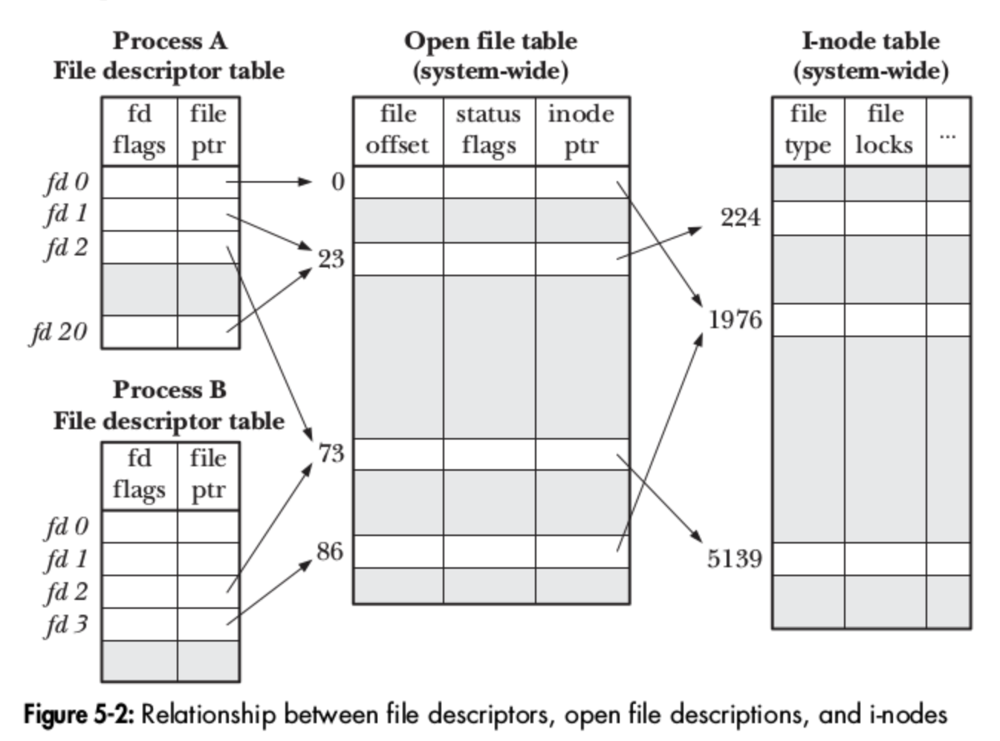
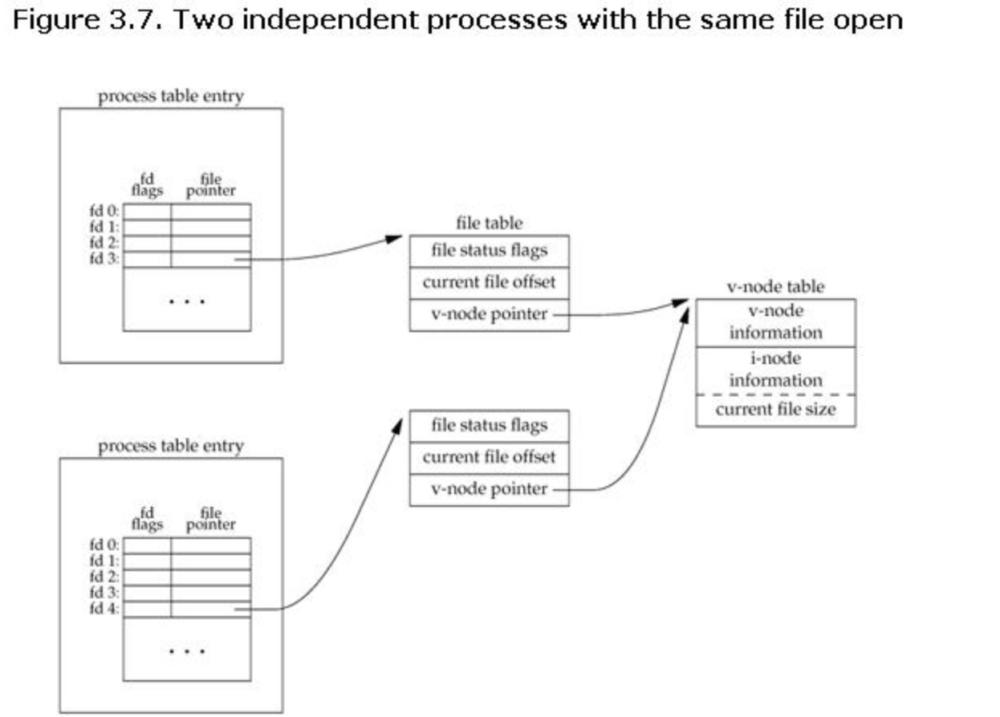
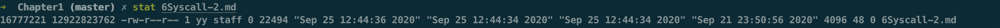
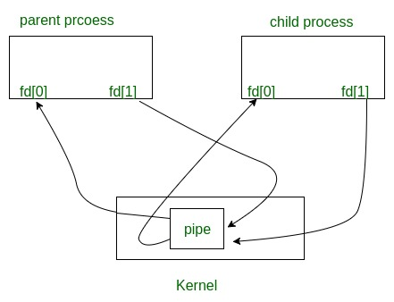
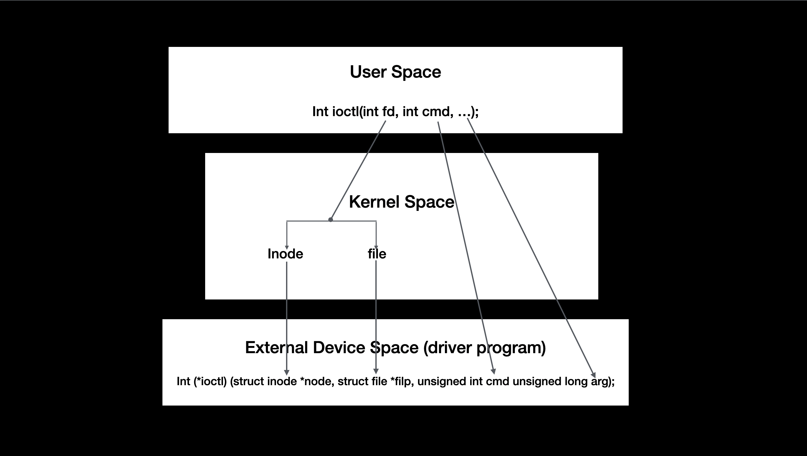
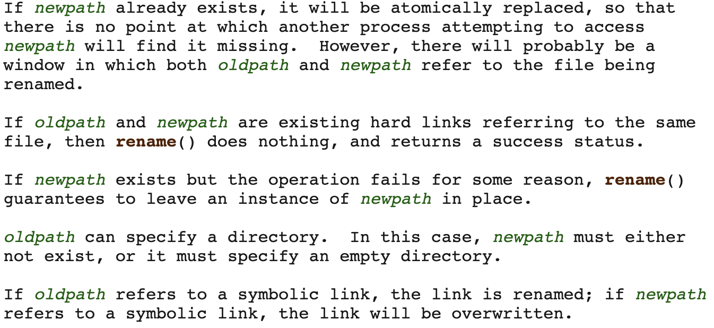

### Operating Systerms Design and Implementation Notes

##### By Jiawei Wang

# 6. System Calls (2)
<br>

<br>

<!-- vim-markdown-toc GFM -->

* [File System](#file-system)
    * [Standard Stream](#standard-stream)
    * [Three Data Structures inside The Kernel](#three-data-structures-inside-the-kernel)
        * [The per-process file description table](#the-per-process-file-description-table)
        * [The system-wide table of open file descriptions](#the-system-wide-table-of-open-file-descriptions)
        * [The file system i-node table](#the-file-system-i-node-table)
* [System Calls for File Management](#system-calls-for-file-management)
    * [creat -- create a file with name and protection mode](#creat----create-a-file-with-name-and-protection-mode)
    * [mknod -- create a special or ordinary file](#mknod----create-a-special-or-ordinary-file)
    * [open -- open file relative to directory file descriptor](#open----open-file-relative-to-directory-file-descriptor)
    * [close -- close a file descriptor](#close----close-a-file-descriptor)
    * [read -- read from a file descriptor](#read----read-from-a-file-descriptor)
    * [write -- write to a file descriptor](#write----write-to-a-file-descriptor)
    * [lseek -- reposition read/write file offset](#lseek----reposition-readwrite-file-offset)
    * [stat, fstat -- get file status](#stat-fstat----get-file-status)
    * [dup, dup2 -- duplicate a file descriptor](#dup-dup2----duplicate-a-file-descriptor)
    * [pipe -- create pipe](#pipe----create-pipe)
    * [ioctl - control device](#ioctl---control-device)
        * [cmd](#cmd)
        * [the usage of ioctl](#the-usage-of-ioctl)
    * [fcntl -- manipulate file descriptor](#fcntl----manipulate-file-descriptor)
    * [access -- check user's permissions for a file](#access----check-users-permissions-for-a-file)
    * [rename -- change the name or location of a file](#rename----change-the-name-or-location-of-a-file)

<!-- vim-markdown-toc -->


## File System
**Before we try to understand the specific file system calls<br>**
**we need to have a general understanding of the operating principle of the entire file system:**

### Standard Stream
**In computer programming, [standard streams](https://en.wikipedia.org/wiki/Standard_streams) are interconnected input and output communication channels between a computer program and its environment when it begins execution.**<br>

**Once a process is created, it will automatically creates a standard stream by opening 3 files (stdin stdout stderr)<br>**
**Once the process opens an existing file or creates a new file, the kernel returns a file descriptor to the process.<br>**
**Once the process involves IO operations, there must be a call file descriptor.**
<br>

**To understand what is Standard Stream. let us see an example in shell process:**<br>
**In the [last Note](https://github.com/Angold-4/OSDI/blob/master/Chapters/Chapter1/5Syscall-1.md) we metioned that shell is a process which accept the user input and creat child processes<br>**
**Let's briefly review the process of shell reading instructions to create child processes:**<br>

* **Call getchar ( ) to read the input string from the terminal, separated by spaces, the first parameter is the file name, and the following parameters are the input parameters.**
* **Execute the system call fork() to generate a child process**
* **The child process executes the system call execve(), passes in the file name and input parameters to update the memory space of the child process, and points the program counter of the process to the first instruction. So far, the new process has been generated.**
* **If the parameter ends with & (in shell), the main process continues to wait for input. On the contrary, the main process executes the system call waitpid() until the child process is executed, and then continues to wait for input.**
<br>

**In these steps above: the last step is very interesting. Sometimes people will say that adding "&" after the command means creating a background process**<br>
**But I don't think it is the true [background process](https://en.wikipedia.org/wiki/Background_process#:~:text=A%20background%20process%20is%20a,%2C%20scheduling%2C%20and%20user%20notification.):**<br>
> **from wikipedia:<br>A background process is a computer process that runs behind the scenes (i.e., in the background) and without user intervention. Typical tasks for these processes include logging, system monitoring, scheduling, and user notification. The background process usually is a child process created by a control process for processing a computing task. After creation, the child process will run on its own, performing the task independent of the control process, freeing the control process of performing that task.**

**In this briefly description: "independent" is the key word. If the background process cannot run with foreground process independently. It will not be truly defined as this name.**<br>

<br>

**Let us see this command above -- cat**<br>
**The independent ```cat``` command read the char from shell and writing them to standard output.**<br>
**In this figure. we can find that: if we create a background ```cat``` process. Then in shell we type ```ps``` command to let the shell write the process status to standard output.**<br>
**We will find that the background process ```cat``` was stopped unexpectly.**
<br>

**To understand why this error occurs. we need to figure out These three Stand Stream -- ```stdin``` ```stdout``` ```stderr```**<br>
**As we metioned above : Once a process is created, it will automatically creates a standard stream by opening 3 files (stdin stdout stderr), which stand for standard input, output, and error.**<br>
**Samely, when shell open (we create the shell process). it will also creates 3 standard stream. we use [lsof](https://en.wikipedia.org/wiki/Lsof) command to view the file opened by a process.**<br>
> **from wikipedia:<br>```lsof``` is a command meaning "list open files", which is used in many Unix-like systems to report a list of all open files and the processes that opened them.**

<br>

**Check out this code:**

```
ubuntu@ubuntu:~$ ps
    PID TTY          TIME CMD
   1799 pts/0    00:00:00 bash
   2367 pts/0    00:00:00 cat
  12849 pts/0    00:00:00 ps
```

```
ubuntu@ubuntu:~$ lsof -p 1799
COMMAND  PID   USER   FD   TYPE DEVICE SIZE/OFF   NODE NAME
bash    1799 ubuntu  cwd    DIR  179,2     4096 130305 /home/ubuntu
bash    1799 ubuntu  rtd    DIR  179,2     4096      2 /
bash    1799 ubuntu  txt    REG  179,2  1215072   1537 /usr/bin/bash
bash    1799 ubuntu  mem    REG  179,2   201272   8107 /usr/lib/locale/C.UTF-8/LC_CTYPE
bash    1799 ubuntu  mem    REG  179,2    51616   3407 /usr/lib/aarch64-linux-gnu/libnss_files-2.31.so
bash    1799 ubuntu  mem    REG  179,2  1518110   8106 /usr/lib/locale/C.UTF-8/LC_COLLATE
bash    1799 ubuntu  mem    REG  179,2  3035952   8118 /usr/lib/locale/locale-archive
bash    1799 ubuntu  mem    REG  179,2  1441800   3130 /usr/lib/aarch64-linux-gnu/libc-2.31.so
bash    1799 ubuntu  mem    REG  179,2    14528   3173 /usr/lib/aarch64-linux-gnu/libdl-2.31.so
bash    1799 ubuntu  mem    REG  179,2   187688   3534 /usr/lib/aarch64-linux-gnu/libtinfo.so.6.2
bash    1799 ubuntu  mem    REG  179,2       50   8114 /usr/lib/locale/C.UTF-8/LC_NUMERIC
bash    1799 ubuntu  mem    REG  179,2     3360   8117 /usr/lib/locale/C.UTF-8/LC_TIME
bash    1799 ubuntu  mem    REG  179,2      270   8112 /usr/lib/locale/C.UTF-8/LC_MONETARY
bash    1799 ubuntu  mem    REG  179,2       48   8111 /usr/lib/locale/C.UTF-8/LC_MESSAGES/SYS_LC_MESSAGES
bash    1799 ubuntu  mem    REG  179,2       34   8115 /usr/lib/locale/C.UTF-8/LC_PAPER
bash    1799 ubuntu  mem    REG  179,2       62   8113 /usr/lib/locale/C.UTF-8/LC_NAME
bash    1799 ubuntu  mem    REG  179,2      131   8105 /usr/lib/locale/C.UTF-8/LC_ADDRESS
bash    1799 ubuntu  mem    REG  179,2   146320   2803 /usr/lib/aarch64-linux-gnu/ld-2.31.so
bash    1799 ubuntu  mem    REG  179,2       47   8116 /usr/lib/locale/C.UTF-8/LC_TELEPHONE
bash    1799 ubuntu  mem    REG  179,2       23   8109 /usr/lib/locale/C.UTF-8/LC_MEASUREMENT
bash    1799 ubuntu  mem    REG  179,2    27004   2767 /usr/lib/aarch64-linux-gnu/gconv/gconv-modules.cache
bash    1799 ubuntu  mem    REG  179,2      252   8108 /usr/lib/locale/C.UTF-8/LC_IDENTIFICATION
bash    1799 ubuntu    0u   CHR  136,0      0t0      3 /dev/pts/0
bash    1799 ubuntu    1u   CHR  136,0      0t0      3 /dev/pts/0
bash    1799 ubuntu    2u   CHR  136,0      0t0      3 /dev/pts/0
bash    1799 ubuntu  255u   CHR  136,0      0t0      3 /dev/pts/0
```

**The 4-th column FD and the very next column TYPE correspond to the File Descriptor and the File Descriptor type.**<br>

**Some of the values for the FD can be:**
```
cwd – Current Working Directory
txt – Text file
mem – Memory mapped file
mmap – Memory mapped device
```
**But the real file descriptor is under:**
```
NUMBER – Represent the actual file descriptor.
```
**The character after the number i.e "1u", represents the mode in which the file is opened. r for read, w for write, u for read and write.**<br>
**In this figure: we can find that the last few lines were 3 different file descripter 0 1 and 2. And that is the standard stream**<br>
```
bash    1799 ubuntu    0u   CHR  136,0      0t0      3 /dev/pts/0
bash    1799 ubuntu    1u   CHR  136,0      0t0      3 /dev/pts/0
bash    1799 ubuntu    2u   CHR  136,0      0t0      3 /dev/pts/0
```
**You may ask yourself where are these file descriptors physically and what is stored in /dev/pts/0 for instance.**<br>
**The ```dev/``` directory stands for device. It is important that all things in linux-like system were files. so in this place store all [device file](https://en.wikipedia.org/wiki/Device_file) (keyboard monitor etc.)**<br>
> **from [stackexchange](https://unix.stackexchange.com/questions/21280/difference-between-pts-and-tty) :<br>A tty is a regular terminal device (the console on your server, for example).<br>A pts is a psuedo terminal slave (an xterm or an ssh connection).**<br>

* **Standard input -- stand for 0 file descripter, is a stream from which a program reads its input data. For example, in shell process. The keyboard is the standard input, which means the keyboard directly write chars into that stdin file.**
* **Standard output -- stand for 1 file descripter, is a stream to which a program writes its output data, Usually be the monitor.**
* **Standard error -- is another output stream typically used by programs to output error messages or diagnostics. It is a stream independent of standard output and can be redirected separately.**<br>

<br>

**Let us back to that question: Why the background ```cat``` program will be stopped?**<br>
**Well, if we check the inode of two Standard streams of two different process.**<br>

```
COMMAND  PID   USER   FD   TYPE DEVICE SIZE/OFF   NODE NAME
bash    1799 ubuntu    0u   CHR  136,0      0t0      3 /dev/pts/0
bash    1799 ubuntu    1u   CHR  136,0      0t0      3 /dev/pts/0
bash    1799 ubuntu    2u   CHR  136,0      0t0      3 /dev/pts/0
```

```
cat     2367 ubuntu    0u   CHR  136,0      0t0      3 /dev/pts/0
cat     2367 ubuntu    1u   CHR  136,0      0t0      3 /dev/pts/0
cat     2367 ubuntu    2u   CHR  136,0      0t0      3 /dev/pts/0
```

**As we can see that: because of two processes' standard stream have the same Node number 3(we will talk about node number later), they direct to the same file.<br>**
**Because of this. When background process ```cat``` is waiting for standard input from keyboard (like the shell), if we type a command or other chars at shell. the OS cannot distingushes which one from the standard input will be executed. So the shell stopped the ```cat``` child process to avoid error.**<br>


**So what is Node number? and what is the File Descripter (fd) ?**<br>
<br>
**The file descriptor (fd) is an index created by the kernel to efficiently manage the opened file. It is a non-negative integer used to refer to the opened file. All system calls that perform I/O operations are Via file descriptor.**<br>

**Each file descriptor will correspond to an open file, and at the same time, different file descriptors will also point to the same file. The same file can be opened by different processes or opened multiple times in the same process.**<br>

**The system maintains a file descriptor table for each process. The value of the table starts from 0, so you will see the same file descriptor in different processes. In this case, the same file descriptor is possible Point to the same file, or it may point to different files. The specific situation needs to be analyzed in detail. To understand the specific situation, you need to look at the three data structures maintained by the kernel.**
<br>

* **File Descripters**
* **File Table**
* **Inode Table**


### Three Data Structures inside The Kernel
#### The per-process file description table
**For each process, the kernel maintains a table of open file descriptors. Each entry in this table records information about a single file descriptor(the one returned by the ```open()``` system call), including:**

* **a set of [flags](https://www.gnu.org/software/libc/manual/html_node/File-Status-Flags.html) controlling the operation of the file descriptor (actually there is just one such flag, the [close-on-exec flag](https://stackoverflow.com/questions/9583845/why-isnt-close-on-exec-the-default-configuration)**
* **a reference to the open file description**
<br>

#### The system-wide table of open file descriptions
**An open file description stores all information relating an open file. It's also called open file table or open file handles. Information includes:**
* **the current file offset (as updated by ```read()``` and ```write()```, or explicitly modified using ```lseek()```)**
* **status flags specified when opening the file (i.e, the flags argument to ```open()```)**
* **the file access mode (read-only, write-only, or read-write, as specified in ```open()```)**
* **setting relating to signal-driven I/O**
* **a reference to the i-node object for this file**

**For more details. I will make a conclution when learning implementation of File system**
<br>


#### The file system [i-node](https://en.wikipedia.org/wiki/Inode) table

* **file type (e.g, regular file, socket or FIFO) and permission**
* **a pointer to a list of blocks held on this file**
* **various properties of this file, including its size and time stamps, etc.**

<br>


**Here is a picture taken from the book The [Linux Programming Interface](https://man7.org/tlpi/), which clearly depicts the relationship between file descriptors, open file descriptions and i-nodes. In this situation, two processes have a number of open file descriptors.**<br>



**Let us do a little analysis on this diagram:<br>**
* **In this diagram, descriptors 1 and 20 of process A both refer to the same open file description (labeled 23). This situation may arise as a result of a call the ```dup()``` , ```dup2()``` or ```fcntl()``` (which I will metioned later)**
* **Descriptor 2 of process A and descriptor 2 of process B refer to a single open file description(73). This scenario could occur after a call to ```fork()```(i.e, process A is the parent of process B, or vice versa), or if one process passes an open file descriptor to another process using a UNIX domain socket.**
* **Finally, we see that descriptor 0 of process A and descriptor 3 of process B refer to different open file descriptions, but that these descriptions refer to the same i-node table entry (1976) -- in other words, to the same file. A similar situation could occur if a single process open the same file twice.** 

<br>

**After that conclution above: let's see another question:<br>**
**Why does unix need these 3 tables?**<br>

**See another example, then maybe we will get the key of the implementation of Unix file system:<br>**



**From that i-node table in that figure below: it is clear that these two processes opened the same file.**<br>
**But due to the difference file table -- these two processes don't read the file with same offset and other permissions (read write etc.)**<br>
**In my case. This arrangement has these advantages:<br>**

* **This arrangement achieved independence between different processes by making file table<br>**
* **In this arrangement, users can flexibly choose the mode of opening multiple files with different progress or the same progress.<br>**
* **Because of the file descripter. The processes just need to pass the fd to the kernel to open files among the massive files. That helps the process more efficient<br>**

<br>


## System Calls for File Management

### creat -- create a file with name and protection mode
**int [creat](https://man7.org/linux/man-pages/man2/creat.2.html) (const char pathname(pointer), mode_t mode);**<br>
```
fd = creat("abc", 0751)
```

**creates a file called abc with mode 0751 octal (in C, a leading zero means that a constant is in octal). The low-order 9 bits of 0751 specify the rwx bits for the owner (7 means read-write-execute permission), his group (5 means read- execute), and others (1 means execute only).<br>**
**Creat not only creates a new file but also opens it for writing, regardless of the file’s mode. The file descriptor returned, fd, can be used to write the file. If a creat is done on an existing file, that file is truncated to length 0, provided, of course, that the permissions are all right. The creat call is obsolete, as open can now create new files, but it has been included for backward compatibility.**
<br>

### mknod -- create a special or ordinary file
**int [mknod](https://man7.org/linux/man-pages/man2/mknod.2.html) (const char pathname (pointer), mode_t mode, dev_t dev);**<br>
**The system call mknod() creates a filesystem node (file, device special file, or named pipe) named pathname, with attributes specified by mode and dev.**<br>

**Special files are created using mknod rather than creat. A typical call is:**
```
fd = mknod(′′/dev/ttyc2′′, 020744, 0x0402);
```

**which creates a file named /dev/ttyc2 (the usual name for console 2) and gives it mode 020744 octal (a character special file with protection bits rwxr--r--). The third parameter contains the major device (4) in the high-order byte and the minor device (2) in the low-order byte. The major device could have been anything, but a file named ```/dev/ttyc2``` ought to be minor device 2. Calls to mknod fail unless the caller is the superuser.**
<br>

### open -- open file relative to directory file descriptor
**int [open](https://man7.org/linux/man-pages/man3/open.3p.html) (const char path (pointer), int oflag, ...);**<br>
**The```open()``` function shall establish the connection between a file and a file descriptor. It shall create an open file description that refers to a file and a file descriptor that refers to that open file description. The file descriptor is used by other I/O functions to refer to that file. The path argument points to a pathname naming the file.**<br>

**To read or write an existing file, the file must first be opened using ```open```. This call specifies the file name to be opened, either as an absolute path name or relative to the working directory, and a code of ORDONLY, OWRONLY, or ORDWR, meaning open for reading, writing, or both. The file descriptor returned can then be used for reading or writing.**
<br>

### close -- close a file descriptor
**int [close](https://www.man7.org/linux/man-pages/man2/close.2.html) (int fd);**<br>
**```close()``` closes a file descriptor, so that it no longer refers to any file and may be reused.**<br>
**After open a file, the file can be closed by close, which makes the file descriptor available for reuse on a subsequent creat or open.**
<br>

### read -- read from a file descriptor
**ssize_t [read](https://man7.org/linux/man-pages//man2/read.2.html) (int fd, void buf (pointer), size_t count);**<br>
**```read()``` attempts to read up to count bytes from file descriptor fd into the buffer starting at buf.**
<br>

### write -- write to a file descriptor
**ssize_t [write](https://www.man7.org/linux/man-pages/man2/write.2.html) (int fd, const void buf (pointer), size_t count);**<br>
**```write()``` writes up to count bytes from the buffer starting at buf to the file referred to by the file descriptor fd.**<br>
**On success, the number of bytes written is returned.  On error, -1 is returned, and errno is set to indicate the cause of the error.**
<br>

### lseek -- reposition read/write file offset
**off_t [lseek](https://www.man7.org/linux/man-pages/man2/lseek.2.html) (int fd, off_t offset, int whence);**<br>
**```lseek``` has three parameters: the first is the file descriptor for the file, the second is a file position, and the third tells whether the file position is relative to the beginning of the file, the current position, or the end of the file. The value returned by lseek is the absolute position in the file after changing the pointer.**

### stat, fstat -- get file status
**int [stat](https://man7.org/linux/man-pages/man2/fstat.2.html) (const char pathname (pointer), struct stat statbuf (pointer));**<br>
**int fstat (int fd, struct stat statbuf(pointer));**<br>
**```stat()``` retrieves information about the file pointed to by pathname;```fstat()``` is identical to ```stat()```, except that the file about which information is to be retrieved is specified by the file descriptor fd.**<br>

**The stat structure<br> All of these system calls return a stat structure, which contains the following fields:**<br>

```c
struct stat {
       dev_t     st_dev;         /* ID of device containing file */
       ino_t     st_ino;         /* Inode number */
       mode_t    st_mode;        /* File type and mode */
       nlink_t   st_nlink;       /* Number of hard links */
       uid_t     st_uid;         /* User ID of owner */
       gid_t     st_gid;         /* Group ID of owner */
       dev_t     st_rdev;        /* Device ID (if special file) */
       off_t     st_size;        /* Total size, in bytes */
       blksize_t st_blksize;     /* Block size for filesystem I/O */
       blkcnt_t  st_blocks;      /* Number of 512B blocks allocated */

       /* Since Linux 2.6, the kernel supports nanosecond
          precision for the following timestamp fields.
          For the details before Linux 2.6, see NOTES. */

       struct timespec st_atim;  /* Time of last access */
       struct timespec st_mtim;  /* Time of last modification */
       struct timespec st_ctim;  /* Time of last status change */

   #define st_atime st_atim.tv_sec      /* Backward compatibility */
   #define st_mtime st_mtim.tv_sec
   #define st_ctime st_ctim.tv_sec
   };
```


<br>

### dup, dup2 -- duplicate a file descriptor
```c
#include <unistd.h>
```
**int [dup](https://man7.org/linux/man-pages/man2/dup.2.html) (int oldfd);**<br>
**int dup2 (int oldfd, int newfd);**<br>
<br>
**The ```dup()``` system call creates a copy of the file descriptor oldfd, using the lowest-numbered unused file descriptor for the new descriptor.**<br>
**The ```dup2()``` system call performs the same task as ```dup()```, but instead of using the lowest-numbered unused file descriptor, it uses the file descriptor number specified in newfd.  If the file descriptor newfd was previously open, it is silently closed before being reused.**<br>
**Please notice that after ```dup``` and ```dup2```: two fd were both refer to the same file in the file table.**
<br>

### pipe -- create pipe
**int [pipe](https://man7.org/linux/man-pages/man2/pipe.2.html) (int pipefd[2]);**<br>
**pipe() creates a pipe, a unidirectional data channel that can be used for interprocess communication.  The array pipefd is used to return two file descriptors referring to the ends of the pipe.  pipefd[0] refers to the read end of the pipe.  pipefd[1] refers to the write end of the pipe.  Data written to the write end of the pipe is buffered by the kernel until it is read from the read end of the pipe.**<br>

**pipe system call creates a pipe and returns two file descriptors, one for writing and one for reading.**<br>
**Where fd is an array of two integers and fd[0] is the file descriptor for reading and fd[1] is the one for writing.**
<br>
**Typically, a fork comes next, and the parent closes the file descriptor for reading and the child closes the file descriptor for writing (or vice versa), so when they are done, one process can read the pipe and the other can write on it.**<br>

**Let us see an [example](https://www.geeksforgeeks.org/pipe-system-call/) below:**<br>
> **Conceptually, a pipe is a connection between two processes, such that the standard output from one process becomes the standard input of the other process. In UNIX Operating System, Pipes are useful for communication between related processes(inter-process communication).**

> **The pipe can be used by the creating process, as well as all its child processes, for reading and writing. One process can write to this “virtual file” or pipe and another related process can read from it.<br>If a process tries to read before something is written to the pipe, the process is suspended until something is written.**

> **Pipe is one-way communication only i.e we can use a pipe such that One process write to the pipe, and the other process reads from the pipe. It opens a pipe, which is an area of main memory that is treated as a “virtual file”.**


```c
#include <stdio.h>
#include <unistd.h>
#define MSGSIZE 16
char* msg1 = "hello, world #1";
char* msg2 = "hello, world #2";
char* msg3 = "hello, world #3";

int main()
{
    char inbuf[MSGSIZE];
    int p[2], i;

    if (pipe(p) < 0)
        exit(1);

    /* continued */
    /* write pipe */

    write(p[1], msg1, MSGSIZE);
    write(p[1], msg2, MSGSIZE);
    write(p[1], msg3, MSGSIZE);

    for (i = 0; i < 3; i++) {
        /* read pipe */
        read(p[0], inbuf, MSGSIZE);
        printf("% s\n", inbuf);
    }
    return 0;
}
```
**output:**<br>
```
hello, world #1
hello, world #2
hello, world #3
```
**In this figure below:<br>we create a pipe (line 15) and write messages into it, then read them from the pipe and lead them to stdout.**<br>
**Pipes behave FIFO(First in First out), Pipe behave like a queue data structure.**<br>

```c
#include <stdio.h>
#include <unistd.h>
#define MSGSIZE 16
char* msg1 = "hello, world #1";
char* msg2 = "hello, world #2";
char* msg3 = "hello, world #3";

int main()
{
    char inbuf[MSGSIZE];  
    int p[2], pid, nbytes;

    if (pipe(p) < 0)                /* create pipe */
        exit(1);

    if ((pid = fork()) > 0) {
        /* parent process */

        write(p[1], msg1, MSGSIZE); /* write into pipe */
        write(p[1], msg2, MSGSIZE);
        write(p[1], msg3, MSGSIZE);

        /* close(p[1]);*/
        wait(NULL);                 /* hang the current process and wait the child process finish */
                                    /* if finished 
    }

    else {
        /* child process */

        /* close(p[1]) */
        while ((nbytes = read(p[0], inbuf, MSGSIZE)) > 0)
            printf("% s\n", inbuf);
        if (nbytes != 0)
            exit(2);
        printf("Finished reading\n");
    }
    return 0;
}
```
**output:**<br>
```
hello, world #1
hello, world #2
hello, world #3
(hangs)         //program does not terminate but hangs
```

**Here, In this code After finishing reading/writing, both parent and child block instead of terminating the process and that’s why program hangs.**<br>
**But if we add two line codes:  two annotated```close(p[1])``` In code block below (line 26 and 33), the output will be:**<br>
```
hello, world #1
hello, world #2
hello, world #3
Finished reading
```
**In Unix-like System: <br>**
* **If pipe is empty and we call read system call then Reads on the pipe will return EOF (return value 0) if no process has the write end open.**
* **If some other process has the pipe open for writing, read will block in anticipation of new data.**<br>


* **Once a process write something into the pipe finished, remember to close the p[1].**
* **Samely. Before a process read someting from the pipe, remember to close the p[1].**

<br>

**About the difference between Pipe and File:<br>**
**In Question12 this Chapter: there is an interesting question**
> **If there is no pipe in linux. Can two processes communicate?**
<br>

**The answer absolutely is Yes. Because we can Let two processes I/O with a file to achieve inter-process communication, but it seems not efficient.<br>**


**The Pipe we talked about is called Unnamed Pipe. There really excist many common grounds between Pipe and file, such as Both of them are the storiage in memory, and both of them can communicate with processes.**<br>
**The difference between pipe and file:<br>**
* **A pipe is a special file. The purpose of inter-process communication is achieved by sharing the page pointed to by the same inode. The pipe(file) does not exist in the real file system.**

* **The commonality of pipelines is exclusivity, and only one process has the right to use the pipeline at the moment.**

<br>


### ioctl - control device 
```c
#include <sys/ioctl.h>
```
**[ioctl](https://en.wikipedia.org/wiki/Ioctl) (fd, TCSETS, &termios);**<br>
**```Ioctl``` is the device control interface function in the device driver. A character device driver usually implements functions such as device opening, closing, reading, and writing. In some situations that need to be segmented, if you need to expand new functions, you usually add ```ioctl()``` Implementation of the command.**<br>

* **The first argument ```fd``` represent to a file**
* **The second argument ```TCSETS``` indicates the protocol used for the opration**
* **The third variable parameter is a pointer type, pointing to a custom structure struct msg.**

**Let us see an example to understand this system call:**<br>

```c
/* test_cmd.h  */
1 #ifndef _TEST_CMD_H
2 #define _TEST_CMD_H
3
4 #define TEST_MAGIC 'x' //define magic number
5 #define TEST_MAX_NR 2 //define maximum arg ordinal
6
7 #define TEST_CLEAR _IO(TEST_MAGIC, 1)   // a cmd switch case
8 #define TEST_OFFSET _IO(TEST_MAGIC, 2)  // another cmd switch case
9
10 #endif /*_TEST_CMD_H*/
```

**The meaning of magic number and these marco above I will metioned later**<br>

```c
/* the device program */
/* test_ioctl.c */
int test_ioctl (struct inode *node, struct file *filp, unsigned int cmd, uns igned long arg)
{
int ret = 0;
struct _test_t *dev = filp->private_data;

if(_IOC_TYPE(cmd) != TEST_MAGIC) return - EINVAL;
if(_IOC_NR(cmd) > TEST_MAX_NR) return - EINVAL;

switch(cmd){
case TEST_CLEAR:
memset(dev->kbuf, 0, DEV_SIZE);
dev->cur_size = 0;
filp->f_pos = 0;
ret = 0;
break;
case TEST_OFFSET:
filp->f_pos += (int)arg;   // change buffset with size(int arg)
P_DEBUG("change offset!\n");
ret = 0;
break;
default: /*when error*/
P_DEBUG("error cmd!\n");
ret = - EINVAL;
break;
}

return ret;
}
```


```c
/* Application program */
1 #include <stdio.h>
2 #include <sys/types.h>
3 #include <sys/stat.h>
4 #include <fcntl.h>
5 #include <sys/ioctl.h>
6
7 #include "test_cmd.h"
8
9 int main(void)
10 {
11 char buf[20];
12 int fd;
13 int ret;
14
15 fd = open("/dev/test", O_RDWR);
16 if(fd < 0)
17 {
18 perror("open");
19 return -1;
20 }
21
22 write(fd, "test", 10); //write first
23
24 ioctl(fd, TEST_OFFSET, -10); //change the offset
25
26 ret = read(fd, buf, 10); //read data
27 printf("<app> buf is [%s]\n", buf);
28 if(ret < 0)
29 {
30 perror("read");
31 }
32
33 close(fd);
34 return 0;
```
<br>

#### cmd
**Please consider that: If there are two different devices, but the cmd of their ```ioctl``` is the same, someone accidentally opens the wrong device and calls ioctl, and it's done. Because this file also has cmd corresponding implementation.**<br>
**In order to prevent this from happening, the kernel has a new definition of cmd, which stipulates that cmd should be different**<br>
**A cmd is divided into 4 segments, each of which has its own meaning:**<br>

```
----------------------------------------------------
|   type   |   number   |   direction   |   size   |
----------------------------------------------------
|   8bit   |   8bit     |     2bit      |   14bit  |
----------------------------------------------------
```
```
1. A Magic number - 8 bits
2. A sequence number - 8 bits
3. Argument type (typically 14 bits), if any.
4. Direction of data transfer (2 bits).
```

**1. type ( magic number )**

**The magic number is a number between 0x00 to 0xff, This number is used to distinguish between different drivers. Like the device number application, the kernel has a document that gives some recommended or used magic numbers:**<br>

```
/*Documentation/ioctl/ioctl-number.txt*/
'w' all CERN SCI driver
'y' 00-1F packet based user level communications
'z' 00-3F CAN bus card
'z' 40-7F CAN bus card
```

**In this example. We use 'x' to define our test device magic number**
```
/* test_cmd.h  */
4 #define TEST_MAGIC 'x' //define magic number
```
<br>

**2. number**<br>
**Use this number to give your own command number, which occupies 8bit (IOC_NRBITS).**
<br>

**3. direction -- data transmission direction**<br>
**2bit(IOC_DIRBITS). If it involves passing parameters, the kernel requires a description of the direction of transmission, which is described from the perspective of the application layer.**

```
1) _IOC_NONE: The value is 0, no data transmission.
2) _IOC_READ: Value is 1, read data from the device driver.
3) _IOC_WRITE: The value is 2, write data to the device driver.
4)_IOC_READ|_IOC_WRITE: Two-way data transmission.
```
<br>

**4. Data size:**<br>
**It is related to the architecture. ARM occupies 14bit (IOC_SIZEBITS). If the data is int, the value assigned by the kernel is sizeof(int).**
<br>
<br>


#### the usage of ioctl
> **from [stackoverflow](https://stackoverflow.com/questions/15807846/ioctl-linux-device-driver):<br>
An ioctl, which means "input-output control" is a kind of device-specific system call. There are only a few system calls in Linux (300-400), which are not enough to express all the unique functions devices may have.**<br>


> **e.g. a printer that has configuration options to check and set the font family, font size etc. ioctl could be used to get the current font as well as set the font to a new one. A user application uses ioctl to send a code to a printer telling it to return the current font or to set the font to a new one.**<br>


**In these program below: <br>We archieve a communication among User Space, Kernel Space and External Device Space by using ```ioctl```**<br>

**As we can see that: After User call ```ioctl```, the kenel just do these things:**<br>
* **find the correspound ```inode``` and ```file``` of the ```fd```**
* **process the cmd by divide them (4 parts)**
* **take the argument**
* **Passing all of them to the specific location of the device space**
<br>

### fcntl -- manipulate file descriptor
**The [fcntl](https://man7.org/linux/man-pages/man2/fcntl.2.html) is pretty same like ```ioctl```, further difference we will metioned when I learn more details of it in further study**<br>

### access -- check user's permissions for a file
**int [access](https://man7.org/linux/man-pages/man2/access.2.html) (const char pathname(pointer), int mode);**<br>
**The access system call is used to determine whether a certain file access is permitted by the protection system,```access()``` checks whether the calling process can access the file pathname.**<br>

**The mode specifies the accessibility check(s) to be performed, and is either the value ```F_OK```, or a mask consisting of the bitwise OR of one or more of ```R_OK```, ```W_OK```, and ```X_OK```.  ```F_OK``` tests for the existence of the file.  ```R_OK```, ```W_OK```, and ```X_OK``` test whether the file exists and grants read, write, and execute permissions, respectively.**<br>

**On success (all requested permissions granted, or mode is F_OK and the file exists), zero is returned.  On error (at least one bit in mode asked for a permission that is denied, or mode is F_OK and the file does not exist, or some other error occurred), -1 is returned, and errno is set appropriately.**
<br>

### rename -- change the name or location of a file
**int [rename](https://man7.org/linux/man-pages/man2/rename.2.html) (const char oldpath(pointer), const char newpath(pointer));**

**```rename()``` renames a file, moving it between directories if required.  Any other hard links to the file (as created using link()) are unaffected.  Open file descriptors for oldpath are also unaffected.**

**Here are some things need to be noticed (from [man7.org](https://man7.org/linux/man-pages/man2/rename.2.html))**<br>


