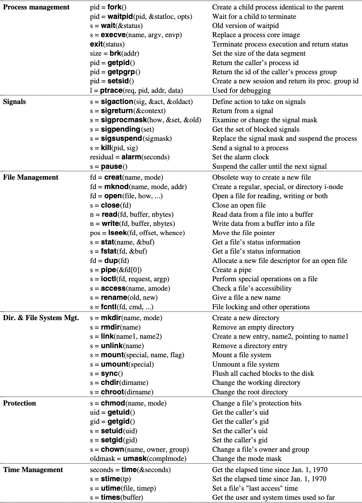
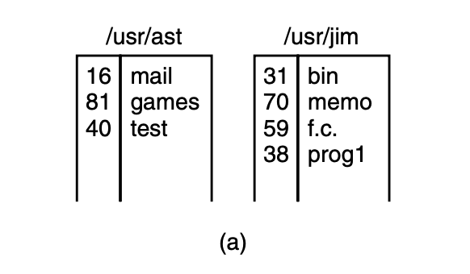
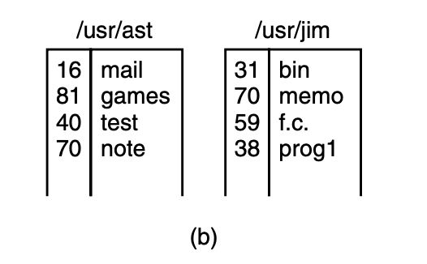
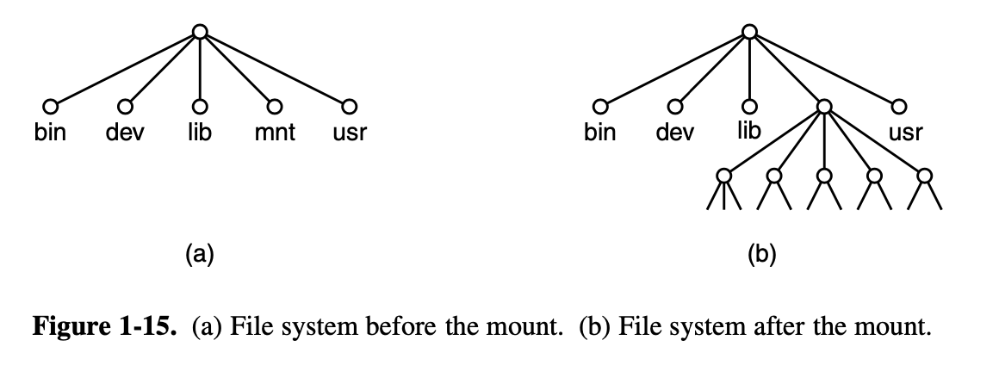
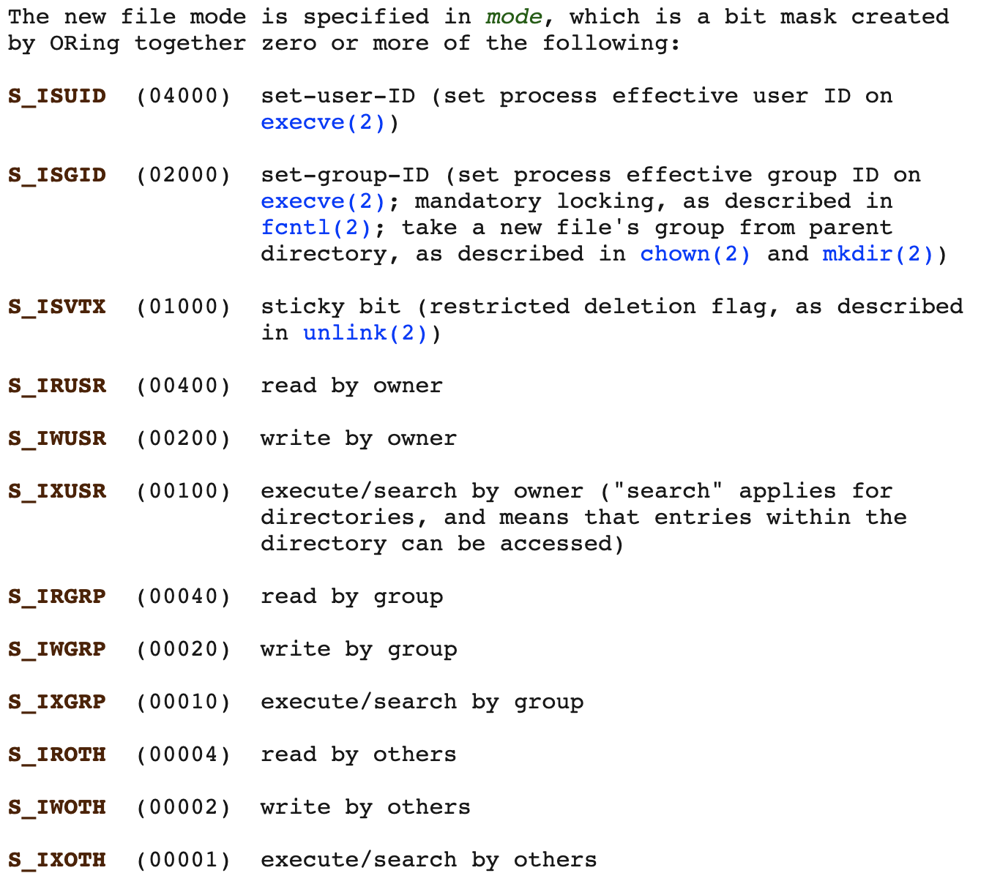

### Operating Systerms Design and Implementation Notes

##### By Jiawei Wang

# 7. System Calls (3)
<br>

<br>


* [System Calls for Directory Management](#system-calls-for-directory-management)
    * [mkdir, rmdir -- make, remove a dir](#mkdir-rmdir----make-remove-a-dir)
    * [link -- make a new name for a file](#link----make-a-new-name-for-a-file)
    * [mount -- mount filesystem](#mount----mount-filesystem)
    * [chdir -- change working directory](#chdir----change-working-directory)
    * [chroot -- change root directory](#chroot----change-root-directory)
* [System Calls for Protection](#system-calls-for-protection)
    * [chmod -- change permissions for a file](#chmod----change-permissions-for-a-file)
    * [getuid getgid -- get the real user/group identity](#getuid-getgid----get-the-real-user/group-identity)
    * [geteuid getegid -- get the effective uid/gid](#geteuid-getegid----get-the-effective-uid/gid)
    * [umask -- set file mode creation mask](#umask----set-file-mode-creation-mask)
    * [access -- check user's permissions for a file](#access----check-user's-permissions-for-a-file)
* [System calls for Time Management](#system-calls-for-time-management)
    * [time -- get time in seconds](#time----get-time-in-seconds)
    * [stime -- set time](#stime----set-time)
    * [utime -- change file last access and modification times](#utime----change-file-last-access-and-modification-times)
    * [times -- get process times](#times----get-process-times)


## System Calls for Directory Management

### mkdir, rmdir -- make, remove a dir
**int [mkdir](https://man7.org/linux/man-pages/man2/mkdir.2.html) (const char pathname(pointer), mode_t mode);**<br>
**```mkdir()``` attempts to create a directory named pathname.**
<br>

**int [rmdir](https://man7.org/linux/man-pages/man2/rmdir.2.html) (const char pathname(pointer));**<br>
**```rmdir()``` deletes a directory, which must be empty.**
<br>

### link -- make a new name for a file
**int [link](https://man7.org/linux/man-pages/man2/link.2.html) (const char oldpath(pointer), const char newpath(pointer));**<br>
**```link()``` creates a new hard link to an existing file. The newly created directory will be owned by the effective user ID of the process.**
<br>

**Understanding how link works will probably make it clearer what it does. Let's see an exmple:**<br>
<br>
**consider the situation of fig.(a). here are two users, ast and jim, each having their own directories with some files. if ast now executes a program containing the system call:**

```c
link("/usr/jim/memo", ""/usr/ast/note");
```
**the file memo in jim’s directory is now entered into ast’s directory under the name note. thereafter, ```/usr/jim/memo``` and ```/usr/ast/note``` refer to the same file.**
**in the [previous note](https://github.com/angold-4/osdi/blob/master/chapters/chapter1/6syscall-2.md). i mentioned that there are 3 tables in unix-like file system:<br>**
**the fd table, the file table and the inode table.**<br>

**every file in unix has a unique number, its i-number, that identifies it. this i-number is an index into a table of i-nodes, one per file, telling who owns the file, where its disk blocks are, and so on.**
> **a directory is simply a file containing a set of (i-number, ascii name) pairs. in the first versions of unix, each directory entry was 16 bytes—2 bytes for the i-number and 14 bytes for the name. a more complicated structure is needed to support long file names, but conceptually a directory is still a set of (i-number, ascii name) pairs.**

**in this example. after the ```link()``` system call, it will be like fig.(b):<br>**
<br>

**in fig.(b), two entries have the same i-number (70) and thus refer to the same file.<br>if either one is later removed, using the unlink system call, the other one remains. if both are removed, unix sees that no entries to the file exist (a field in the i-node keeps track of the number of directory entries pointing to the file), so the file is removed from the disk.**
<br>

### mount -- mount filesystem
```#include <sys/mount.h>```

**int [mount](https://man7.org/linux/man-pages/man2/mount.2.html)(const char source(pointer), const char target(pointer),<br>const char filesystemtype(pointer), unsigned long mountflags<br>const void data(pointer));**

**the mount system call allows two file systems to be merged into one. A common situation is to have the root file system con- taining the binary (executable) versions of the common commands and other heavily used files, on a hard disk. The user can then insert a CD-ROM with files to be read into the CD-ROM drive.**<br>



**By executing the mount system call, the CD-ROM file system can be attached to the root file system, as shown in Fig. 1-15. A typical statement in C to perform the mount is**<br>
```c
mount(′′/dev/cdrom0′′, ′′/mnt′′, 0);
```
**Where the first parameter is the name of a block special file for CD-ROM drive 0, the second parameter is the place in the tree where it is to be mounted, and the third one tells whether the file system is to be mounted read-write or read-only.**<br>

> **After the mount call, a file on CD-ROM drive 0 can be accessed by just using its path from the root directory or the working directory, without regard to which drive it is on. In fact, second, third, and fourth drives can also be mounted**<br>

<br>

### sync -- commit filesystem caches to disk

```#include <unistd.h>```<br>
**void [sync](https://man7.org/linux/man-pages/man2/sync.2.html) (void);**<br>
**```sync()``` causes all pending modifications to filesystem metadata and cached file data to be written to the underlying filesystems.**


> **MINIX 3 maintains a block cache cache of recently used blocks in main memory to avoid having to read them from the disk if they are used again quickly. If a block in the cache is modified (by a write on a file) and the system crashes before the modified block is written out to disk, the file system will be damaged. To limit the potential damage, it is important to flush the cache periodically, so that the amount of data lost by a crash will be small.**
<br>

**The system call sync tells MINIX 3 to write out all the cache blocks that have been modified since being read in. When MINIX 3 is started up, a program called update is started as a back- ground process to do a sync every 30 seconds, to keep flushing the cache.**
<br>

### chdir -- change working directory
```#include <unistd.h>```<br>
**int [chdir](https://man7.org/linux/man-pages/man2/chdir.2.html) (const char path(pointer));**<br>
**chdir() changes the current working directory of the calling process to the directory specified in path.**<br>

**After the call:**
```c
chdir("/usr/ast/test");
```
**an open on the file xyz will open ```/usr/ast/test/xyz```.**
<br>

### chroot -- change root directory
```#include <unistd.h>```<br>
**int [chroot](https://man7.org/linux/man-pages/man2/chroot.2.html) (const char path(pointer));**<br>
**```chroot()``` changes the root directory of the calling process to that specified in path.  This directory will be used for pathnames beginning with /.  The root directory is inherited by all children of the calling process.**

<br><br>

## System Calls for Protection

### chmod -- change permissions for a file
```#include <sys/stat.h>```<br>

**int chmod(const char pathname(pointer), mode_t mode);**<br>
**In MINIX 3 every file has an 11-bit mode used for protection. Nine of these bits are the read-write-execute bits for the owner, group, and others.**<br>
**The chmod system call makes it possible to change the mode of a file. For example, to make a file read-only by everyone except the owner, one could execute:**<br>
```
chmod("file", 0644);
```

**For more about protection mode: Please check this table from [man7.org](https://www.man7.org/linux/man-pages/man2/chmod.2.html):**<br>


<br>

### getuid getgid -- get the real user/group identity
**uid_t [getuid](https://www.man7.org/linux/man-pages/man2/getuid.2.html) (void);**<br>
**uid_t [getgid](https://man7.org/linux/man-pages/man2/getgid.2.html) (void);**<br>

**```getuid()``` returns the real user ID of the calling process. <br>Samely, ```getgid()``` returns the real group ID of the calling process.**
<br>
**In the previous notes, I mentioned the meaning of User ID -- In unix-like system: Every User of the computer has its own user ID, which means different user can have different permissions to do some specific things.**<br>

#### Group Identity
**From this name. We can easily know that -- Like User id, in unix-like system. Each User also has its own Group ID. So what is the usage of Gid?**<br>

**Group identification number for the process. Valid group numbers are given in /etc/group, and in the GID field of /etc/passwd file. When a process is started, its GID is set to the GID of its parent process.**<br>

> **From [StackExchange](https://unix.stackexchange.com/questions/43744/what-does-gid-meank):<br>**
**Sometimes, though, it is necessary to have elevated privileges to run certain commands, but it is not desirable to give full administrative rights. For example, the passwd command needs access to the system's shadow password file, so that it can update your password. Obviously, you don't want to give every user root privileges, just so they can reset their password - that would undoubtedly lead to chaos! Instead, there needs to be another way to temporarily grant elevated privileges to users to perform certain tasks. That is what the SETUID and SETGID bits are for. It is a way to tell the kernel to temporarily raise the user's privileges, for the duration of the marked command's execution. A SETUID binary will be executed with the privileges of the owner of the executable file (usually root), and a SETGID binary will be executed with the group privileges of the group owner of the executable file. In the case of the passwd command, which belongs to root and is SETUID, it allows
normal users to directly affect the contents of the password file, in a controlled and predictable manner, by executing with root privileges. There are numerous other SETUID commands on UNIX-like systems (chsh, screen, ping, su, etc), all of which require elevated privileges to operate correctly. There are also a few SETGID programs, where the kernel temporarily changes the GID of the process, to allow access to logfiles, etc. sendmail is such a utility.**


### geteuid getegid -- get the effective uid/gid
**uid_t [geteuid](https://www.man7.org/linux/man-pages/man2/getuid.2.html) (void);**<br>
**uid_t [getegid](https://man7.org/linux/man-pages/man2/getgid.2.html) (void);**<br>
**```geteuid()``` returns the effective user ID of the calling process. <br>Samely, ```getegid()``` returns the effective group ID of the calling process.**
<br>

#### Effective ID
**So what is the effective Id?<br>**
**The other two protection bits, are the SETGID (set-group-id) and SETUID (set-user-id) bits, respectively. When any user executes a program with the SETUID bit on, for the duration of that process the user’s effective UID is changed to that of the file’s owner. This feature is heavily used to allow users to execute programs that perform superuser only functions, such as creating directories. Creating a directory uses mknod, which is for the superuser only. By arranging for the mkdir program to be owned by the superuser and have mode 04755, ordinary users can be given the power to execute mknod but in a highly <u>restricted</u> way.**


### umask -- set file mode creation mask
**mode_t [umask](https://man7.org/linux/man-pages/man2/umask.2.html) (mode_t mask);**<br>
**```umask(mask)``` sets an internal bit mask within the system, which is used to mask off mode bits when a file is created. After the call**<br>
```
umask(022);
```
**The mode supplied by creat and mknod will have the 022 bits masked off before being used. Thus the call:**
```
creat("file", 0666)
```
**The resulting file permissions would be 0644 (rw-r--r--). Instead of 0666 (rw-rw-rw-).**<br>
**Since the bit mask is inherited by child processes, if the shell does a umask just after login, none of the user’s processes in that session will accidently create files that other people can write on.**
<br>

### access -- check user's permissions for a file
```#include <unistd.h>```<br>
**int [access](https://man7.org/linux/man-pages/man2/access.2.html) (const char *pathname, int mode);**<br>

**The ```access()``` system call is born to solve a problem:**<br>
**We call know that when a program owned by the root has the SETUID bit on, it can access any file, because its effective UID is the superuser. Frequently it is useful for the program to know if the person who called the program has permission to access a given file. If the program just tries the access, it will always succeed, and thus learn nothing.**
<br>

**What is needed is a way to see if the access is permitted for the real UID. The access system call provides a way to find out. The mode parameter is 4 to check for read access, 2 for write access, and 1 for execute access. Combinations of these values are also allowed. For example, with mode equal to 6, the call returns 0 if both read and write access are allowed for the real ID; otherwise −1 is returned. With mode equal to 0, a check is made to see if the file exists and the directories leading up to it can be searched.**

<br><br>

## System calls for Time Management
### time -- get time in seconds
```#include <time.h>```

**time_t [time](https://man7.org/linux/man-pages/man2/time.2.html) (time_t tloc(pinter));**<br>

**```time()```returns the time as the number of seconds since the Epoch.<br>
```1970-01-01 00:00:00 +0000 (UTC).```**<br>

**If tloc is non-NULL, the return value is also stored in the memory pointed to by tloc.**
<br>

### stime -- set time
```#include <time.h>```

**int [stime](https://man7.org/linux/man-pages/man2/stime.2.html) (const time_t t(pointer));**<br>

**```stime()``` sets the system's idea of the time and date.  The time, pointed to by t, is measured in seconds since the Epoch, ```1970-01-01 00:00:00 +0000 (UTC)```. ```stime()``` may be executed only by the superuser.**

<br>

### utime -- change file last access and modification times

```
#include <sys/types.h>
#include <utime.h>
```

**int [utime](https://man7.org/linux/man-pages/man2/utime.2.html) (const char filename(pointer), const struct utimbuf times(pointer));**<br>

**the ```utime()``` system call changes the access and modification times of the inode specified by filename to the actime and modtime fields of times respectively.**<br>
**if times is null, then the access and modification times of the file are set to the current time. application of this system call is fairly limited, but a few programs need it, for example, ```touch```, which sets the file’s time to the current time.**

<br>


### times -- get process times

```
#include <sys/times.h>
```

**clock_t [times](https://man7.org/linux/man-pages/man2/times.2.html) (struct tms buf(pointer));**<br>

**```times()``` stores the current process times in the struct tms that buf points to.  the struct tms is as defined in ```<sys/times.h>```:<br>**
```c
struct tms {
       clock_t tms_utime;  /* user time */
       clock_t tms_stime;  /* system time */
       clock_t tms_cutime; /* user time of children */
       clock_t tms_cstime; /* system time of children */
};
```
> **From [man7.org](https://man7.org/linux/man-pages/man2/times.2.html):<br>
The ```tms_utime``` field contains the CPU time spent executing instructions of the calling process.  The ```tms_stime``` field contains the CPU time spent executing inside the kernel while performing tasks on behalf of the calling process.<br>**

> **The ```tms_cutime``` field contains the sum of the ```tms_utime``` and ```tms_cutime``` values for all waited-for terminated children.  The ```tms_cstime``` field contains the sum of the ```tms_stime``` and ```tms_cstime``` values for all waited-for terminated children.**

> **Times for terminated children (and their descendants) are added in at the moment ```wait(2)``` or ```waitpid(2)``` returns their process ID.  In particular, times of grandchildren that the children did not wait for are never seen.**

> **All times reported are in clock ticks.**


