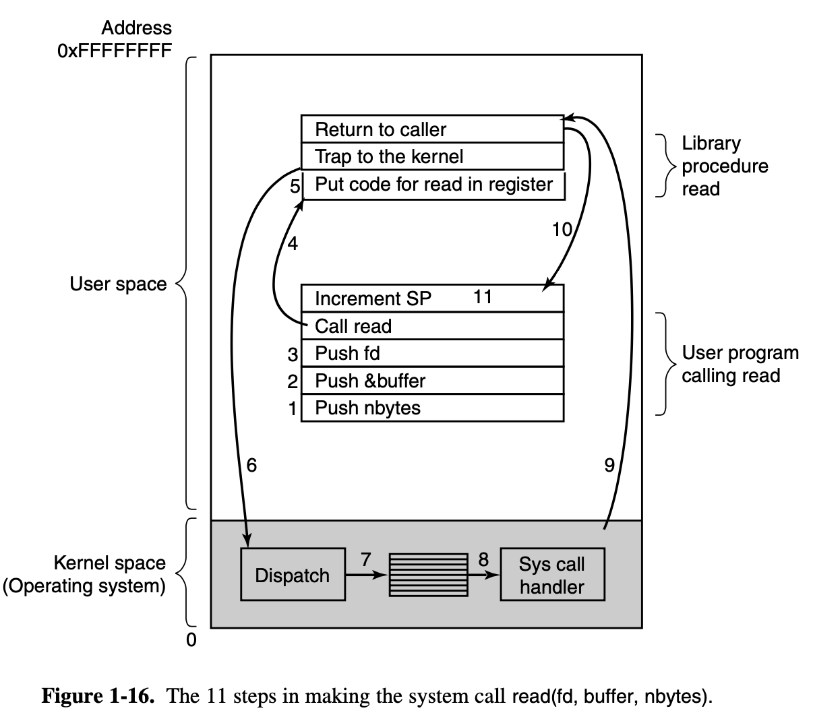
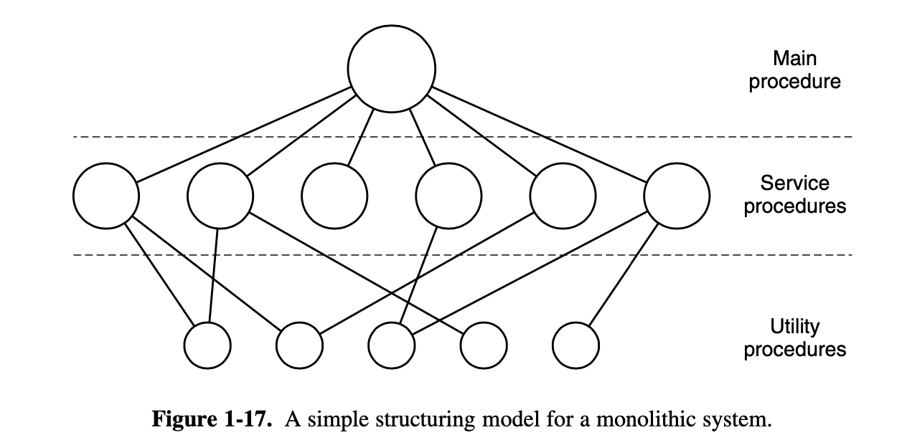
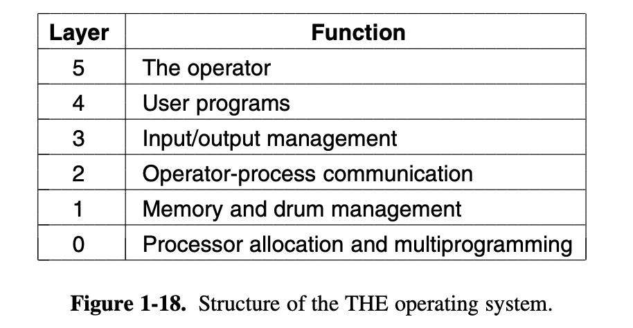
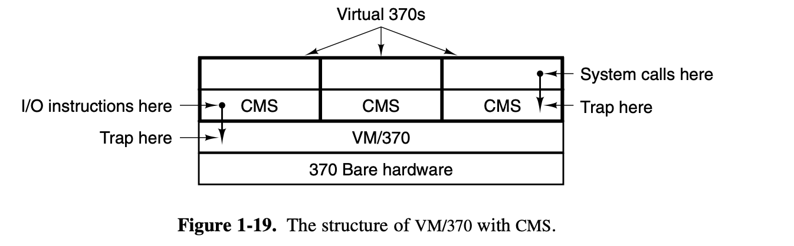
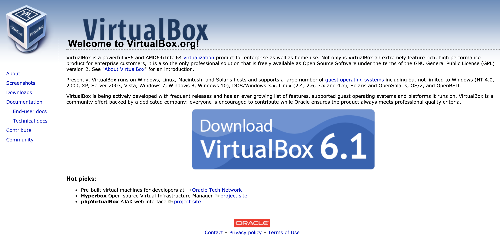
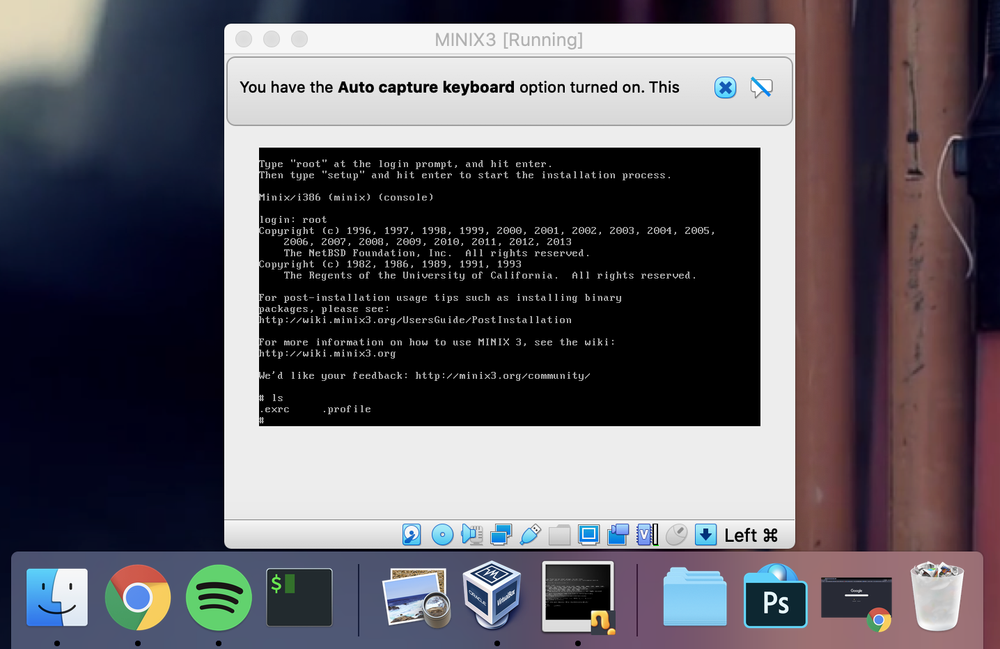
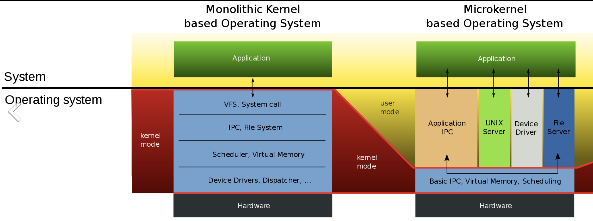
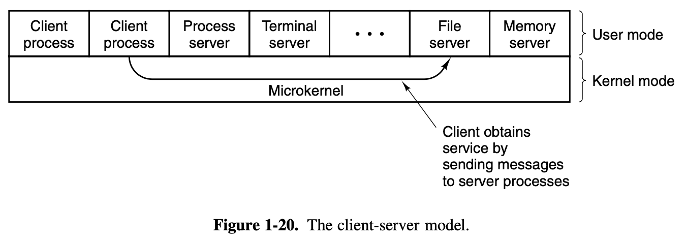
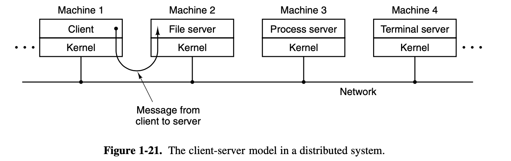

### Operating Systerms Design and Implementation Notes

##### By Jiawei Wang

# 8. Oprating System Structure

**Now that we have seen what operating systems look like on the outside (i.e, the programmer’s interface), it is time to take a look inside.**<br>
**In the Following sections, We will introduce Oprating System briefly in 5 point of views:**<br>


<!-- vim-markdown-toc GFM -->

* [1. Monolithic Systems](#1-monolithic-systems)
* [2. Layered Systems](#2-layered-systems)
* [3. Virtual Machines](#3-virtual-machines)
* [4. Exokernels](#4-exokernels)
* [5. Client-Server Model](#5-client-server-model)

<!-- vim-markdown-toc -->

<br>


## 1. Monolithic Systems
**In this point of view. The OS is written as a collection of procedures.**<br>
* **Each of procedures can call any of the other ones whenever it needs to.**
* **Each procedure in the system has a well-defined interface in terms of parameters and results**
* **Each one is free to call any other one, if the latter provides some useful computation that the former needs.**
<br>

**This is a good time to look at how system calls are performed in this point of view.**<br>
**Let's see this ```read``` system call:**<br>

```c
count = read(fd, &buffer, nbytes);
```



**In preparation for calling the read library procedure, which actually makes the ```read``` system call.**<br>
**(Please notice that the following point 1 to 11 are correspond to the 11 steps in figure 1.16 above)**

1. **The calling program pushes the parameters onto the stack(nbytes)**
2. **The calling program pushes the parameters onto the stack(buffer)**
3. **The calling program pushes the parameters onto the stack(fd)**
4. **Then comes the actual call to the library procedure ```read```.**
5. **Execute the library procedure ```read```, It possibly written in assembly language, typically puts the system call number in a place where the operating system expects it, such as a register.**
6. **This step is the continuous of step 5, Then it executes a TRAP instruction to switch from user mode to kernel mode and start execution at a fixed address within the kernel.**
7. **Within the kernel, the kernel code that starts examines the system call number and then dispatches to the correct system call handler, usually via a table of pointers to system call handlers indexed on system call number.**
8. **At that point the system call handler runs <u>(This is the formal handler)</u>**
9. **Once the system call handler has completed its work, control may be returned to the user-space library procedure at the instruction following the TRAP instruction.**
1. **This procedure then returns to the user program(The program called ```read``` system call) in the usual way procedure calls return**
1. **To finish the job, the user program has to clean up the stack, as it does after any procedure call.**
> **Assuming the stack grows downward, as it often does, the compiled code increments the stack pointer exactly enough to remove the parameters pushed before the call to read. The program is now free to do whatever it wants to do next.**
<br>

**This organization suggests a basic structure for the operating system:**

1. **A main program that invokes the requested service procedure.<br><u>i.e: The user program which called the system call</u>**
2. **A set of service procedures that carry out the system calls.<br><u>i.e: The system call handler inside the kernel (8)</u>**
3. **A set of utility procedures that help the service procedures.<br><u>i.e: Specific operation. Such as fetching data from user programs or clean up the stack</u>**

<br>



<br><br>

## 2. Layered Systems
**The system had 6 layers, as shown in Fig. 1-18.**<br>


<br>

**For details each book, please check No.64 to 65 pages in the book**<br>
**Each layer conceals certain details, and by providing some interfaces upwards, the upper-level program does not need to consider specific details.**<br>

**For example:<br>**
**Layer 0 dealt with allocation of the processor, switching between processes when interrupts occurred or timers expired.<br>Above layer 0, the system consisted of sequential processes, each of which could be programmed without having to worry about the fact that multiple processes were running on a single processor. In other words, layer 0 provided the basic multiprogramming of the CPU.**

<br><br>


## 3. Virtual Machines
**Before We introduce OS in this point of view, to make a better understanding.  It is important to know some history about it.<br>**

> **The initial releases of OS/360 were strictly batch systems. Nevertheless, many 360 users wanted to have timesharing, so various groups, both inside and outside IBM decided to write timesharing systems for it. The official IBM timesharing system, TSS/360, was delivered late, and when it finally arrived it was so big and slow that few sites converted over to it. It was eventually abandoned after its development had consumed some $50 million (Graham, 1970). But a group at IBM’s Scientific Center in Cambridge, Massachusetts, produced a radically dif- ferent system that IBM eventually accepted as a product, and which is now widely used on its mainframes.**

<br>

**This system, originally called CP/CMS and later renamed VM/370, was based on a very astute observation:<br>A timesharing system provides:<br>(1) multiprogramming and (2) an extended machine with a more convenient interface than the bare hardware.**<br>

**The heart of the system, known as the <u>virtual machine monitor</u>, runs on the bare hardware and does the multiprogramming, providing not one, but several <u>virtual machines</u> to the next layer up, as shown in Fig. 1-19.**<br>



**The [virtual machine](https://en.wikipedia.org/wiki/Virtual_machine) is a software which modify the hardware, including kernel/user mode, I/O, interrupts, and everything else the real machine has.**<br>
**In this point of view, maybe we can understand the meaning of <u>OS is the virtual machine monitor</u>:<br>**
**When a CMS program executes a system call, the call is trapped to the operating system in its own virtual machine, not to VM/370, just as it would if it were running on a real machine instead of a virtual one. CMS then issues the normal hardware I/O instructions for reading its virtual disk or whatever is needed to carry out the call. <u>These I/O instructions are trapped by VM/370</u>, which then performs them as part of its simulation of the real hardware.**<br>

**In this example above, we can find that the OS is the manager of all virtual machine at this time. By making a complete separation of the functions of multiprogramming and providing an extended machine, each of the pieces can be much simpler, more flexible, and easier to maintain.**
<br>

**Several virtual machine implementations are marketed commercially. For example, today it is very convinent to run Linux on Windows through [Virtual PC](https://www.microsoft.com/en-hk/download/details.aspx?id=3702) or other virture machine software. The nature of them were all provide a <u>virtual machine monitor</u> layer between Two systems and handle all system calls just like below.**<br>

<br>

<br>

**Run [MINIX3.3](https://wiki.minix3.org/doku.php?id=www:download:start) in OS X by using [Virtual Box](https://www.virtualbox.org/wiki/Downloads)**

<br><br>


## 4. Exokernels
**With VM/370, each user process gets an exact copy of the actual computer. Going one step further, researchers at M.I.T. built a system that gives each user a clone of the actual computer, but with a subset of the resources<br>**

**For example: Thus one virtual machine might get disk blocks 0 to 1023, the next one might get blocks 1024 to 2047, and so on.**<br>
**At the bottom layer, running in kernel mode, is a program called the [exokernel](https://en.wikipedia.org/wiki/Exokernel). Its job is to allocate resources to virtual machines and then check attempts to use them to make sure no machine is trying to use somebody else’s resources. Each user-level virtual machine can run its own operating system, as on VM/370, except that each one is restricted to using only the resources it has asked for and been allocated.**
<br>

<br>
**[Provided by Thorben Bochenek, CC BY-SA 3.0](https://commons.wikimedia.org/w/index.php?curid=25131239)**<br>

**The advantage of the exokernel scheme is that it saves a layer of mapping. In the other designs, each virtual machine thinks it has its own disk, with blocks running from 0 to some maximum, so the virtual machine monitor must maintain tables to remap disk addresses (and all other resources).**<br>
**With the exokernel, this remapping is not needed. The exokernel need only keep track of which virtual machine has been assigned which resource, since all the exokernel has to do is keep the virtual machines out of each other’s hair.**

<br><br>


## 5. Client-Server Model
**VM/370 gains much in simplicity by moving a large part of the traditional operating system code (implementing the extended machine) into a higher layer, CMS. Nevertheless, VM/370 itself is still a complex program because simulating a number of virtual 370s is not that simple (especially if you want to do it reasonably efficiently and in large systems).**
<br>

**A trend in modern operating systems is to take this idea of moving code up into higher layers even further and remove as much as possible from the operating system, leaving a minimal kernel(Usually called [Micro Kernel](https://en.wikipedia.org/wiki/Microkernel)).**
<br>


<br>
**[https://commons.wikimedia.org/wiki/File:OS-structure2.svg](https://commons.wikimedia.org/wiki/File:OS-structure2.svg)**<br>

**As we can see in the picture below: The Kernel Space in Monolithic Kernel is much bigger than which in Micro Kernel.<br>In Micro Kernel. The reason is to implement most of the operating system functions in user processes. To request a service, such as reading a block of a file, a user process sends the request to a server process, which then does the work and sends back the answer.**
<br>

**In this model, shown in Fig. 1-20, <u>all the kernel does is handle the communication between clients and servers.</u> <br>By splitting the operating system up into parts, each of which only handles one facet of the system, such as file service, process service, terminal service, or memory service, each part becomes small and manageable. <br>Furthermore, because all the servers run as user-mode processes, and not in kernel mode, they do not have direct access to the hardware. As a consequence, if a bug in the file server is triggered, the file service may crash, but this will not usually bring the whole machine down.**

<br>


**Another advantage of the client-server model is its adaptability to use in distributed systems (see Fig. 1-21).<br><br>If a client communicates with a server by sending it messages, the client need not know whether the message is handled locally in its own machine, or whether it was sent across a network to a server on a remote machine. As far as the client is concerned, the same thing happens in both cases: a request was sent and a reply came back.**
<br>


<br>

**However, in reality, the microkernel is not on the same level as the monolithic kernel. We do not use it or accept it. In addition to the preconceived factors caused by commercial and ecological factors, there is a more important factor -- Performance.**


