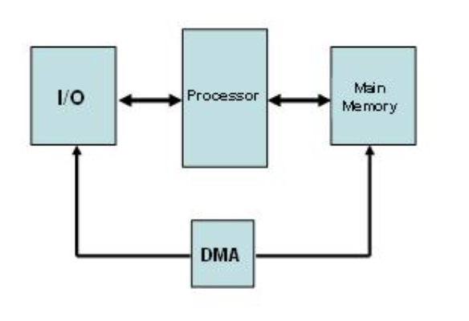

### Operating Systerms Design and Implementation Notes

##### By Jiawei Wang

# 9. Exercises for Chapter 1

 

### Question1
> **What are the two main functions of an operating system?** 

1. **Provide the users with an extended (i.e., virtual) machine**
2. **Manage the I/O devices and other system resources.**

### Question2
> **What is the difference between kernel mode and user mode?  Why is the difference important to an operating system?**

**In kernel mode, every machine instruction is allowed, as is access to all the I/O devices. In user mode, many sensitive instructions are prohibited.** 
**Operating systems use these two modes to encapsulate user programs. Running user programs in user mode keeps them from doing I/O and prevents them from interfering with each other and with the kernel.**

### Question3
> **What is multiprogramming?**

**Multiprogramming is the rapid switching of the CPU between multiple processes in memory. It is commonly used to keep the CPU busy while one or more processes are doing I/O.**

### Question4
> **What is spooling? Do you think that advanced personal computers will have spooling as a standard feature in the future?**

**First Please check the [Spooling](https://en.wikipedia.org/wiki/Spooling).it is to use software to simulate offline technology** 
**the "Spool" stands for Simultaneous Peripheral Operations On-Line, which I've be metioned in the history of OS.** 

* **<u>Input spooling</u> is the technique of reading in jobs, for example, from cards, onto the disk, so that when the currently executing processes are finished, there will be work waiting for the CPU.**
* **<u>Output spooling</u> consists of first copying printable files to disk before printing them, rather than printing directly as the output is generated**
 

**Input spooling on a personal computer is not very likely, but output spooling is widely used in nowadays computers.**

### Question5
> **On early computers, every byte of data read or written was directly handled by the CPU (i.e., there was no DMA—Direct Memory Access). What implications does this organization have for multiprogramming?**

**The DMA(Direct Memory Access): First, In early CPU, when data from I/O wants to access the memory, it need to go through the CPU then to the Memory.** 
**This bring these actions not very effecient. By using DMA, which means add a DMA Controller between I/O and Memory and the CPU don't need to wait while sending the data: **

 

**The prime reason for multiprogramming is to give the CPU something to do while waiting for I/O to complete. If there is no DMA, the CPU is fully occupied doing I/O, so there is nothing to be gained (at least in terms of CPU utilization) by multiprogramming.**

### Question6
> **List some differences between personal computer operating systems and mainframe operating systems.**

* **Personal computer systems are always interactive, often with only a single user.**
* **Mainframe systems nearly always emphasize batch or timesharing with many users**
* **On Mainframe systems: Protection is much more a issue as well as the efficient use of all resources**

### Question7
> **Give one reason why a closed-source proprietary operating system like Windows should have better quality than an open-source operating system like Linux. Now give one reason why an open-source operating system like Linux should have better quality than a closed-source proprietary operating system like Windows.**

* **Closed Source: Company can vet the programmers, establish programming standards, and enforce a development and testing methodology, also the Closed Source means can help to protect the core technology for big company**

* **Open Source: more people look at the code, so there is a form of peer review and the odds of a bug slipping in are much smaller with so much more inspection.**

### Question8
> **In view of the fact that the mere existence of a superuser can lead to all kinds of security problems, why does such a concept exist?**

**It is often essential to have someone who can do things that are normally forbidden. For example, a user starts up a job that generates an infinite amount of output. The user then logs out and goes on a three-week vacation to London. Sooner or later the disk will fill up, and the superuser will have to manu- ally kill the process and remove the output file. Many other such examples exist.**

### Question9
> **Why is the process table needed in a timesharing system? Is it also needed in personal computer systems in which only one process exists, that process taking over the entire machine until it is finished?**

**The process table is needed to store the state of a process that is currently suspended, either ready or blocked. It is not needed in a single process system because the single process is never suspended.**

