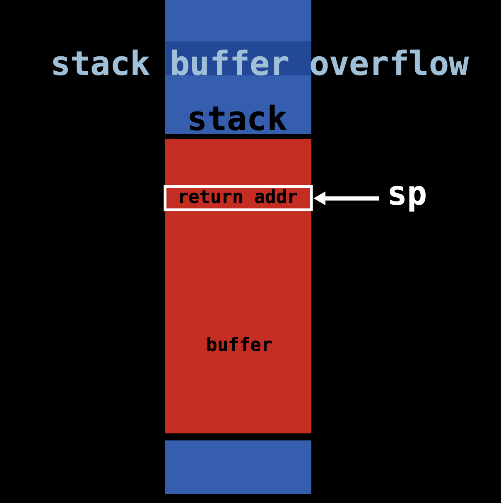
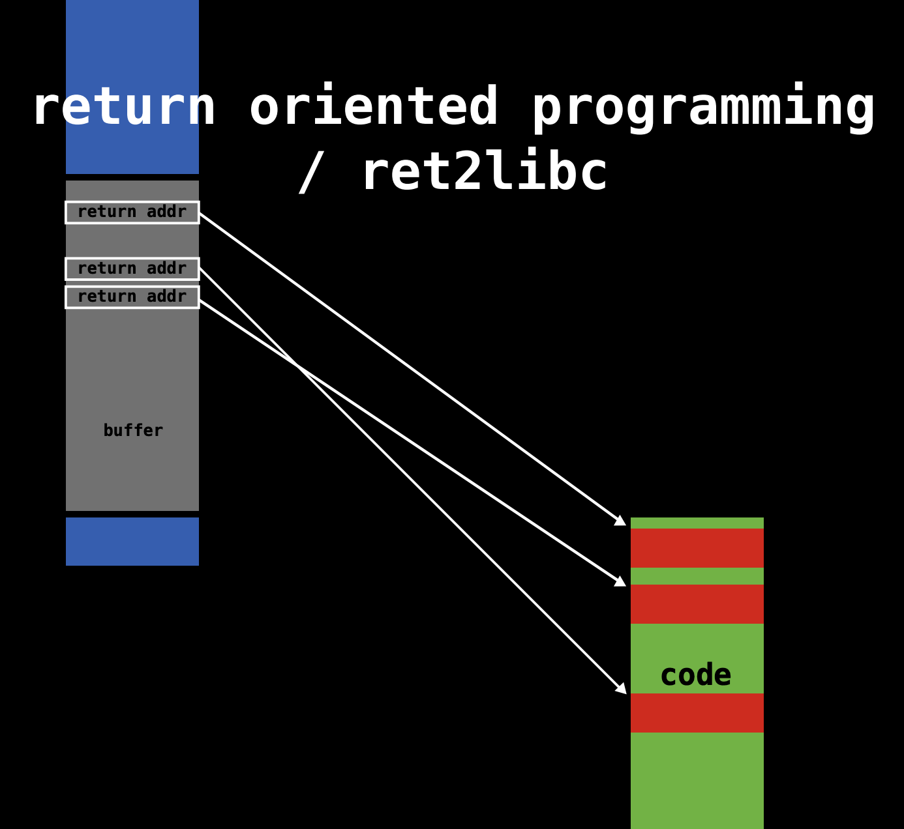
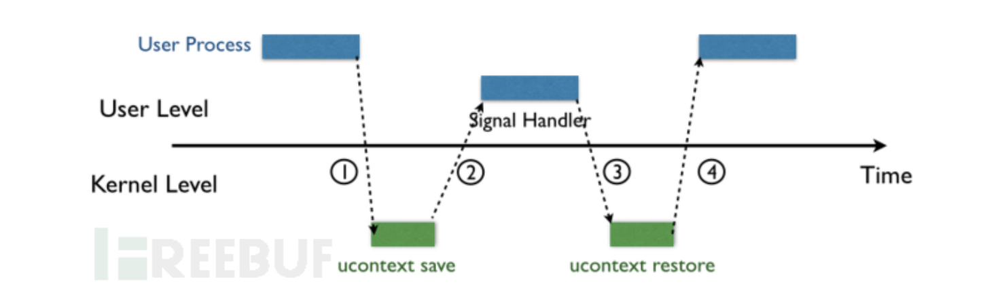

# Sigreturn Oriented Programming Attack

##### By Jiawei Wang

**This is my Notes for This Paper : [Framing Signals — A Return to Portable Shellcode](http://www.ieee-security.org/TC/SP2014/papers/FramingSignals-AReturntoPortableShellcode.pdf)**<br>
**Which Won the [Best Student Paper](http://www.ieee-security.org/TC/SP2014/donors.html) in 35th IEEE Symposium on Security and Privacy. 2014**
<br>


<!-- vim-markdown-toc GFM -->

* [1.Return Oriented Programming Attack](#1return-oriented-programming-attack)
    * [Ways Oprating System Defence](#ways-oprating-system-defence)
        * [Data Execution Protection(DEP)](#data-execution-protectiondep)
        * [Address Space Layout Randomization(ASLR)](#address-space-layout-randomizationaslr)
        * [Stack Destruction Detection(SDD)](#stack-destruction-detectionsdd)
    * [Return Oriented Programming Attack](#return-oriented-programming-attack)
        * [The Core of ROP](#the-core-of-rop)
* [2. Sigreturn Oriented Programming Attack](#2-sigreturn-oriented-programming-attack)
    * [Signal in Unix-like System](#signal-in-unix-like-system)

<!-- vim-markdown-toc -->

## 1.Return Oriented Programming Attack
### Ways Oprating System Defence
#### [Data Execution Protection(DEP)](https://en.wikipedia.org/wiki/Executable_space_protection#Windows)
**In computer security, executable-space protection marks memory regions as non-executable, such that an attempt to execute machine code in these regions will cause an exception.**

#### [Address Space Layout Randomization(ASLR)](https://en.wikipedia.org/wiki/Address_space_layout_randomization)
**Address space layout randomization (ASLR) is a computer security technique involved in preventing exploitation of memory corruption vulnerabilities. In order to prevent an attacker from reliably jumping to, for example, a particular exploited function in memory, ASLR randomly arranges the address space positions of key data areas of a process, including the base of the executable and the positions of the stack, heap and libraries.**

#### [Stack Destruction Detection(SDD)](https://github.com/Angold-4/Angold4-CSAPP/blob/master/ChapterNotes/Chapter3/canary.md)
**Canary is a Test area in Stack. Which helps to avoid Stack Overflow**<br>
**Although The Stack Randomization(ASLR) Can counter some forms of attack**<br>
**Random loss to brute force** You will never know what the power of attacker


**Let's see a normal stack:**
```
-------------------------------------
|                                   |
|___________________________________| --> Caller's shallow frame
|          Return address           |
-------------------------------------
|                                   |
|                                   | --> Buffer
|___________________________________|
|             Canary                |
------------------------------------- --> buf = %rsp
```
**Store a special Canary Value between any local buffer and the Caller's shallow frame**<br>

**Let's see an example to figure out that:**
```c
/*echo.c*/
#include <stdio.h>

void echo(){
    char buf[8];
    gets(buf);
    puts(buf);
}
```
**After we compile it:**
```assembly
## echo.s
_echo:                                  ## @echo
	.cfi_startproc
## %bb.0:
	pushq	%rbp
	movq	%rsp, %rbp
	.cfi_def_cfa_register %rbp
	pushq	%rbx
	subq	$24, %rsp
	.cfi_offset %rbx, -24
	movq	___stack_chk_guard@GOTPCREL(%rip), %rax
	movq	(%rax), %rax
	movq	%rax, -16(%rbp)
	leaq	-24(%rbp), %rbx
	movq	%rbx, %rdi
	callq	_gets
	movq	%rbx, %rdi
	callq	_puts
	movq	___stack_chk_guard@GOTPCREL(%rip), %rax
	movq	(%rax), %rax
	cmpq	-16(%rbp), %rax
	jne	LBB0_2
## %bb.1:
	addq	$24, %rsp
	popq	%rbx
	popq	%rbp
	retq
LBB0_2:
	callq	___stack_chk_fail
                                        ## -- End function

```
**We can find that in line 11 at echo.s: ```movq stack_chk_guard@GOTPCREL(%rip), %rax```**<br>
**It is like we create a special position pointer and mov it to %rax(This Special area is Marked as Read-Only)<br>**
**In the next line We move the value into %rax and this value is Canary<br>**


**Before the function ```puts()``` return. The gcc will check the Value of Canary's position whether it is as same as the Value store in The Special position pointer(In Line 20)<br>**
**If not equal(```jne```). Jump to LBB0_2(last line) and cause ```stack_chk_fail```**
<br><br>


### Return Oriented Programming Attack
**Because of These Defences. The earliest code injection attacks are basically unusable in current operating systems, ROP appeared**<br>

**The main idea of ROP is that the attacker does not need to inject code himself (because the injected code is not executable under the protection of DEP), but uses the existing code fragments of the system to construct the attack. It is called ROP here because the way it changes the control flow is to use the return instruction in the system (such as `ret` in x86).**
<br>


**For Example:**<br>

**Here is a simple example to illustrate how to use ROP to implement a memory assignment statement:**
```
Mem[v2] = v1
```
**Which assembly code is:**
```assembly
mov %eax v1;
mov %ebx v2;
mov [%ebx], %eax
```

**We can achieve that Statement by using ROP:**<br>

```
-------------------------------------
|               addr3               |
|                v2                 | 
|               addr2               |  --> Stack
|                v1                 |
|               addr1               |
-------------------------------------
```

```
-------------------------------------
addr1: pop %eax; ret                |
addr2: pop %ebx; ret                |  --> Memory
addr3: mov [%ebx]; %eax;            |
-------------------------------------
```
**Among them, `addr1`, `addr2`, and `addr3` are the memory addresses of the corresponding instructions. We call each line a "gadget". The same effect as the compilation above can be achieved by constructing the data on the stack as shown in the figure above.**<br>

**Before trying to understand The Detail of ROP. We need to understand the Core of ROP:**<br>
**When ASLR and DEP are turned on, the memory location of the program will change every time the program is executed and the executable location cannot be written, and the writeable location cannot be executed, so try to combine the original fragments of the program to form a meaningful attack process.**<br>

**The small fragments of these programs are called gadgets, such as pop eax; ret; fragments, these fragments mostly exist at the end of the function (because there is ret), you can use tools to find available gadgets**
<br>

#### The Core of ROP
**As we mentioned before: Because of ASLR and DEP. The Program which is executable cannot be written, and the Program which is writeable cannot be executed.**<br>
**If The Attack wants to run his attack program in a computer. The ROP attack need to modify the writeable program(Stack) to control the executable program(Code)<br>**

**And the Only Way Link Between Stack and Code is ```ret``` in x86**
<br><br>
**Procedure:**
* **First. The Attacker need to find a buffer overflow loophole**
<br>
* **Then. It is very important and troublesome to distribute all gadgets in memory and stack<br>(One to one correspondence)<br>**
<br>
* **Last. Call the Program which have a buffer overflow loophole. and Execute it<br>When overflow. The return addr is addr1. and the Kernel will execute addr1 code in memory and so on automatically.<br>**
<br>
**That makes the attacker can run his attack code in target computer**
<br><br>
**Although it will works sometimes. But ASLR makes this work harder.<br>**
**And for an attacker, he needs to carefully construct a large number of gadgets separately to attack each different application, which also makes the reusability of ROP very poor.**
<br><br>

## 2. Sigreturn Oriented Programming Attack

**Here `sigreturn` is a system call, it will be called indirectly when a signal occurs in the unix system**<br>
**Before starting to introduce the attack principle of SROP. Let's introduce ```signal```. Which is a system call in Unix-like system:** 
<br>

### Signal in Unix-like System
**Signal handling has been an integral part of UNIX (and UNIX-like) systems ever since the very first implementation by Dennis Ritchie in the early 1970s.**
> **Signals are an extremely powerful mechanism to deliver asynchronous notifications directly to a process or thread. They are used to kill processes, to tell them that timers have expired, or to notify them about exceptional behavior. The UNIX design has spawned a plethora of UNIX-like “children” of which GNU Linux, several flavours of BSD, Android, iOS/Mac OS X, and Solaris are perhaps the best known ones in active use today. While each flavor handles signals in slightly different ways, the different implementations are all very similar.**
<br>


**As shown in the figure below, when the kernel delivers a signal to a process, the process will be temporarily suspended and enter the kernel(1)**<br>
<br>


