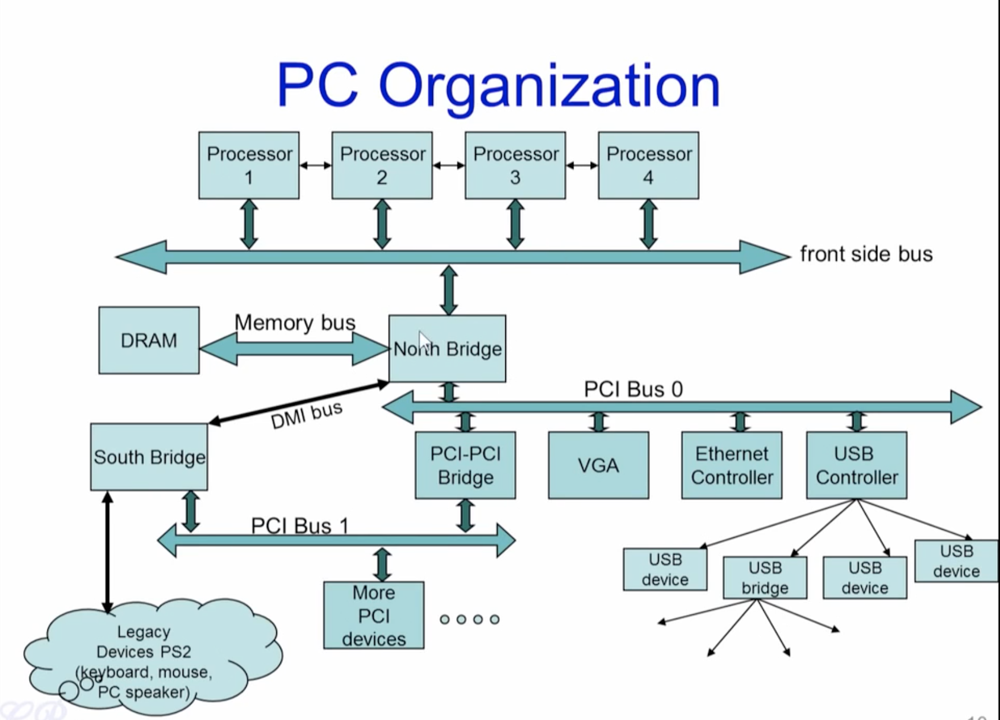

## #02 PC Organization/ Hardware, Address Types, Address Range

**[Source Video Cource](https://www.youtube.com/watch?v=mio9OsckCZM) By [Chester Rebeiro](https://scholar.google.com/citations?user=ctxSQrwAAAAJ&hl=en)**<br>

##### **Notes by Jiawei Wang([Angold4](https://github.com/Angold-4)) at Nov.9-10 2020**

### Address Types

#### Memory Addresses

* **<u>Range:</u>  0 to RAM or Max CPU-mapping size<br>(2^32-1 ≈ 4GB for 32-bits CPU and 2^64-1 ≈ 2TB for 64-bits CPU)**
* **<u>Where main memory is mapped:</u><br>Used to store data for code, heap, stack, OS, etc**<br>

```
/\/\/\/\/\/\/\/\/\/\/\/\/\/\/\/\/\/\/\
|                                    |
|               Unused               |
|                                    |
+------------------------------------+    <- depends on amount of RAM
|                                    |
|                                    |
|          Extended Memory           |    <- Store data for code, heap, stack, OS
|                                    |
|                                    |
+------------------------------------+    <- 0x00100000 (1MB)
|              BIOS ROM              |    <- Basic I/O system. to start the computer system after it is powered on. 
+------------------------------------+    <- 0x000F0000 (960KB)
|    16-bit devices, expansion ROMs  |    <- legacy Space
+------------------------------------+    <- 0x000C0000 (768KB)
|            VGA Display             |    <- legacy Space
+------------------------------------+    <- 0x000A0000 (640KB)
|                                    |
|             Low Memory             |    <- Used in legacy computers for mapping like 8086 80286
|                                    |
+------------------------------------+    <- 0x00000000
```


#### I/O Ports
**It is a very small storiage used to access device and completely isolated from memory. And it uses a different bus compared to RAM memory access**

#### Memory Mapped I/O
**Because of the storiages of I/O ports for devices are too small (64KB for 32-bit CPU)**<br>
**There is a space in high address of RAM that when the processor generates an addr in this area, then that particular address would be directed to the specific device and not to the RAM**<br>

### PC Organization



