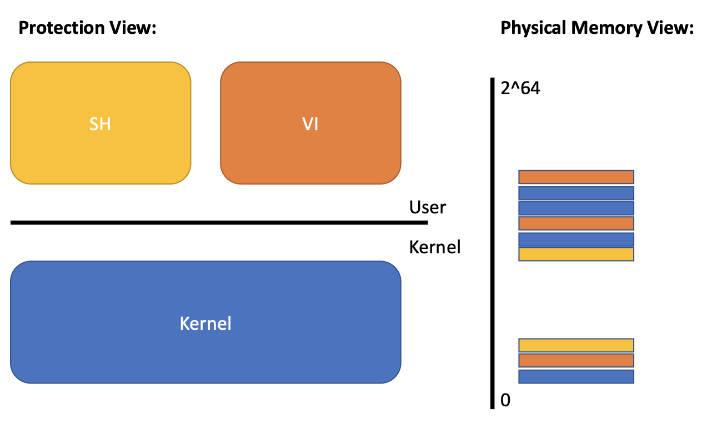
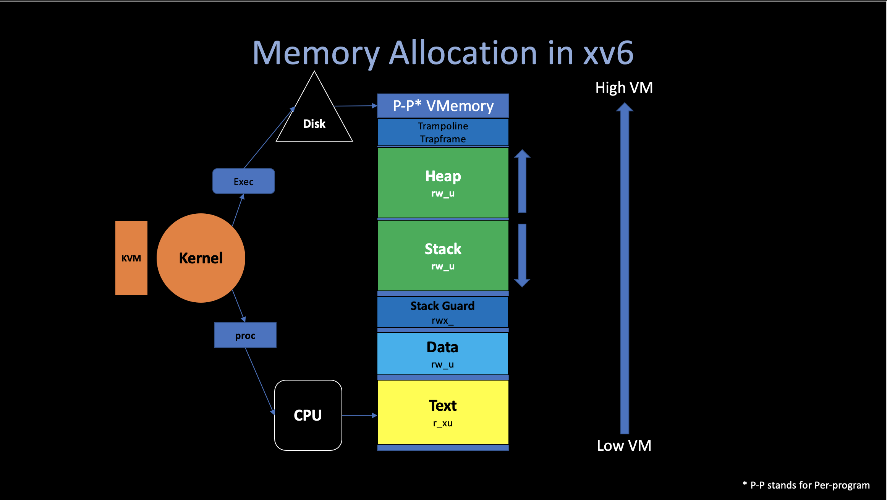
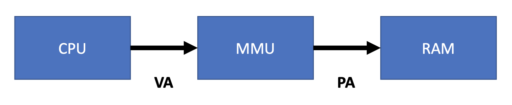
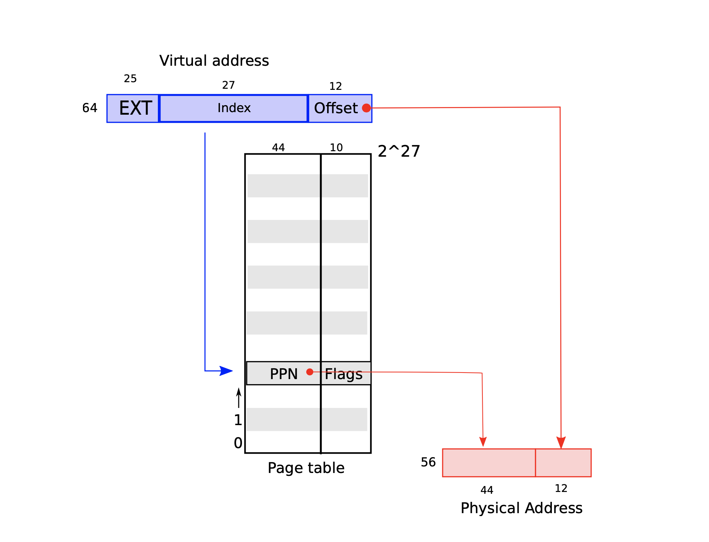
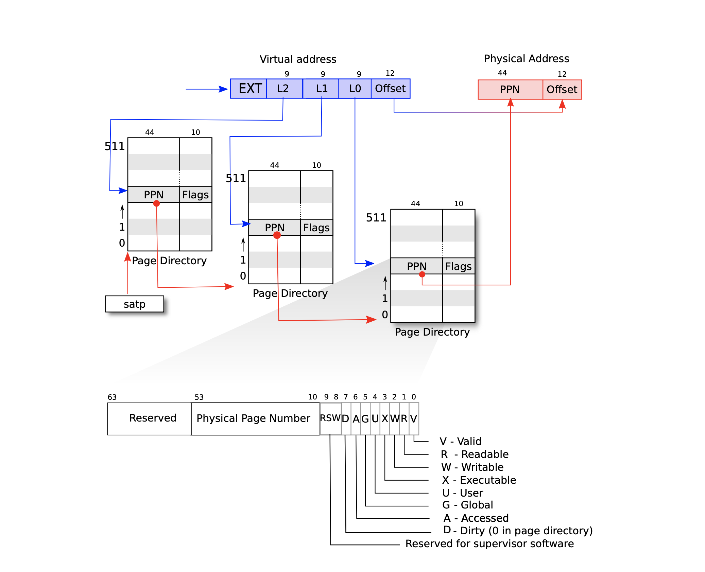
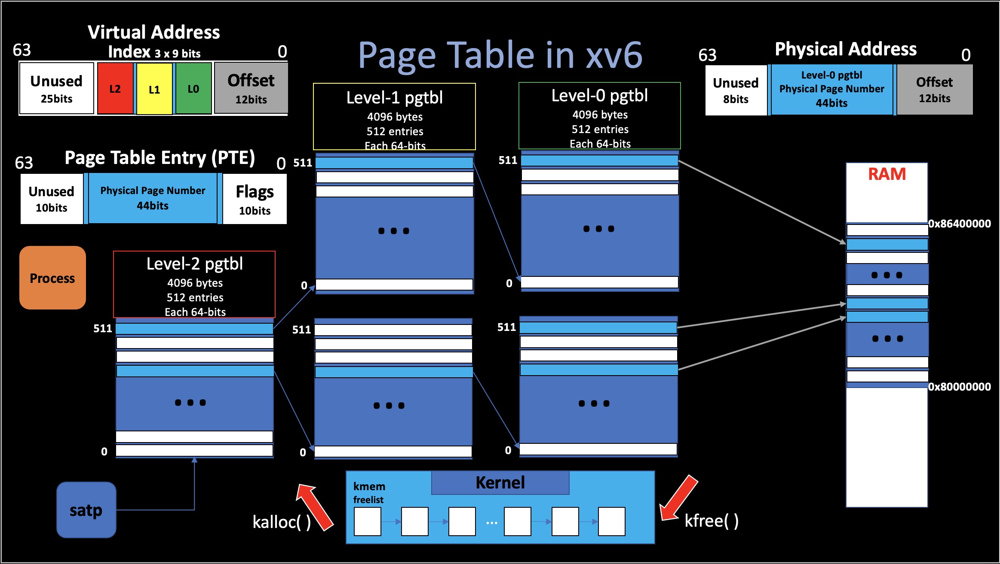

# 2. Virtual Memory
##### 03/03/2022 By Angold Wang

### Kernel with "Isolation"
* **Restrict each user processes so that all it can do is read/write/execute its own user memory, and use the 32 gerneral-purpose RISC-V registers.**
* **One user-process can only affect the kernel and other processes in the ways that system calls are intended to allow**


## 1. Memory Isolation

The RISC-V instructions (both user and kernel) **manipulate** **virtual addresses**. But machine's RAM, or physical memory, is indexed with **physical addresses**. 

In the **[last](https://a4org.github.io/os/docs/lectures/1Introduction.html)** note, we mentioned that one way to bring isolation is through **Virtual Memory**.
The main purpose of **Virtual Memory** is to achieve **strong Memory Isolation**.

* Each process has its own memory
* It can read and write its own memory
* It cannot read or write anything else directly (must through syscall, with privileges)
* **Each process believes that they have full memory space under control** (Two processes with "same" virtual address)



How to multiplex several memories over one physical memory? while maintaining isolation between memories.




## 2. Paging Hardware

### i. Level of Indirection Indexing



* Software can only read and write to virtual memory.
* Only kernel can program mmu (Memory Manage Unit), **which means this VA -> PA mapping is completely under the control of the Operating System.**
* MMU has a **Page table** that maps virtual addresses to physical adresses.
* Some virtual addresses restricted to kernel-only.

### ii. Virtual Address to Page

#### Why we need page?
Imagine that a `64-bit` machine, which means it support `2^64` memory address, if we just simply map one **VA** into one **PA**, the mapping table continuous store in memory will be also `2^64` -- which is gigantic.

**So we use another way, instead store this mapping relationship in a very gigantic continuous mapping array, we divide them into different pages, and each virtual address contains two message: `page_id` and `offset`.**

**Each process has its own `page_table`, which managed by the kernel**, here is the **`proc`** structure in xv6:

```c
struct proc {
  struct spinlock lock;

  // p->lock must be held when using these:
  enum procstate state;        // Process state
  void *chan;                  // If non-zero, sleeping on chan
  int killed;                  // If non-zero, have been killed
  int xstate;                  // Exit status to be returned to parent's wait
  int pid;                     // Process ID

  // wait_lock must be held when using this:
  struct proc *parent;         // Parent process

  // these are private to the process, so p->lock need not be held.
  uint64 kstack;               // Virtual address of kernel stack
  uint64 sz;                   // Size of process memory (bytes)
  pagetable_t pagetable;       // User page table (Which table / start address)
  struct trapframe *trapframe; // data page for trampoline.S
  struct context context;      // swtch() here to run process
  struct file *ofile[NOFILE];  // Open files
  struct inode *cwd;           // Current directory
  char name[16];               // Process name (debugging)
};

```

#### High-level view of xv6 page table

xv6 runs on Sv39 RISC-V, which means that only the bottom `39` bits of a 64-bit virtual address. **A RISC-V page table is logically an array of `2^27` (`134,217,728`) page table entries (PTE). Each PTE contains a `44-bit` physical page number (PPN) and `10-bit` flags.**



### iii. Page to Page Directory

**Revisted: Would it be reasonable for page table to just be an array of PTEs?**
* **`2^27` is roughly `134` millions**
* **`64` bits per page entry**
* **`134 * 8bytes * million` for a full page table**
    * wasting roughly `1GB` per page table
    * one page table per address space
    * one address space per application
* **Would waste losts of memory for small programs!**
    * you only need mappings for a few hundred pages.
    * so the rest of the million entries would be there but not needed


#### Satp Register
Each CPU core has its own unique **`%satp`** register, where store the current-running process's page table starting address of its CPU.
That makes different CPUs can run different processes, **each with a private address space described by its own page table.**


#### 3-level page table (Page Directory)

As we see that above, it is not good to just simply have a giant page table per process. In real translation at MMU, **A page table is stored in physical memory as a three-level tree. Each level is a page directory, which is `4096 bytes`, and contains `512 (2^9)` 64-bit page table entries. And that 3-level `2^9` PTEs can be located via the first 27 bits virtual address.**




This three-level structure of above figure **allows a memory-efficient way of recording PTEs, which means in the 3-level page table, you can leave a lot of entries empty.**

For example, if you leave the entry in the top level page table directory empty, for those entries, you don't have to create middle level page tables or bottom level page tables at all. **And then we can allowcate these chunks on demand.**


## 3. Page Table Implementation in xv6

**The kernel must allocate and free physical memory at run-time for page tables, and it uses a very small `allocator` resides in `kalloc.c` (`kernel/kalloc.c`) to do these stuff.**


### i. Initialize

For simplicity, the allocator can only use physical memory between **`KERNBASE (0x80000000L)`** and **`PHYSTOP(0x86400000L)`** to allocate pages, which is about 104MB. The xv6 assumes that the machine has 128 megabytes of RAM.

The **`main`** calls **`kinit`** to initialze the allocator. **`kinit`** initialzes the free list (`freelist`) to hold **every pages** in the physical memory (104MB).

**A PTE can only refer to a physical address that is aligned on a 4096-byte boundary (is a multiple of 4096).**

If some process need to shrink or grow its memory, it will call syscall **`sbrk()`**. And this syscall will call whether **`uvmalloc()`** or **`uvmdealloc()`** in order to perform the task.
* **To shrink the memory.** The task is done by **`kfree()`**, which append the unused memory pages into the free list page by page.
* **To grow the memory.** The task is done by **`kalloc()`**, which "pop" the number of pages from the free list.
 


### ii. Code: `walk()`

If you want to study the actual implementation of xv6 Virtual Memory, I highly recommend you to read these two functions: **`walk()`** and **`mappages()`**.

Since the allocator sometimes treats address as **integers in order to perform arithmetic on them** (e.g., traversing all pages by adding `PGSIZE`), and sometimes uses addresses as **pointers to read and write memory **(e.g., manipulating the `run` structure stored in each page), which makes the code a little bit sophisticated.

```c
// Return the address of the PTE in page table pagetable
// that corresponds to virtual address va.  If alloc!=0,
// create any required page-table pages.
//
// The risc-v Sv39 scheme has three levels of page-table
// pages. A page-table page contains 512 64-bit PTEs.
// A 64-bit virtual address is split into five fields:
//   39..63 -- must be zero.
//   30..38 -- 9 bits of level-2 index.
//   21..29 -- 9 bits of level-1 index.
//   12..20 -- 9 bits of level-0 index.
//    0..11 -- 12 bits of byte offset within the page.
pte_t *
walk(pagetable_t pagetable, uint64 va, int alloc)
{
  if(va >= MAXVA)
    panic("walk");

  for(int level = 2; level > 0; level--) {
      // pagetable -> pointer
    pte_t *pte = &pagetable[PX(level, va)]; // 4096 bytes / 2^9  = 64 bits (a pte)
    if(*pte & PTE_V) {
      pagetable = (pagetable_t)PTE2PA(*pte); // next pgtbl's begin address
    } else {
      if(!alloc || (pagetable = (pde_t*)kalloc()) == 0)
        return 0;
      memset(pagetable, 0, PGSIZE);
      *pte = PA2PTE(pagetable) | PTE_V;
    }
  }
  return &pagetable[PX(0, va)]; // only need 9 bits to get a valid pte (64bits)
}
```

The **`walk()`** functions basically performs so-called **Software Translate**, which return the **Level-0 pte of given virtual address in that page table.** 

This work usually is done by the **MMU Hardware**, with the help of `satp` register. And is much faster than this function. But sometimes the page table we need is not in the `%satp` register. (e.g., the kernel wants to dereference the user virtual address pointers that **`write()`** system call passed).


```c
// Create PTEs for virtual addresses starting at va that refer to
// physical addresses starting at pa. va and size might not
// be page-aligned. Returns 0 on success, -1 if walk() couldn't
// allocate a needed page-table page.
int
mappages(pagetable_t pagetable, uint64 va, uint64 size, uint64 pa, int perm)
{
  uint64 a, last;
  pte_t *pte;

  if(size == 0)
    panic("mappages: size");
  
  a = PGROUNDDOWN(va); // 0000 in the last (begin a page)
  last = PGROUNDDOWN(va + size - 1);
  for(;;){
    if((pte = walk(pagetable, a, 1)) == 0) // software walk get the last(0) level pte
      return -1;
    if(*pte & PTE_V) // last pte value
      panic("mappages: remap");
    // the pte is a pointer, points to the real physical address
    *pte = PA2PTE(pa) | perm | PTE_V; // PTE
    if(a == last)
      break;
    a += PGSIZE;
    pa += PGSIZE;
  }
  return 0;
}
```

The **`mappages()`** creating mappings between virtual and physical addresses.
The `pagetable_t` is a pointer, which points to the begin of a `4096` bytes page.


## 4. Advanced Topic in Virtual Memory

### i. Kernel Page Table Per User Process

### ii. Lazy Page Allocation

### iii. Copy-on-Write


