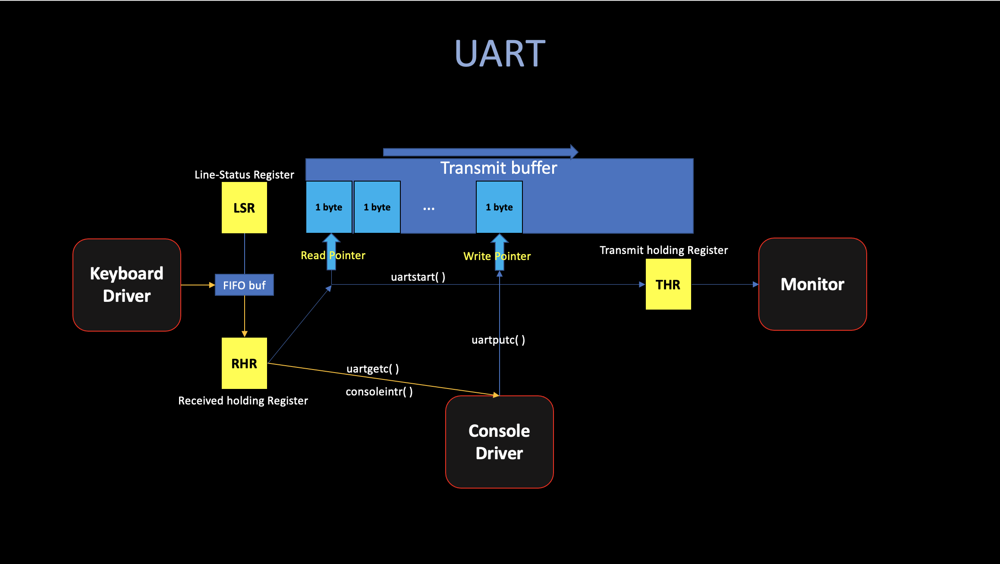
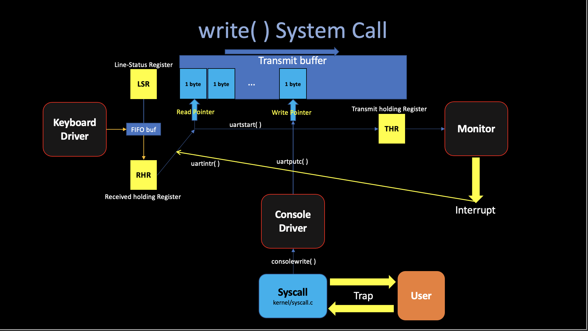
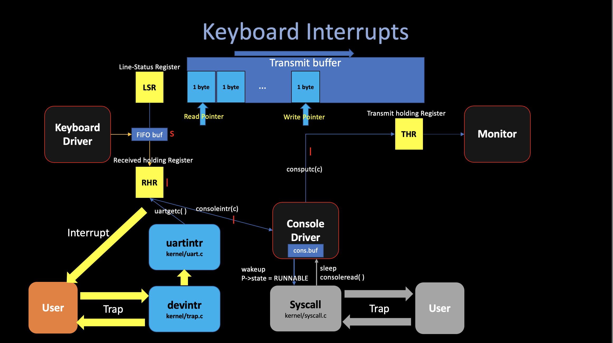
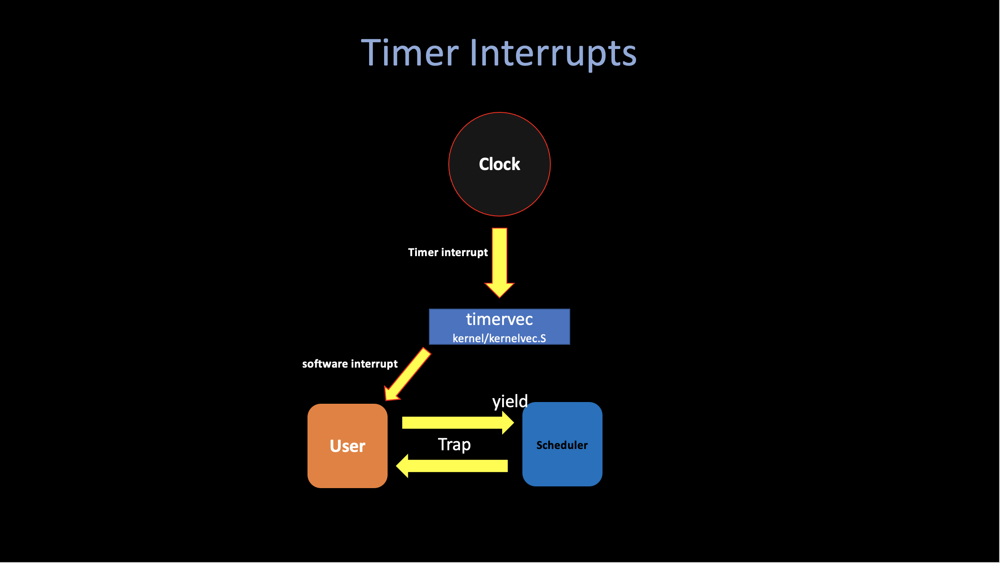

# 4. Interrupts

##### 04/03/2022 By Angold Wang

In the previous post, **[3. Traps](https://a4org.github.io/os/docs/lectures/3Traps.html)**, we went through the actual xv6 code to illustrate the actual mechanics in the system call.
I also mentioned at the begin of prev post, **The "traps" mechanisim is used in 3 different situations**:
1. **System Call**
2. **Device Interrupt**
3. **Fault and Exceptions**

Since the previous article covered the whole trap procedure (trampoline, recovery...) with actual xv6 code. Which is pretty much the same in these 3 situations. I'll treat the **"Trap"** as an abstract procedure and this lecture will focus on things other than traps.

## 0. Device Driver (UART)
**A driver is the code in an operating system that manages a particular device. Which:**
1. Configures the device hardware.
2. Handles the resulting interrupts.
3. Tells the device to perform operations.
4. **Interacts with processes that may be waiting for the I/O from the device.**

**While booting, xv6's `main` calls `consoleinit` to initialize the [UART](https://en.wikipedia.org/wiki/Universal_asynchronous_receiver-transmitter) hardware:**
* **Generating a recieve interrupt when the UART receives each byte of input. (In RHR)**
* **Generating a transmit complete interrupt each time the UART finishes sending a byte of output. (In THR)**



## 1. System Call
**A system call will pause the current user-process, cause a trap which saves user's current state... and jump to kernel space in order to execute the kernel syscall.**

Let's continue the actual **`write()`** system call we mentioned last article. The way that shell indicate that it is ready for user input is to print "$" in the console.

In the xv6 implementation, the shell calls `fprintf` function, which will eventually make a system call `write(2, "$", 1)`.

```c
  fprintf(2, "$");
```
Now we are in the kernel code, the `write` system call eventually arrives at **`consolewrite()`** located in `kernel/console.c`, which will write the stuff byte-by-byte by calling **`uartputc(c)`**.

Like I show in the figure, the UART device maintains an output buffer (`uart_tx_buf`) so that **writing processes do not have to wait for the UART to finish sending,** this mechanism, called **asynchrony**, separates device activity from process activity through **buffering** and **interrupts**. Instead, **`uartputc`** appends each character to the buffer, kick the UART hardware to start transmitting by calling **`uartstart()`**.

Basically, **`uartstart()`** writes the byte pointed to by the current write pointer into the `THE`, which is the transmit holding register. In our system, **once you write that byte into `THR`, the UART hardware will send the data to the Console (Monitor) to draw that byte on your monitor.**

Each time UART finishes sending a byte to console, it generates an interrupt. After the trap **`uartintr()`** calls **`uartstart()`** again, which hands the device the next buffered output character... It will keep that loop (the yellow arrow showing on the figure) until no data in the buffer (writep == readp).




## 2. Device Interrupts

There are basically two kinds of device interrupts -- The **Timer interrupts** and **others**.

### i. Device interrupts

For the device interrups, typically, when a user types **"ls"**, press enter in their keyboard and wants to pass this command to the shell. The UART hardware asks the RISC=V to raise an interrupt, The current user process will be interrupted and the xv6's trap handler will be activated. The trap handler calls **`devintr`** (`kernel/trap.c`), which looks at the RISC-V `scause` register to discover that the interrupt is from an external device. Then it asks a hardware unit called the `PLIC` to tell it which device interrupted. In this case, it was the UART, **`devintr`** calls **`uartintr`**.

**`uartintr`** reads any waiting input characters from the UART hardware and hands them to **`consoleintr`**, which **accumulate input characters in `cons.buf` until a whole line arrives.** The way is that **`consoleintr`** treats backspace and a few other characters specially. When a newline arrives, it wakes up a waiting **`consoleread`** (if there is one)(`p->status = RUNNABLE`), then back to the trap ret, and resume the interrupted process.

Once woken, **`consoleread`** will observe a full line in `cons.buf`, copy it to user space, and return from the trap to the user space.




### ii. Timer interrupts

Xv6 uses **timer interrupts** to switch among different **compute-bound process**.

The code **`timerinit`** in `kernel/start.c` initializing the clock hardware. Basically, it sets `mtvec` to **`timervec`** (kernel/kernelvec.S) in order to deal with each clock interrupts.

**A timer interrpt can occur at any point when user or kernel code is executing.** The basic strategy to handle a clock interrupt is to ask the RISC-V to **raise a "software interrupt"** and then immediately return (**then switch to the sheduler's context by calling `yield()`** which we will talk in great amount of details next post). The RISC-V delivers software interrupts to the kernel with the **ordinary trap mechanism**, and allows the kernel to disable them (very important for code executing in critical section).



The xv6 makes sure that there will always be an interrupt while the code executing in the user space. 

## 3. Fault and Exceptions
Xv6's response to exceptions is quite boring:
* **If an exception happens in user space, the kernel kills the faulting process.**
* **If an exception happens in the kernel, the kernel panics.**

In the real sophisticated operating system, fault and exceptions often be responded in much more interesting ways.

### i. Copy-on-Write

#### The problem
The `fork()` system call in xv6 copies all of the parent process's user-space memory into the child. If the parent is large, copying can take a long time. Worse, the work is often largely wasted; for example, a `fork()` followed by `exec()` in the child will cause the child to discard the copied memory, probably without ever using most of it. On the other hand, if both parent and child use a page, and one or both writes it, a copy is truly needed.

#### The solution
The goal of copy-on-write (COW) `fork()` is to defer allocating and copying physical memory pages for the child until the copies are actually needed, if ever.
COW `fork()` creates just a pagetable for the child, with PTEs for user memory pointing to the parent's physical pages. COW `fork()` marks all the user PTEs in both parent and child as not writable. 

When either process tries to write one of these COW pages, the CPU will force a page fault. The kernel page-fault handler detects this case, allocates a page of physical memory for the faulting process, copies the original page into the new page, and modifies the relevant PTE in the faulting

process to refer to the new page, this time with the PTE marked writeable. When the page fault handler returns, the user process will be able to write its copy of the page.

**[6.S081 Lab6 Copy-on-write fork](https://pdos.csail.mit.edu/6.828/2020/labs/cow.html)**

**[Personal Implementation](https://a4org.github.io/os/docs/labs/cow.html)**


### ii. Lazy Allocation
One of the many neat tricks an O/S can play with page table hardware is **lazy allocation** of user-space heap memory. 

Xv6 applications ask the kernel for heap memory using the `sbrk()` system call. In the kernel we've given you, `sbrk()` allocates physical memory and maps it into the process's virtual address space. It can take a long time for a kernel to allocate and map memory for a large request. Consider, for example, that a gigabyte consists of `262,144 4096-byte pages`; that's a huge number of allocations even if each is individually cheap. 

In addition, some programs allocate more memory than they actually use (e.g., to implement sparse arrays), or allocate memory well in advance of use. To allow `sbrk()` to complete more quickly in these cases, sophisticated kernels allocate user memory lazily. That is, `sbrk()` doesn't allocate physical memory, but just remembers which user addresses are allocated and marks those addresses as invalid in the user page table. 

When the process first tries to use any given page of lazily-allocated memory, the CPU generates a page fault, which the kernel handles by allocating physical memory, zeroing it, and mapping it.


**[6.S081 Lab6 Lazy Allocation](https://pdos.csail.mit.edu/6.828/2020/labs/lazy.html)**

**[Personal Implementation](https://a4org.github.io/os/docs/labs/lazy.html)**


