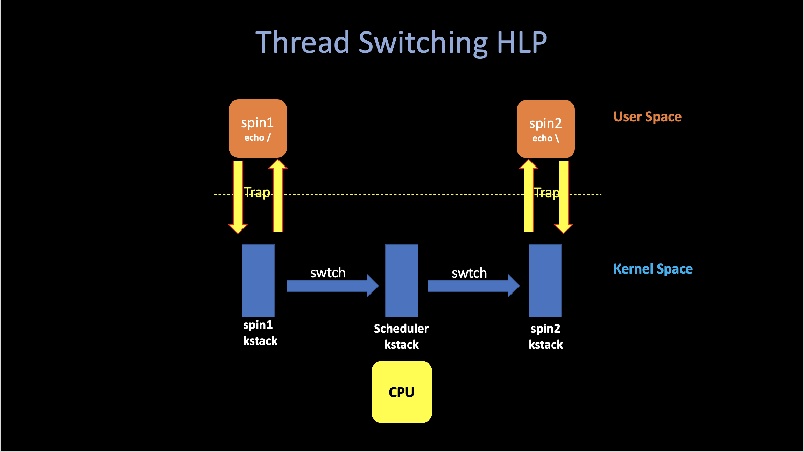
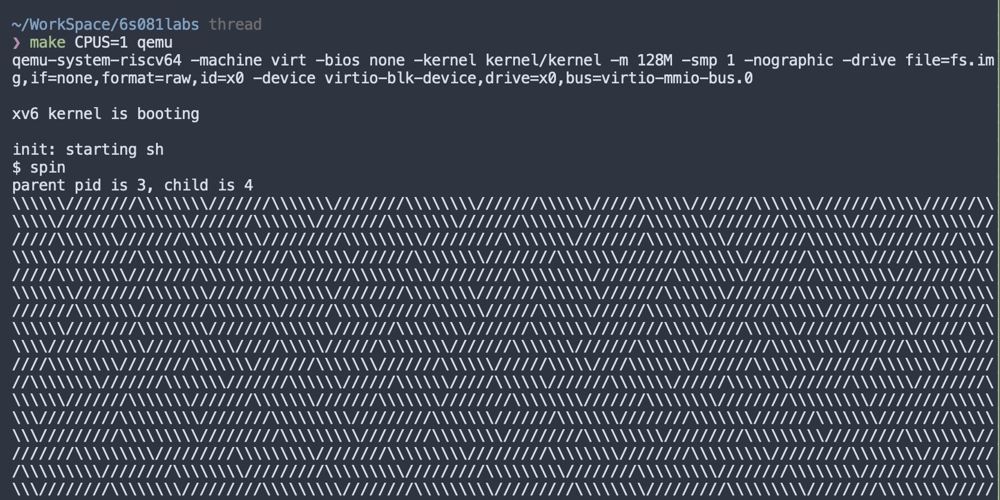
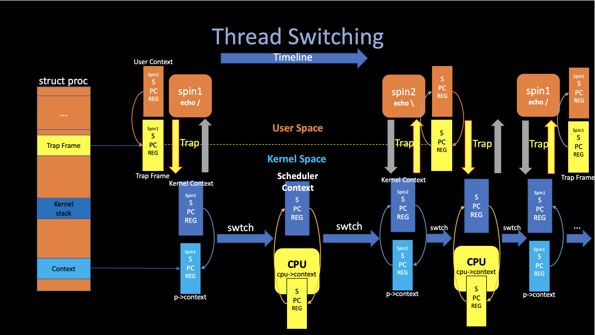

# 5. Scheduler

##### 04/04/2022 By Angold Wang

The OS brings an illusion to user that there are many processes (larger than CPU cores) running at the same time by switching between them very quickly. There are two kinds of processes: -- **I/O bound** and **CPU bound**. Each of them has different mechanisms to manage by the scheduler.

* **For the I/O bound processes:**
    * While executing, the CPU spend most of time waiting for I/O. 
    * For this kind of processes, **the scheduler needs to sleep it when it is waiting for the device interrupt to avoid wasting CPU time and wake it up when there comes a target device interrupt.**
* **For the CPU bound processes:**
    * This kind of processes spend most of time executing instructions in the CPU.
    * In this case, since there are usually multiple processes running in the CPU, the scheduler implements scheduling algorithms to manage them.


## 1. Multiplexing - Threads

##### Thread: one serial execution
* PC: Where is it in its execution.
* Registers: The compiler uses registers to hold variables.
* Stack: Each thread has its own stack dedicated to executing. Where records the record of function calls.

### i. Interleaving
The Threading System: **Manage the interleaving of multiple threads.**
We'd like to fire up hundred or thousand threads and have the threading system figure out how to juggle all those threads and cause them all to make progress.

Typically, there are two levels of interleaving:
1. Multi-Core: Each threads runs on its CPU, and automatically get its one PC, Registers and Stack.
2. **Switching: How each CPU is going to switch among different threads.**

Here is a high-level picture of thread switching in xv6:




### ii. Example: Switching in a Single-Core Machine

This piece of code, which can be found in [`user/spin.c`](https://github.com/Angold-4/6s081labs/blob/pgtbl/user/spin.c).
And what it does is basically **`fork`** the parent process and then both parent and child process echo '/' or '\\'. Let's call them **`spin1`** and **`spin2`**, as you can see from the program, both of them were simulate two essentially **CPU-bound** process and may need to let CPU switch between them (since it will compute forever), rather than wait them to finish.
```c
int 
main(int argc, char* argv[]) {
    int pid;
    char c;
    pid = fork();
    if (pid == 0) {
        // child
        c = '/';
    } else {
        printf("parent pid is %d, child is %d\n", getpid(), pid);
        c = '\\';
    }
    for (int i = 0; ;i++) {
        if ((i % 1000000) == 0)
            write(2, &c, 1);
    }
    exit(0);
}
```
If we run this user-level program in xv6, and make qemu to simulate a single core machine:



As we can see, every once a while, the xv6 is switching between them. 
**(forward slash -> timer interrupt -> backward slash)**.


## 2. Context Switching


### i. Switching



The above figure outlines the steps involved in switching from one user process to another: 
1. **A user-kernel transition (system call or interrupt) to the old process's kernel thread.**
2. **A context switch to the current CPU's scheduler thread.** 
3. **A context switch to a new process's kernel thread.**
4. **A trap return to the user-level process.**

### ii. Two Handy Points

#### 1. Every core can just execute one thing at a time. It either running some processes' user thread, some processes' kernel thread or that core's scheduler thread.

#### 2. In xv6, a process is either executing instructions in user level, or it is executing instructions in the kernel, or it is not executing at all and its state has been saved away into this combination of `context` and `trapframe`.


## 3. Scheduling

After introducing the abstract mechanisims in thread switching. In this section, we are going to look at the low-level details(code) of switching.

The xv6 scheduler implements a simple scheduling policy, **which runs each process in turn.** This policy is called _round robin_. Real operating systems implement more sophisticated policies.


### i. Preempt
When a timer interrupt come, like we just saw in the last article **[os4. Interrupts](https://a4org.github.io/os/docs/lectures/4Interrupts.html)**, When a timer interrupts come, if the interrupts hasn't be unabled, the current running process will cause a trap, using the mechanisims we introduced in **[os3. Traps](https://a4org.github.io/os/docs/lectures/3Traps.html)** and after saving all its context in `trapframe`, it eventually come to **`devintr()`** and then return `2` to the `which_dev` variable after checking that it is an timer interrupt. 

After that, both **`usertrap()`** (trap in user space) and **`kerneltrap()`** will see that `which_dev` is `2` and immediatly call **`yield()` to let this process gives up the CPU and switch to the scheduler.**

One interesting mechanisim there is that the **`yield`** will make xv6 hold current process's **lock** (`p->lock`). And release that **lock** in the scheduler's context. Also next time when the scheduler decide to resume this interrupted user process, it will hold that (`p->lock`), and the resumed code in **`yield`** will release that lock. We need this because `p->lock` **protects invariants on the process's `state` and `context` fields. Imagine if the lock is not held: a different CPU might decide to run the process after yield had set its state to `RUNNABLE`, which will cause two CPUs running on the same stack and cause chaos.**


### ii. Sleep and Wake up

Scheduling and locks help multiple CPUs switching among different **`RUNNABLE`** processess. But we also need some abstractions that help threads intentionally interact.
For example, the `printf($)` case we mentioned in the last article, after the `UART` hardware finish sending the `$` to the monitor, it will generate an interrupt in order to make **`consoleintr`** call **`wakeup`** to wake up all process that called **`sleep`** and waiting for this char.

The implementation is pretty much the same as the thread switching we mentioned above: If a process make a **`wait`** system call, eventually it will come to **`sleep`** function inside kernel, after set its state to `SLEEPING`, it will call **`sched()`** and then switch to the **scheduler**.


## 4. Kernel Pgtbl Per User Process
Xv6 has a single kernel page table that's used whenever it executes in the kernel. The kernel page table is a direct mapping to physical addresses, so that kernel virtual address `x` maps to physical address `x`. Xv6 also has a **separate page table for each process's user address space**, containing only mappings for that process's user memory, starting at virtual address zero. Because the kernel page table doesn't contain these mappings, user addresses are not valid in the kernel. Thus, when the kernel needs to use a user pointer passed in a system call (e.g., the buffer pointer passed to **`write()`**), the kernel must first translate the pointer to a physical address. The goal of this section and the next is to allow the kernel to directly dereference user pointers **by adding a kernel page table per process.**

**[6.S081 Lab3 Page Table](https://pdos.csail.mit.edu/6.828/2020/labs/pgtbl.html)**

**[Personal Implementation and Notes](https://a4org.github.io/os/docs/labs/pgtbl.html)**

