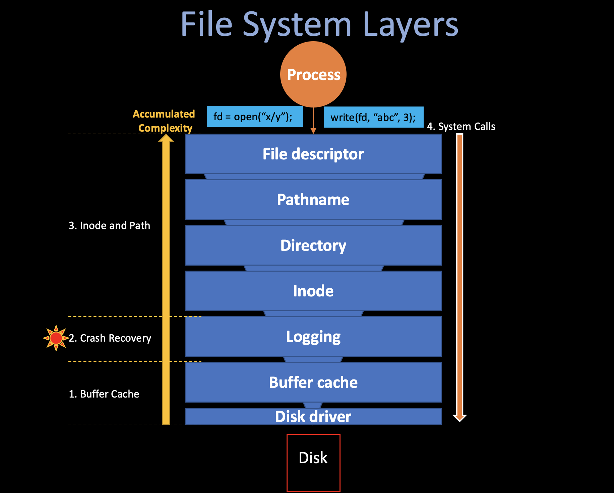
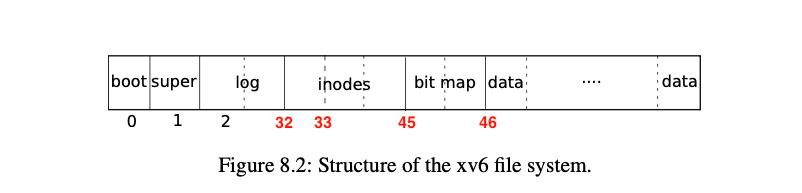
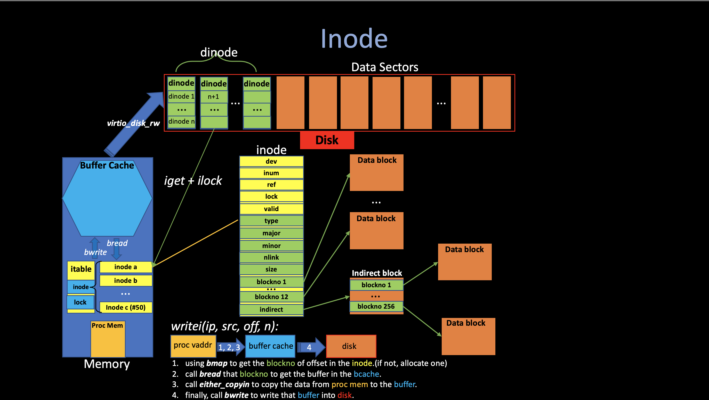
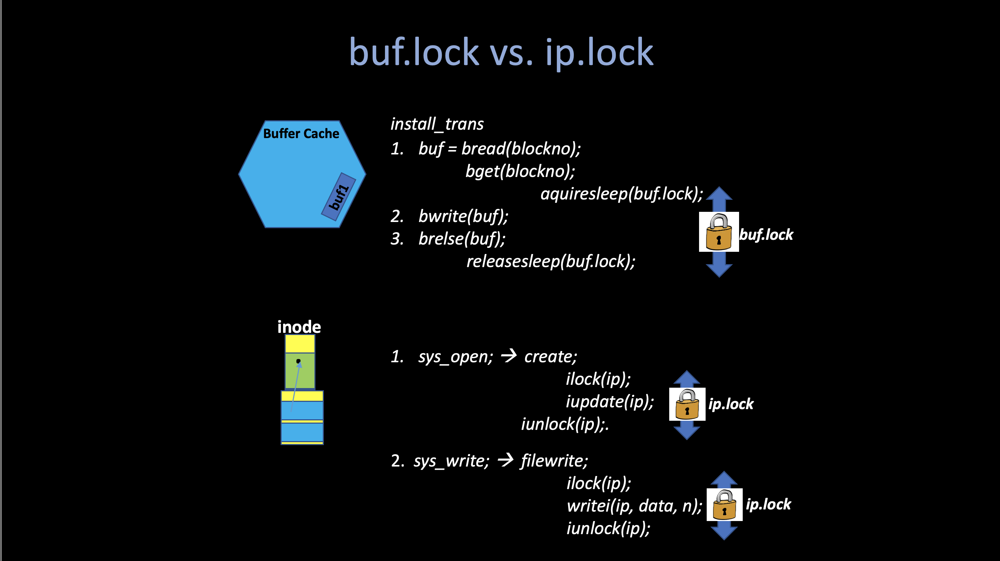

# 7. File System (ii)
##### 05/25/2022 By Angold Wang



## 3. Inode and Path
**Up until log, these lower layers are all interacting with disk blocks (sectors) with a specific `blockno`.** But in the file systems that we are using in our daily life, seems that we are manipulating data on specific **files**, and finding them using **path names**.

The upper layers (layer 4, 5, 6, 7) is trying to ease the user by providing **path, file, directory, etc,** which we are familar with.

### i. Block Allocator
File and directory is stored in **disk blocks**, which must be allocated from a free pool. Xv6's block allocator maintains a **bitmap** on disk, **with one bit per block.** A zero bit indicates that the corresponding block is free; a one bit indicates that it is in use.

The main API function that the block allocator provided is **`balloc()`** which allocates a new disk block and return its **`blockno`**. The loop inside `balloc` is split into two pieces:
* The outer loop reads each block of bitmap bits (on disk).
* **The inner loop checks all Bits-Per-Block(BPB) bits in a single bitmap block.**

The loop looks for a block whose bitmap bit is zero, indicating that it is free. If **`balloc`** finds such a block, it updates the block and writes it to the disk (`log_write`) then return the `blockno` of that block.


```c
// kernel/fs.c:
  for(b = 0; b < sb.size; b += BPB){
    // for each bitmap block
    bp = bread(dev, BBLOCK(b, sb));
    for(bi = 0; bi < BPB && b + bi < sb.size; bi++){
      m = 1 << (bi % 8);
      if((bp->data[bi/8] & m) == 0){  // Is block free?
        bp->data[bi/8] |= m;  // Mark block in use.
        log_write(bp); // write to the log buffer (bitmap -> disk)
        brelse(bp);
        bzero(dev, b + bi);
        return b + bi;
      }
    }
  }
```

### ii. Inode
You should view File System as **many on-disk data structures.** (tree, dirs, inodes, blocks) with two allocation pools: (**blocks** and **inodes**)

Up to now, **we walk through one of the two allocations pools in Xv6 - the blocks** and understand how the file system manipulate this on-disk data structures. The next part would be another allocation pool: **inodes.**

First let's do not talk about the code or even design, let's look at xv6 in action with some real system calls and **illustrade on-disk data structure via how updated.**

Here is the sequence of disk writes involved in each operation of these two write system calls in echo (`user/echo.c`).
We can track these syscalls by adding a `printf` statement in `log_write`, which will be called when a atomic series of disk writes happends. (e.g,. a write system call).

```
$ echo "hi" > x

--- create the file
log write block: 33  // by ialloc: allocate inode in inode block 33
log write block: 33  // by iupdate: update inode (e.g., set nlink)
log write block: 70  // by writei: write to the data block of this directory entry (dirlink)
log write block: 32  // by iupdate: update the directory inode since we change the size of it.
log write block: 33  // by iupdate: itrunc new inode (even through nothing changed)

--- write "hi" to file x
log write block: 45  // by balloc: allocate a block in bitmap block 45
log write block: 628 // by bzero: zero the allocated block
log write block: 628 // by writei: write to it (hi)
log write block: 33  // by iupdate: update inode

--- write "\n" to file x
log write block: 628 // by writei: write to it (\n)
log write block: 33  // by iupdate: update inode

```



#### 1. Inode Design

The term *inode* stands for two things in xv6:
* **On-disk datastructure** containing a file's size and list of data block numbers
* **In-memory copy of this disk inode in the inode table** contains extra informantion needed within the kernel.


**Disk Inode `dinode`**
```c
// kernel/fs.h
// On-disk inode structure
struct dinode {
  short type;           // File type
  short major;          // Major device number (T_DEVICE only)
  short minor;          // Minor device number (T_DEVICE only)
  short nlink;          // Number of links to inode in file system
  uint size;            // Size of file (bytes)
  uint addrs[NDIRECT+1];   // Data block addresses (blockno)
};

```
The on-disk inodes are packed into a contiguous area of disk called the **inode blocks**. Just like block, every inode is in the same size, so it is easy, given a number n, to find the nth node on the disk. And this number n, called the inode number of i-number (`inum`).

This on-disk inode structure, **`dinode`**, contains a size and an array of block numbers. (the green part of the following figure). The inode data is found in block listed in the **`dinode`**'s' **`addr`** array, and every elements of this array is a **`blockno`** referring to a block in the disk.

* The first `NDIRECT` blocks of data are listed in the first `NDIRECT` entries in the array, called **direct blocks**.
    * size of the direct blocks: **`12`** `(NDIRECT)` `*` **`1024`** `(BSIZE) = ` **`12KB`**.   
* The next `NINDIRECT` blocks of data are listed in the last entry in the **`addrs`** array are address of the **indirect blocks.**
    * size of the indirect blocks: **`1024 / 4`** `(BSIZE / sizeof(uint) *` **`1024`** `(BSIZE) = ` **`256KB`**.
* **So the Maximum size of a file in xv6 is `12KB + 256KB = 268KB`**.



**In-memory Inode `inode`**
```c
// kernel/file.h
// in-memory copy of an inode
struct inode {
  uint dev;           // Device number
  uint inum;          // Inode number
  int ref;            // Reference count
  struct sleeplock lock; // protects everything below here
  int valid;          // inode has been read from disk?

  // copy of disk inode
  short type;
  short major;
  short minor;
  short nlink;
  uint size;
  uint addrs[NDIRECT+1];
};
```

The **`inode`** is the in-memory copy of the **`dinode`** on disk with some extra attributes for **File Systems** to manipulate them:
* **The `inum` record the inode number of that inode in order to read/write them to/from disk.**
* **`ref` field counts the number of C pointers referring this in-memory inode.**


**Inode Table `itable`**
```c
// kernel/fs.c
struct {
  struct spinlock lock;
  struct inode inode[NINODE];
} itable;
```

**An inode describes a single file or directory, the kernel keeps a table in-use inodes in memory called `itable` to provide a place for synchronization access.** (also cache frequently-used inodes) The kernel stores an inode in memory only if **there are C pointers referring to that inode. (`open`)**.


#### 2. Inode Implementation
There are several api functions in the Inode layer, although xv6 uses very straightforward but non-efficient algorithms in the most part of its implementation, it is still quite hard to understand all of them with a simple description of each of them.

The following figure shows the all procedures related to inode when a user process make a **write** system call.


There are many functions related to the inode, all of them are in **`kernel/fs.c`**. If you are trying to understand the actual implementation, I highly recommend you to read the source code, just like I said before, it is pretty straightforward. There are three functions worth mentioning:**`bmap`**,  **`ilock`** and **`iput`**.


* **`bmap(ip, f->off/BSIZE)`: returns the blockno of specific offset of inode `ip`.**

The function **`bmap`** manage the complexity of blocks representation in **`inode.addr[]`** so that higher-level routines, such as **`readi`** and **`writei`**, do not need to deal with this complexity. **`bmap(ip, bn)`** returns the disk block number of the **`bn`**'th data block for the inode **`ip`**. If **`ip`** does not have such a block yet, **`bmap`** allocates one.

> **Bigfile**: Note that in the current xv6 implementation, the files are limited to *268KB*, this limit comes from the fact that an xv6 inode contains 12 "direct" block number and one "singly-indirect" block number, which refers to a block that holds up to 256 more block numbers. If we want to increase the maximum size of an xv6 file, like adding a "double-indirect" block in each inode, containing 256 addresses of singly-indirect blocks, each of which can contain up to 256 addresses of
data blocks. The result will be consist of up to (`256*256 + 11 + 256`) **65803** blocks, We can do this by changing this **`bmap`** function to make it support **double indirection**, you can see a implementation here: **[bigfile](https://github.com/Angold-4/6s081labs/pull/6/commits/921a16e0e8276473e5b9f02c85cc541df2ccca0d)**.


* **`ilock(ip)`: lock the given inode and reads the inode from disk.**

Typically, the **lock** is used to prevent some harzards come from synchronization access of shared data, which make sure that at any time, only one process that holding the lock can change that the protected data.

But too much locking especially locking for too long may also cause many problems such as **deadlock.** In the **1. buffer cache** part, I said the way to prevent multiple kernel thread use that copy of disk block is everytime when **`bwrite`** wants to write something to the disk, it should always call **`bread`**, and **`bread`** will call **`bget`** to return a locked buffer in the buffer cache, after writes finished, it will call **`brelse`** to release that buffer lock.

And the situation is a little bit different here: If you want to write something to a file (i.e., calling **`file_write`**), you always need to first open that file (`sys_open`) and you cannot hold the lock when open it because you don't know when you gonna write something to it. So when you call **`iget`** in order to get a entry in the global inode table (**`itable`**), you cannot hold the lock of that inode because you don't know when to release it. If you keep holding it, it may causes **deadlock** and **races** when you do some operations like directory lookup, etc.

The xv6 prevent this from happening by seperating the **`ilock`** and **`iget`** so that the system call can get **a long-term reference to an inode (as for an open file), and only lock it for a short period when needed (e.g., in `read()`)**. And **`iget`** only increments the `ip->ref` so that the inode stays in the table and pointers to it remain valid.



Worth mentioning that another thing **`ilock`** will do is read the inode data from the disk **`dinode`**, that is because we do not keep holding that **`ip.lock`** before and this inode may have changed by another process and we have to get those changes from disk.


* **`iput(ip)`: drop a reference to an in-memory inode and free it (also its content) in disk if ref goes 0.**

**`iput`** releases a C pointer to an inode and that the inode has no links to it **(i.e., no directory has link to it)**, if this is the last reference, then the inode and its data blocks must be freed. **`iput`** calls **`itrunc`** to truncatre the file to zero bytes, freeing the data blocks; sets the inode type to 0 (unallocated); and writes the inode to disk.

### iii. Directory

A directory is implemented internally much like a file. Its inode has type `T_DIR` and its data in the data block is a sequence of directory entries. **Each entry is a struct `dirent`, which contains a name (`name`) its inode number (`inum`).** The name is at most `DIRSIZ(14)` characters; if shorter, it is terminated by a `NUL(0)` byte. Directory entries with inode number zero are free.

```c
// kernel/fs.h
struct dirent {
  ushort inum;
  char name[DIRSIZ]; // 14
};
```

There are two main API functions in this layer: **`dirlookup`** and **`dirlink`**.

* **`dirlookup`: look for a directory entry/file inode in a directory.**

```c
// kernel/fs.c
  for(off = 0; off < dp->size; off += sizeof(de)){
    // the data inside directory inode (addr) is the address of dirent
    if(readi(dp, 0, (uint64)&de, off, sizeof(de)) != sizeof(de))
      // read data from disk inode to de
      panic("dirlookup read");
    if(de.inum == 0)
      continue;
    if(namecmp(name, de.name) == 0){
      // entry matches path element
      if(poff)
        *poff = off;
      inum = de.inum; // directory entry
      return iget(dp->dev, inum);
      // allocate a inode in the inode table
      // and then return the address of that inode in the table
    }
  }
```
The main loop is also very straightforward: it searches a directory for an entry with the given name. It it finds one, it updates `*poff` to the byte offset of the entry within the directory(in case the caller wishes to edit it) and returns an unlocked inode in the **`itable`** obtained via **`iget`**.

Here **`dirlookup`** is one reason that **`iget`** returns unlocked inodes that I mentioned before: **Since everytime when a system call wants to call `dirlookup(ip, name)`, it should always hold the lock (`ip->lock`) before entering it to avoid other process changing its data while `dirlookup` is reading in it. Imagine the look up is for `.` (`$ls .`), an alias for the current directory, attemping to lock the inode before returning would try to re-lock `ip` (by `iget`) and deadlock.**

* **`dirlink`: write a directory entry (name, inum) into the directory dp.**

The main loop reads directory entries looking for a unallocated entry (`de.inum == 0`). The usually call stack will be:

**`dp = namex(path, name)` -> `ip = ialloc(dp->dev)` -> `dirlink(dp, name, ip->inum)`**

### iv. Path Name

Path name lookup (**`namex`**) involves a sucession of calls to **`dirlookup`** (iteration), **`namei`** evaluetes `path` and returns the corresponding **`inode`**.

Here again we see why the separation between **`iget`** and **`ilock`** is important:

The procedure **`namex`** may take a long time to complete: it should involve several disk operations to read inodes and directory blocks for the directories traversed in the pathname (if they are not in the buffer cache). So we must allow parallel pathname lookup, which means lookups in different directoryies can proceed in parallel.

Let's look at **`namex()` (`kernel/fs.c`)**:
```c
// kernel/fs.c

  if(*path == '/')
    ip = iget(ROOTDEV, ROOTINO);
  else
    ip = idup(myproc()->cwd);

  while((path = skipelem(path, name)) != 0){
    ilock(ip); // read the inode from disk
    ...
    if((next = dirlookup(ip, name, 0)) == 0){
      iunlockput(ip);
      return 0;
    }
    iunlockput(ip);
    ip = next; // next -> iteration
    ...
  }
  return ip;

```

1. **`iget(ip)`**: get the directory inode at in creasing its `ref` in the inode table.
2. **`ilock(ip)`**: locks current directory. 
3. **`dirlookup(ip, name)`**: find next directory inode.
4. **`iunlockput(ip)`**: unlock current directory.

Another process may unlink the next inode, but inode won't be deleted, because inode's `ref` > 0 (by **`iget()`**). and finally the `iunlockput()` will both call `iunlock()` and `iput()` to unlock it and decreasing its `ref`.

Also same as the **deadlock.** For example, `next` points to te same inode as **`ip`** when looking up "`.`". Locking `next` before releasing the lock on `ip` would result in a deadlock. To avoid this deadlock, **`namex`** unlocks the directory before obtaining a lock on `next`, just as we've seen before.

> Key Idea: **getting a reference separately from locking**

The **`skipelem(path, name)`** is used for managing the complexity of pathname.

For example: to resolve **`path = skipelem(path, name)`**, where `path` = `os/docs/lectures/6FS.md`.
this **`skipelem`** will return the `path` equal to `docs/lectures/6FS.md` and setting `name` equal to `os`.


### v. File Descriptor

A cool aspect of Unix interface is that **most resources in Unix are represented as files**. Including devices such as the console, pipes, and of course, real files. The **File Descriptor** layer is the layer that achieves this uniformity.

In xv6, each process has its own table of open files (`*ofile[NOFILE]; (16)`), so-called **file descriptors**, **which is just a wrapper around either an inode or a pipe, plus an I/O offset, and previlegies like `readable` and `writeable`**.

```
// kernel/proc.h
// Per-process state
struct proc {
  ...
  struct file *ofile[NOFILE];  // Open files
  ...
}

```

```c
// kernel/file.h
struct file {
  // which is wrapper around either an inode or a pipe,
  // plus an I/O offset
  enum { FD_NONE, FD_PIPE, FD_INODE, FD_DEVICE } type;
  int ref; // reference count
  char readable;
  char writable;
  struct pipe *pipe; // FD_PIPE
  struct inode *ip;  // FD_INODE and FD_DEVICE
  uint off;          // FD_INODE
  short major;       // FD_DEVICE
};

```

This brings two "independency":
* **If multiple processes open the same file independently, the different instance will have differnt I/O offsets.**
* **A single open file can appear multiple times in one process's file table, and `dup` can use this to create alias.**

Just as xv6 implemented in **lower layers.** (**`bcache`, `logheader` and `itable`**), there also a place to store all opened files, and this global file table called **`ftable`,** make sure that only one copy of the disk file (inode) resides in the file system (for synchronization access).

```c
struct {
  struct spinlock lock;
  struct file file[NFILE];
} ftable;

```
The file descriptor layer provides the **top-level** API functions to allocate a file (**`filealloc`**), create a duplicate reference (**`filedup`**), release a reference (**`fileclose`**), and read and write data (**`fileread`** and **`filewrite`**). All of them will call the APIs that lower-level provides to do the actual work.


## 4. System Calls

All files related to File System's syscall is in **`kernel/sysfile.c`**. And they just the very-top level layer which uses the lower-layer services.

With the functions that the lower layers provide the implementation of most system calls is trivial. Like what I mentioned in the intro part of **[6. File Systems (i)](https://angold4.org/os/docs/lectures/6FS.html), this bottom-up view will help you to understand the design purpose of each layers.**

Now lets take a **top-down** view of the whole file system by walking through the actual implementation of System calls, just to make this all concrete. I am using the same example here - the **`echo "hi"`** example we've seen in the **inode** part of this article. But this time, we track the `bwrite()` instead of the `log_write()`,  which shows all the writes to disk in the buffer cache. And we can see the trace of what actual disk writes are.


This trace is way longer than the trace that we've looked at last time:

```
$ echo "hi" > x

// create the file
bwrite: 3    // write_log: new allocated inode block 33 -> log 3 in disk (by ialloc + iupdate)
bwrite: 4    // write_log: directory inode 70 -> log 4 in disk (directory data) (by dirlink + writei)
bwrite: 5    // write_log: directory inode 32 -> log 5 in disk (directory inode) (by dirlink + iupdate)
bwrite: 2    // write_head: actual commit to the log header
bwrite: 33   // bwrite (iupdate): allocate inode and update inode for x (log absorption)
bwrite: 70   // bwrite (writei): write to the data block of this directory entry
bwrite: 32   // bwrite (iupdate): update the directory inode since we change the size of it
bwrite: 2    // write_head: clear the log (make log "empty")

// write "hi" to file x
bwrite: 3    // write_log: set the bit of new allocated block in 45 bitmap -> log 3 in disk (by bmap + balloc)
bwrite: 4    // write_log: zero that block and then write hi to it -> log 4 in disk (by bzero + writei)
bwrite: 2    // write_head: actual commit to the header
bwrite: 45   // bwrite (balloc): allocate a block in bitmap block 45
bwrite: 628  // bwrite (writei): zero the allocated block and write "hi"
bwrite: 33   // bwrite (iupdate): update the inode of file x
bwrite: 2    // write_head: clear the log (make log "empty")

// write "\n" to file x
bwrite: 3    // write_log: zero that block and then write hi to it -> log 3 in disk (by bzero + writei)
bwrite: 4    // write_log: update the file's inode 33 -> log 4 in disk (by iupdate)
bwrite: 2    // write_head: actual commit to the header
bwrite: 628  // bwrite (writei): write "\n"
bwrite: 33   // bwrite (iupdate): update the inode of file x
bwrite: 2    // write_head: clear the log (make log "empty")
```


If you walkthough all block writes above, and you can both tell "**After write that block, what we can get?**" and more important, "**Why we should write that block?**", I believe that can makes you to have a comprehensive understanding of xv6 File System with both view to it, and hope it will benefit your journey in **database world, modern operating system world, or even any system design world...**

**Although most part of xv6 uses very straightforward and inefficient implementation for simplicity, it still shares the same purpose and some design choice at each layer with the mordern operating systems, which is significantly more complex than xv6's.**

Thanks for your reading! If you have any questions or promlems in this article, just feel free to mail me at [wangold4w@gmail.com](mailto:wangold4w@gmail.com) or comment below. I'm happy to see that :). 

See you next time.

**this page was last edited on 29 May 2022, at 11:45 (UTC), by [Angold Wang](https://github.com/Angold-4).**
